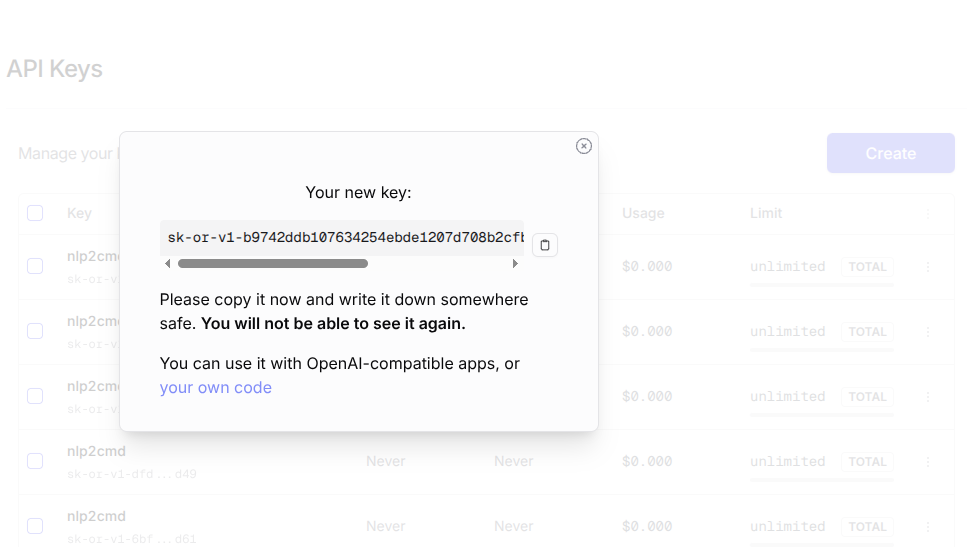

# NLP2CMD

[](https://www.python.org/downloads/)
[](https://opensource.org/licenses/Apache-2.0)
[](https://pypi.org/project/nlp2cmd/)
[](https://github.com/wronai/nlp2cmd)


## AI Cost Tracking

   
  

- 🤖 **LLM usage:** $7.5000 (273 commits)
- 👤 **Human dev:** ~$9584 (95.8h @ $100/h, 30min dedup)

Generated on 2026-03-30 using [openrouter/qwen/qwen3-coder-next](https://openrouter.ai/qwen/qwen3-coder-next)

---


**Natural Language → Domain-Specific Commands** — production-ready framework for transforming natural language (Polish + English) into shell, SQL, Docker, Kubernetes, browser automation, and desktop GUI commands.

## Quick Start

```bash
pip install nlp2cmd[all]
nlp2cmd cache auto-setup          # Setup Playwright browsers

# Single commands
nlp2cmd "uruchom usługę nginx"    # → systemctl start nginx
nlp2cmd "znajdź pliki większe niż 100MB"  # → find . -type f -size +100MB

# Multi-step browser automation
nlp2cmd -r "otwórz openrouter.ai, wyciągnij klucz API i zapisz do .env"

# Canvas drawing with video recording
nlp2cmd -r "wejdź na jspaint.app i narysuj biedronkę" --video webm

# Web form filling
nlp2cmd -r "otwórz https://example.com/kontakt i wypełnij formularz i wyślij"
```

## Key Features

### Multi-Step Browser Automation (v1.1.0)

Complex queries are automatically detected and decomposed into executable action plans:

```bash
nlp2cmd -r "otwórz tab w firefox wyciągnij klucz API z OpenRouter i zapisz do .env"
# → domain=multi_step, 7 steps: navigate → check_session → click → wait → extract_key → prompt_secret → save_env
```

The pipeline routes queries through:
1. **Cache** — instant lookup of previously seen multi-step patterns
2. **ComplexQueryDetector** — regex-based multi-step detection (~0.1ms)
3. **ActionPlanner** — rule-based decomposition for known services (10 API providers)
4. **KeywordIntentDetector** — single-command keyword matching (1615 templates)

### 16 Domains (1615+ Templates)

| Domain | Examples |
|--------|----------|
| **Shell** | find, ls, grep, ps, du, df, tar, chmod, systemctl |
| **Docker** | container, image, compose, volume, network |
| **SQL** | SELECT, INSERT, CREATE, JOIN, window functions |
| **Kubernetes** | kubectl, pods, deployments, services, helm |
| **Browser** | Playwright automation, form filling, site exploration |
| **Git** | commit, branch, merge, rebase, stash, tag |
| **DevOps** | systemctl, Ansible, Terraform, CI/CD, nginx, cron |
| **API** | curl, httpie, wget, REST, GraphQL |
| **FFmpeg** | video/audio conversion, streaming, recording |
| **Package Mgmt** | apt, pip, npm, yarn, snap, flatpak, brew |
| **Desktop** | Firefox tabs, Thunderbird, xdotool/ydotool, window mgmt |
| **Canvas** | jspaint.app drawing (shapes, ladybug, text) |
| **Remote** | SSH, SCP, rsync, tmux, VPN |
| **Data** | jq, csvkit, awk, sed, sqlite, pandas |
| **IoT** | Raspberry Pi GPIO, MQTT, sensors |
| **RAG** | ChromaDB, Qdrant, embeddings, LangChain |

### Evolutionary Cache — Self-Learning

100% accuracy with Qwen-Coder-3B, 24,355× speedup. Template pipeline + pre-warm cache eliminate 31% of queries without LLM.

```python
from nlp2cmd.generation.evolutionary_cache import EvolutionaryCache
cache = EvolutionaryCache()
r = cache.lookup("znajdź pliki PDF większe niż 10MB")  # template: ~15ms, cached: ~0.015ms
r = cache.lookup("znajdz pliki PDF wieksze niz 10MB")  # typo → similarity hit!
```

### LLM Validation & Self-Repair

Every command result is automatically validated by a local LLM (`qwen2.5:3b` via Ollama). If the validator marks a result as **fail**, a cloud LLM (OpenRouter) suggests an improved command and optionally patches `patterns.json`/`templates.json` so the pipeline learns from the mistake.

```
Execute command → stdout/stderr
       ↓
LLM_VALIDATOR (local, ~0.5s)
  query + command + output → pass/fail + score + reason
       ↓ fail?
LLM_REPAIR (OpenRouter cloud)
  full context → improved_command + JSON patches
       ↓
Retry + update data files
```

```bash
# Example output after command execution:
llm_validator: pass
score: 0.90
reason: Found 1 camera with RTSP on the local network.
model: qwen2.5:3b
```

Configuration in `.env`:
```bash
LLM_VALIDATOR_ENABLED=true          # enabled by default
LLM_VALIDATOR_MODEL=qwen2.5:3b     # local Ollama model
LLM_REPAIR_ENABLED=true            # cloud repair on fail
LLM_REPAIR_MODEL=qwen/qwen-2.5-coder-32b-instruct
```

Test suite: `python3 examples/08_llm_validation/test_validator.py` — 15 test cases, 100% accuracy with `qwen2.5:3b`.

### LLM Router — Multi-Model Routing

Smart routing across multiple LLM providers with automatic fallbacks: **paid remote → free remote → local Ollama**.

```
User prompt → classify_task() → LiteLLM Router
                                  ├── Remote (paid)   — Gemini 2.5 Pro, Qwen2.5-Coder-32B
                                  ├── Remote (free)   — Qwen2.5-VL-7B, Arcee Trinity
                                  └── Local (Ollama)  — qwen2.5:7b, qwen2.5-coder:7b, bielik
```

8 task specializations: **vision**, **coding**, **text**, **polish**, **repair**, **validation**, **fast**, **planning** — each with dedicated model chains. Even with zero API credits, all tasks work via local models.

```python
from nlp2cmd.llm.router import get_router

router = get_router()
resp = await router.auto_completion("napisz zapytanie SQL dla tabeli users")
# → task=coding, model=qwen2.5-coder, content="SELECT * FROM users;"
```

Full configuration guide: [Config README](config/README.md)

### Declarative Feedback Loop (Browser Automation)

Complex multi-step browser automation uses a **schema-driven feedback loop** — each step is validated, failures are classified, and repairs are escalated until a solution is found.

```
Step Schema (declarative)
    ↓
Execute step → Validate result (pre/post)
    ↓ failed?
Classify failure:
  schema_error      → wrong selector/URL     → Page analysis (DOM scan)
  page_state_error  → redirect/CAPTCHA/modal  → Navigate to correct page
  data_error        → not logged in / no key   → Login flow / create key
  handling_error    → browser crash / timeout   → Retry / escalate
    ↓
Repair escalation:
  1. Rule-based         ~0ms    (selector alternatives)
  2. Page analysis      ~50ms   (DOM scan for elements)
  3. Local LLM          ~500ms  (qwen2.5:3b diagnosis)
  4. Cloud LLM          ~2s     (OpenRouter 32B repair)
    ↓
Retry with repaired params (max 5 attempts)
```

Provider-agnostic: works across HuggingFace, OpenRouter, Anthropic, GitHub, Groq, and any SaaS site without hardcoded URLs — `PageAnalyzer` dynamically finds API key sections by scanning navigation links.

Test suite: `python3 examples/08_llm_validation/test_feedback_loop.py` — 19 test cases (failure classification + page analysis + multi-provider), 100% accuracy.

### Polish Language Support

Native Polish NLP with 87%+ accuracy: lemmatization, fuzzy matching, diacritic normalization.

```bash
nlp2cmd "zainstaluj vlc"                    # → sudo apt-get install vlc
nlp2cmd "pokaż procesy zużywające pamięć"   # → ps aux --sort=-%mem | head -10
nlp2cmd "znajdź pliki .log starsze niż 2 dni"  # → find . -type f -name "*.log" -mtime +2
```

### Desktop GUI Automation

Control desktop applications through natural language — works on both X11 and Wayland:

```bash
nlp2cmd -r "otwórz tab w firefox, wyciągnij klucz API z OpenRouter i zapisz do .env"
nlp2cmd -r "wejdź na jspaint.app i narysuj biedronkę" --video webm
nlp2cmd -r "otwórz Thunderbird i sprawdź pocztę"
nlp2cmd -r "zminimalizuj wszystko"
```

Supported API services for key extraction: OpenRouter, Anthropic, OpenAI, Groq, Mistral, DeepSeek, Together, GitHub, HuggingFace, Replicate.

## Video Recording



Record entire browser automation sessions with video output:

```bash
# Full session recording (WebM format)
nlp2cmd -r "otwórz tab w firefox wyciągnij klucz API z OpenRouter i zapisz do .env" --video webm --execute-web

# Short video clips (3-10 seconds)
nlp2cmd -r "wejdź na jspaint.app i narysuj koło" --video webm --duration 5
```


**Demo Recording**: [nlp2cmd-operouter-token.mp4](nlp2cmd-operouter-token.mp4) - Firefox automation with API key extraction

### Web Form Filling & Site Exploration

```bash
nlp2cmd -r "otwórz https://example.com/kontakt i wypełnij formularz i wyślij"
nlp2cmd -r "wejdź na strona-docelowa.pl i wypełnij formularz kontaktu"
# → Automatically explores site, finds contact form, fills with .env data
```

### Deep Company Extraction

```bash
nlp2cmd -r "wejdź na https://katalog-stron.pl/firmy, znajdź strony www firm i zapisz do firmy.csv"
# → Navigates profiles, extracts external websites, saves to CSV
```

## Architecture

```
Query → [Cache] → [ComplexDetector] → [ActionPlanner] → [KeywordDetector] → [TemplateGenerator]
                                           ↓                    ↓
                                    ActionPlan (multi-step)   SingleCommand
                                           ↓                    ↓
                                    PipelineRunner ←────────────┘
                                    ├── ShellExecutionMixin
                                    ├── BrowserExecutionMixin
                                    ├── DesktopExecutionMixin
                                    └── PlanExecutionMixin
```

**PipelineRunner** is split into 4 mixins (~4400 LOC total) for maintainability:

| Module | Lines | Responsibility |
|--------|-------|---------------|
| `pipeline_runner.py` | 170 | Core class, mixin composition |
| `pipeline_runner_shell.py` | 217 | Shell execution, safety policies |
| `pipeline_runner_browser.py` | 1561 | DOM/DQL, multi-action browser automation |
| `pipeline_runner_desktop.py` | 389 | xdotool/ydotool/wmctrl desktop control |
| `pipeline_runner_plans.py` | 2277 | Multi-step ActionPlan execution |

## Installation

```bash
# Full installation
pip install nlp2cmd[all]

# Specific components
pip install nlp2cmd[browser,nlp]    # Web automation + Polish NLP
pip install nlp2cmd[sql,shell]      # Database + system commands

# Desktop automation tools
nlp2cmd-install-desktop
# or: make install-desktop

# Setup Playwright browsers
nlp2cmd cache auto-setup
```

## CLI Usage

```bash
# Generate command
nlp2cmd "pokaż pliki użytkownika"           # → find $HOME -type f
nlp2cmd --dsl sql "pokaż użytkowników"      # → SELECT * FROM users

# Execute immediately (run mode)
nlp2cmd -r "list files" --auto-confirm

# Multi-step with video
nlp2cmd -r "wejdź na jspaint.app i narysuj biedronkę" --video webm

# Full session recording
nlp2cmd -r "otwórz tab w firefox wyciągnij klucz API z OpenRouter i zapisz do .env" --video webm --execute-web

# Interactive mode
nlp2cmd --interactive

# Web automation
nlp2cmd web-schema extract https://example.com
nlp2cmd web-schema history --stats

# Cache management
nlp2cmd cache info
nlp2cmd cache auto-setup
nlp2cmd cache full-clear --yes

# Service mode (HTTP API)
nlp2cmd service --host 0.0.0.0 --port 8000

# Diagnostics
nlp2cmd doctor --fix
nlp2cmd --show-decision-tree "zapytanie"
nlp2cmd --show-schema
```

## Python API

```python
from nlp2cmd.generation.pipeline import RuleBasedPipeline

pipeline = RuleBasedPipeline()

# Single command
result = pipeline.process("pokaż pliki w katalogu")
print(result.command)  # ls -la .

# Multi-step (auto-detected)
result = pipeline.process("otwórz openrouter.ai, wyciągnij klucz API i zapisz do .env")
print(result.domain)       # multi_step
print(result.action_plan)  # ActionPlan with 7 steps
```

```python
# Execute action plan
from nlp2cmd.pipeline_runner import PipelineRunner

runner = PipelineRunner()
result = runner.execute_action_plan(plan, dry_run=False)
```

## Testing

```bash
pytest tests/ -v                    # All 1543+ tests
pytest tests/unit/ -v               # Unit tests
pytest tests/e2e/ -v                # End-to-end tests
pytest --cov=nlp2cmd --cov-report=html  # With coverage
```

## Documentation

| Document | Description |
|----------|-------------|
| [Project Structure](PROJECT_STRUCTURE.md) | Architecture and module organization |
| [Installation Guide](INSTALLATION.md) | Setup instructions |
| [User Guide](docs/guides/user-guide.md) | Complete usage tutorial |
| [CLI Reference](docs/cli-reference.md) | CLI documentation |
| [Python API](docs/python-api.md) | Python API guide |
| [Examples Guide](docs/examples-guide.md) | Examples overview |
| [Keyword Detection](docs/KEYWORD_DETECTION_FLOW.md) | Intent detection pipeline |
| [Web Schema Guide](docs/WEB_SCHEMA_GUIDE.md) | Browser automation |
| [Cache Management](docs/CACHE_MANAGEMENT.md) | Caching system |
| [Desktop Automation](docs/DESKTOP_GUI_AUTOMATION.md) | Desktop GUI control |
| [LLM Router Config](config/README.md) | Multi-model routing, fallbacks, specialization |
| [Canvas Drawing](docs/CANVAS_DRAWING.md) | jspaint.app drawing |
| [Firefox Sessions](docs/FIREFOX_SESSION_INJECTION.md) | Session injection |
| [Evolutionary Cache](docs/EVOLUTIONARY_CACHE.md) | Self-learning cache |
| [Stream Protocols](docs/STREAM_PROTOCOLS.md) | SSH, RTSP, VNC, etc. |
| [Service Mode](docs/SERVICE_MODE.md) | HTTP API service |
| [Contributing](CONTRIBUTING.md) | Development guidelines |

## License

Licensed under Apache-2.0.
## Author

Tom Sapletta
