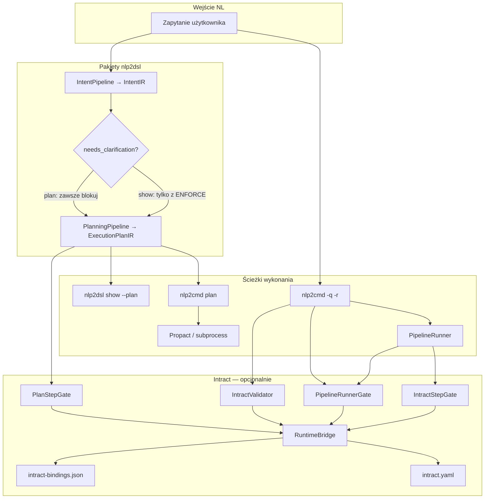
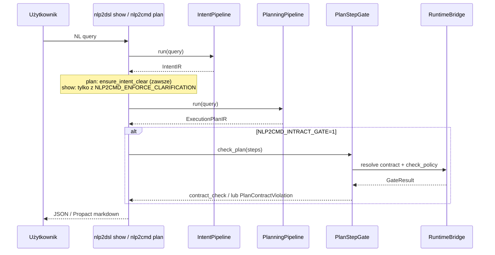
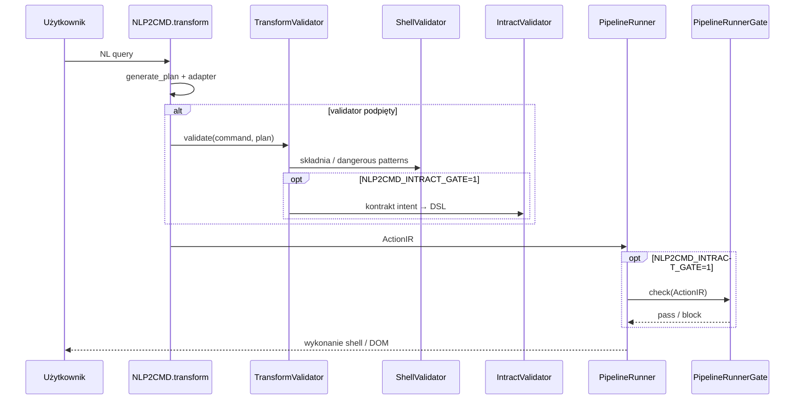
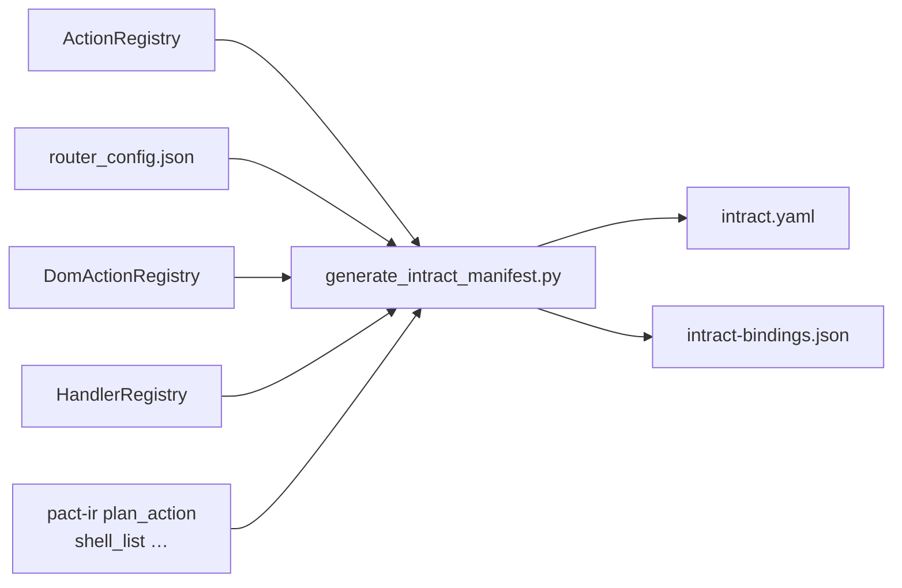

# Intract × nlp2dsl × nlp2cmd

Warstwa kontraktów [Intract](https://github.com/semcod/intract) egzekwuje **policy przed wykonaniem** (zakazane efekty, wymagane inputy, zgodność z manifestem). Nie weryfikuje stdout ani semantyki wyniku w shellu.

## Architektura (przegląd)



## Dwie ścieżki wykonania

### Ścieżka integracji (`show` / `plan`)

Struktura i planowanie — **bez** legacy `ActionRegistry`. Walidacja = Pydantic IR + (opcjonalnie) Intract na `PlanStep`.



### Ścieżka legacy (`-q -r`)

Pełny runtime: generacja → transform → pre-execute gate → wykonanie.



## Warstwy walidacji

| Warstwa | Gdzie | Co sprawdza | Czego nie sprawdza |
|---------|-------|-------------|-------------------|
| **Pydantic IR** | `pact-ir` | Struktura `IntentIR` / `ExecutionPlanIR` | Poprawność komendy |
| **Keyword detector** | `nlp2cmd-intent` | `confidence`, `ambiguities` | Wynik w shellu |
| **needs_clarification** | `nlp2cmd plan` | Blokada przy `confidence < 0.5` | — |
| **PlanStepGate** | `plan`, `show --plan` | Kontrakt na `PlanStep.dsl` | stdout |
| **TransformValidator** | `nlp2cmd -q` | ShellValidator + IntractValidator | stdout |
| **PipelineRunnerGate** | legacy execute | `ActionIR` przed shell/DOM | stdout |
| **IntractStepGate** | browser plan | pre/post kroków canvas/DOM | treść strony |

## Bramki Intract (nlp2cmd)

| Klasa | Plik | Hook | Wejście |
|-------|------|------|---------|
| `PlanStepGate` | `intract/plan_gate.py` | `plan_query_via_integration`, `nlp2dsl show --plan` | `PlanStep` + `IntentIR` |
| `IntractValidator` | `intract/validator.py` | `NLP2CMD.transform` via `build_transform_validator` | DSL + plan.intent |
| `PipelineRunnerGate` | `intract/pipeline_gate.py` | `PipelineRunner.run` | `ActionIR` |
| `IntractStepGate` | `intract/step_gate.py` | `plan_executor` browser steps | krok DOM/canvas |

Mapowanie kontraktów: `src/nlp2cmd/data/intract-bindings.json` (generowany z `scripts/generate_intract_manifest.py`).

### Źródła kontraktów



Akcje plannera spoza `ActionRegistry` (np. `shell_list`) mają `scope: plan_action` i `registry: pact_ir`.

### Aliasy intencji (keyword → kontrakt)

| Alias detektora | Kontrakt kanoniczny |
|-----------------|---------------------|
| `find`, `search` | `intent.file_search` |
| `ls`, `dir` | `intent.list` |

## Zmienne środowiskowe

| Zmienna | Domyślnie | Efekt |
|---------|-----------|-------|
| `NLP2CMD_INTEGRATION` | `0` | Włącza `nlp2cmd plan` |
| `NLP2CMD_INTRACT_GATE` | `0` | PlanStepGate + TransformValidator + PipelineRunnerGate + IntractStepGate |
| `NLP2CMD_ENFORCE_CLARIFICATION` | `0` | `nlp2dsl show` blokuje niską pewność (`nlp2cmd plan` — zawsze) |
| `NLP2CMD_QUERY_INPUT` | `1` | IntentIR na wejściu `-q` / `-r` / `plan` |

## Przykłady

```bash
export NLP2CMD_INTEGRATION=1
export NLP2CMD_INTRACT_GATE=1

# Plan z contract_check w JSON
nlp2cmd plan "znajdź pliki *.py w src" --json

# Show — contract_check w output (exit 1 przy violations)
nlp2dsl show "znajdź pliki *.py w src" --plan

# Legacy — Intract na transform + pre-execute
nlp2cmd -q "znajdź pliki *.py" -r

# Blokada niejednoznacznego zapytania (show)
export NLP2CMD_ENFORCE_CLARIFICATION=1
nlp2dsl show "xyz"   # exit 2
```

### Przykładowy `contract_check` w JSON

```json
{
  "contract_check": {
    "enabled": true,
    "passed": true,
    "steps": [{
      "step_id": "s1",
      "action": "shell_find",
      "contract_id": "action.shell_find",
      "passed": true,
      "violations": []
    }]
  }
}
```

## Czego Intract nie robi

- Nie porównuje stdout z oczekiwaniem użytkownika.
- Nie zastępuje `ActionRegistry.validate_action()` w ścieżce integracji (plan buduje params z regexów).
- Przy braku mapowania kontraktu gate **pomija** krok (`passed: true`, `skipped: true`) — nie blokuje po cichu destrukcyjnych komend bez kontraktu.

Post-execution validation (stdout vs oczekiwanie) to **osobna warstwa** — zob. [`post-execution-validation.md`](post-execution-validation.md). Włączanie: `NLP2CMD_POST_CHECK=1` po `plan --execute`.

## Regeneracja manifestu

```bash
cd nlp2cmd
python scripts/generate_intract_manifest.py
# → intract.yaml, src/nlp2cmd/data/intract-bindings.json, intract-policy.json
```

## Powiązane repozytoria

| Repo | Rola |
|------|------|
| [nlp2dsl](https://github.com/wronai/nlp2dsl) | `IntentIR`, `ExecutionPlanIR`, `nlp2dsl show` |
| [nlp2cmd](https://github.com/wronai/nlp2cmd) | Runtime, gates, `intract-bindings.json` |
| [intract](https://github.com/semcod/intract) | Silnik kontraktów (`validate_contract_against_source`) |
