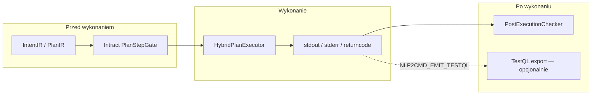
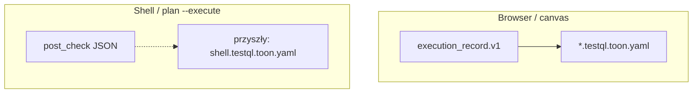

# Post-execution validation

Warstwa **po wykonaniu** — porównuje stdout/stderr/returncode z oczekiwaniem. **Osobna od Intract** (kontrakty przed wykonaniem) i od Pydantic IR (struktura planu).

## Pozycja w pipeline



| Warstwa | Kiedy | Pytanie |
|---------|-------|---------|
| Intract | pre-execute | Czy DSL spełnia kontrakt policy? |
| Post-check | post-execute | Czy output wygląda jak oczekiwany rezultat? |
| TestQL | artefakt / CI | Czy scenariusz jest powtarzalny do regresji? |

## Implementacja (`nlp2cmd.post_execution`)

| Moduł | Rola |
|-------|------|
| `checker.py` | `infer_post_check_spec`, `check_step_output`, `check_plan_outputs` |
| `plan.py --execute` | Wywołuje `validate_plan_outputs_if_enabled` po `HybridPlanExecutor` |

### Domyślne reguły (inferencja)

| Akcja | Spec |
|-------|------|
| `shell_find` | `returncode: 0`; jeśli `name=*.py` → co najmniej jedna linia pasuje do `\.py$` |
| `shell_list` | `returncode: 0` |
| inne | brak spec → `skipped: true` |

### Jawny override w `PlanStep.metadata`

```json
{
  "post_check": {
    "returncode": 0,
    "min_lines": 1,
    "line_regex": "\\.py$",
    "contains_any": ["src/"],
    "not_contains": ["Permission denied"],
    "non_empty": true
  }
}
```

## Zmienne środowiskowe

| Zmienna | Domyślnie | Efekt |
|---------|-----------|-------|
| `NLP2CMD_POST_CHECK` | `0` | Włącza post-check po `plan --execute` |
| `NLP2CMD_POST_CHECK_STRICT` | `0` | Ostrzeżenia → błędy; `PostCheckViolation` → exit 2 |

## Przykłady

```bash
export NLP2CMD_INTEGRATION=1
export NLP2CMD_POST_CHECK=1

nlp2cmd plan "znajdź pliki *.py w src" --execute --explain
# post_check: s1 passed=True lines=N

export NLP2CMD_POST_CHECK_STRICT=1
nlp2cmd plan "znajdź pliki *.xyz w src" --execute   # fail jeśli brak dopasowań
```

### Przykładowy `post_check` w flow JSON

```json
{
  "post_check": {
    "enabled": true,
    "passed": true,
    "strict": false,
    "steps": [{
      "step_id": "s1",
      "action": "shell_find",
      "passed": true,
      "spec": {"returncode": 0, "line_regex": "\\.py$"},
      "metadata": {"line_count": 3, "returncode": 0}
    }]
  }
}
```

## TestQL (istniejące, browser)

`NLP2CMD_EMIT_TESTQL=1` eksportuje scenariusz GUI z `execution_record.v1` (`plan_execution/testql_export.py`) — **nie** shell stdout.



Roadmap shell + TestQL: generować scenariusz z `post_check` + stdout snapshot do regresji CI.

## Powiązania w ekosystemie

| Projekt | Post-execution |
|---------|----------------|
| **nlp2cmd** | `post_execution/checker.py`, `plan --execute` |
| **koru** | `koru replay --validate`, `post_run_verify` w `koru.yaml` |
| **Intract** | nie dotyczy — tylko pre-execute |

Zob. też: [`intract-integration.md`](intract-integration.md)
