# System Architecture Analysis

## Overview

- **Project**: /home/tom/github/wronai/nlp2cmd
- **Analysis Mode**: static
- **Total Functions**: 329
- **Total Classes**: 34
- **Modules**: 44
- **Entry Points**: 256

## Architecture by Module

### scripts.thermodynamic.termo2
- **Functions**: 38
- **Classes**: 12
- **File**: `termo2.py`

### tools.schema.enhanced_schema_generator
- **Functions**: 37
- **Classes**: 3
- **File**: `enhanced_schema_generator.py`

### tools.schema.non_llm_schema_extractor
- **Functions**: 28
- **Classes**: 3
- **File**: `non_llm_schema_extractor.py`

### tools.schema.comprehensive_command_scanner
- **Functions**: 24
- **Classes**: 3
- **File**: `comprehensive_command_scanner.py`

### tools.generation.intelligent_command_generator
- **Functions**: 18
- **Classes**: 3
- **File**: `intelligent_command_generator.py`

### tools.schema.intelligent_schema_generator
- **Functions**: 14
- **Classes**: 2
- **File**: `intelligent_schema_generator.py`

### scripts.maintenance.refactor_shell_entities
- **Functions**: 11
- **File**: `refactor_shell_entities.py`

### scripts.maintenance.implement_core_integration
- **Functions**: 10
- **Classes**: 1
- **File**: `implement_core_integration.py`

### scripts.maintenance.implement_high_priority_fixes
- **Functions**: 10
- **Classes**: 1
- **File**: `implement_high_priority_fixes.py`

### scripts.maintenance.final_analysis_and_next_steps
- **Functions**: 10
- **Classes**: 1
- **File**: `final_analysis_and_next_steps.py`

### scripts.maintenance.final_project_summary
- **Functions**: 10
- **Classes**: 1
- **File**: `final_project_summary.py`

### scripts.maintenance.refactor_detect_normalized
- **Functions**: 10
- **File**: `refactor_detect_normalized.py`

### tools.schema.cmd2schema
- **Functions**: 9
- **Classes**: 1
- **File**: `cmd2schema.py`

### demos.demo_intelligent_nlp2cmd
- **Functions**: 9
- **Classes**: 1
- **File**: `demo_intelligent_nlp2cmd.py`

### benchmarks.thermodynamic_benchmark
- **Functions**: 7
- **Classes**: 1
- **File**: `thermodynamic_benchmark.py`

### tools.analysis.analyze_version_detection
- **Functions**: 6
- **File**: `analyze_version_detection.py`

### docker.novnc.demos.demo_desktop_gui
- **Functions**: 6
- **File**: `demo_desktop_gui.py`

### scripts.thermodynamic.termo_demo
- **Functions**: 5
- **File**: `termo_demo.py`

### scripts.maintenance.apply_nlp2cmd_fixes
- **Functions**: 5
- **File**: `apply_nlp2cmd_fixes.py`

### tools.generation.generate_cmd_from_prompts
- **Functions**: 5
- **Classes**: 1
- **File**: `generate_cmd_from_prompts.py`

## Key Entry Points

Main execution flows into the system:

### scripts.maintenance.refactoring_summary.print_summary
> Print a summary of the refactoring work completed.
- **Calls**: print, print, print, print, print, print, print, print

### tools.generation.generate_cmd_from_prompts.main
> Main function to generate CSV from prompt.txt.
- **Calls**: next, print, CommandGenerator, Path, data_dir.mkdir, str, print, print

### scripts.maintenance.final_project_summary.ProjectSummary.generate_final_summary
> Generate final project summary
- **Calls**: print, print, print, print, print, print, print, self.load_original_results

### demos.demo_enhanced.main
> Run the enhanced NLP2CMD demo.
- **Calls**: print, print, Path, print, print, extract_appspec_to_file, extract_appspec_to_file, extract_appspec_to_file

### demos.demo_persistent_storage.demonstrate_persistent_storage
> Demonstrate the persistent storage system.
- **Calls**: print, print, print, DynamicSchemaRegistry, print, print, print, print

### demos.simple_schema_demo.main
- **Calls**: print, print, print, print, DynamicSchemaRegistry, print, print, print

### tools.analysis.compare_batches.compare_batch_files
> Compare results from batch files.
- **Calls**: print, print, None.glob, sorted, None.exists, file.stem.split, int, batch_files.keys

### tools.schema.validate_schemas.validate_and_fix_schemas
> Validate all schemas and fix issues.
- **Calls**: print, print, None.exists, config.get, Path, export_dir.mkdir, DynamicSchemaRegistry, print

### benchmarks.thermodynamic_benchmark.main
> Run all benchmarks.
- **Calls**: print, print, print, print, print, print, print, print

### tools.schema.intelligent_schema_generator.main
> Main function to generate schemas for all commands.
- **Calls**: None.exists, print, IntelligentSchemaExtractor, extractor.batch_generate, sum, print, print, print

### scripts.maintenance.final_analysis_and_next_steps.FinalAnalyzer.analyze_fix_implementation
> Analyze the fix implementation
- **Calls**: print, print, self.load_all_results, print, print, print, print, print

### scripts.maintenance.implement_core_integration.CoreIntegrator.load_polish_fixes
> Load all Polish language fixes
- **Calls**: print, print, Path, patterns_file.exists, Path, intent_file.exists, Path, table_file.exists

### tools.generation.intelligent_command_generator.main
> Demonstrate intelligent command generation.
- **Calls**: print, print, print, IntelligentCommandGenerator, print, print, generator.batch_generate, print

### demos.demo_intelligent_nlp2cmd.demo_intelligent_nlp2cmd
> Demonstrate the intelligent NLP2CMD system.
- **Calls**: print, print, print, IntelligentNLP2CMD, print, print, print, print

### tools.generation.generate_cmd_simple.main
> Generate cmd.csv from prompt.txt.
- **Calls**: tools.generation.generate_cmd_simple.load_prompts, print, Path, data_dir.mkdir, str, print, print, print

### scripts.maintenance.generate_refactor_report.generate_refactor_report
> Generate a detailed report of the refactoring work.
- **Calls**: print, print, print, None.isoformat, open, json.dump, open, f.write

### scripts.maintenance.final_analysis_and_next_steps.FinalAnalyzer.run_complete_analysis
> Run complete analysis
- **Calls**: print, print, self.analyze_fix_implementation, self.identify_root_causes, self.create_action_plan, self.estimate_implementation_effort, self.create_implementation_roadmap, self.generate_final_recommendations

### tools.schema.enhanced_schema_generator.main
> Demonstrate enhanced schema generation.
- **Calls**: print, print, print, EnhancedSchemaExtractor, print, print, print, extractor.get_statistics

### scripts.maintenance.final_analysis_and_next_steps.FinalAnalyzer.generate_final_recommendations
> Generate final recommendations
- **Calls**: print, print, enumerate, print, print, print, print, print

### scripts.maintenance.implement_core_integration.CoreIntegrator.create_core_integration_patch
> Create patch for core integration
- **Calls**: print, print, Path, core_content.find, core_content.split, enumerate, Path, print

### scripts.maintenance.implement_high_priority_fixes.HighPriorityFixer.generate_fix_report
> Generate comprehensive fix report
- **Calls**: print, print, print, print, enumerate, print, print, print

### demos.demo_versioned_schemas.main
> Main demonstration.
- **Calls**: demos.demo_versioned_schemas.migrate_existing_schemas, demos.demo_versioned_schemas.demonstrate_schema_updates, demos.demo_versioned_schemas.demonstrate_dual_versions, print, print, print, store.get_version_stats, print

### scripts.maintenance.implement_core_integration.CoreIntegrator.run_integration
> Run the complete integration
- **Calls**: print, print, print, print, print, print, print, print

### scripts.maintenance.apply_complexity_refactors.main
> Apply all refactors and report results.
- **Calls**: print, print, scripts.maintenance.refactor_detect_normalized.apply_refactor_to_keyword_detector, print, print, scripts.maintenance.refactor_shell_entities.apply_refactor_to_template_generator, print, print

### tools.schema.enhanced_schema_generator.EnhancedSchemaExtractor._parse_llm_response
> Parse LLM response into schema.
- **Calls**: re.search, json.loads, data.get, CommandSchema, ExtractedSchema, ValueError, json_match.group, parameters.append

### scripts.setup_external.main
> Setup external dependencies cache.
- **Calls**: print, ExternalCacheManager, print, manager.setup_environment, manager.is_playwright_cached, manager.get_cache_info, print, print

### scripts.maintenance.implement_core_integration.CoreIntegrator.create_adapter_patches
> Create patches for adapters
- **Calls**: print, print, Path, adapter_file.exists, adapter_path.replace, content.split, enumerate, adapter_path.replace

### scripts.bump_version.bump_version
> Bump version in pyproject.toml
- **Calls**: Path, pyproject_path.read_text, re.search, version_match.group, version.split, None.join, re.sub, pyproject_path.write_text

### scripts.maintenance.apply_nlp2cmd_fixes.apply_fixes
> Apply all fixes to the system
- **Calls**: print, scripts.maintenance.apply_nlp2cmd_fixes.load_polish_patterns, scripts.maintenance.apply_nlp2cmd_fixes.load_intent_mappings, scripts.maintenance.apply_nlp2cmd_fixes.load_table_mappings, scripts.maintenance.apply_nlp2cmd_fixes.load_domain_weights, print, print, print

### scripts.maintenance.final_analysis_and_next_steps.FinalAnalyzer.estimate_implementation_effort
> Estimate implementation effort and timeline
- **Calls**: print, print, sum, print, effort_breakdown.items, print, print, print

## Process Flows

Key execution flows identified:

### Flow 1: print_summary
```
print_summary [scripts.maintenance.refactoring_summary]
```

### Flow 2: main
```
main [tools.generation.generate_cmd_from_prompts]
```

### Flow 3: generate_final_summary
```
generate_final_summary [scripts.maintenance.final_project_summary.ProjectSummary]
```

### Flow 4: demonstrate_persistent_storage
```
demonstrate_persistent_storage [demos.demo_persistent_storage]
```

### Flow 5: compare_batch_files
```
compare_batch_files [tools.analysis.compare_batches]
```

### Flow 6: validate_and_fix_schemas
```
validate_and_fix_schemas [tools.schema.validate_schemas]
```

### Flow 7: analyze_fix_implementation
```
analyze_fix_implementation [scripts.maintenance.final_analysis_and_next_steps.FinalAnalyzer]
```

### Flow 8: load_polish_fixes
```
load_polish_fixes [scripts.maintenance.implement_core_integration.CoreIntegrator]
```

### Flow 9: demo_intelligent_nlp2cmd
```
demo_intelligent_nlp2cmd [demos.demo_intelligent_nlp2cmd]
```

### Flow 10: generate_refactor_report
```
generate_refactor_report [scripts.maintenance.generate_refactor_report]
```

## Key Classes

### tools.schema.enhanced_schema_generator.EnhancedSchemaExtractor
> Enhanced schema extractor with multiple strategies.
- **Methods**: 36
- **Key Methods**: tools.schema.enhanced_schema_generator.EnhancedSchemaExtractor.__init__, tools.schema.enhanced_schema_generator.EnhancedSchemaExtractor.extract_schema, tools.schema.enhanced_schema_generator.EnhancedSchemaExtractor._select_strategy, tools.schema.enhanced_schema_generator.EnhancedSchemaExtractor._extract_with_strategy, tools.schema.enhanced_schema_generator.EnhancedSchemaExtractor._extract_from_help, tools.schema.enhanced_schema_generator.EnhancedSchemaExtractor._extract_from_man, tools.schema.enhanced_schema_generator.EnhancedSchemaExtractor._extract_with_llm, tools.schema.enhanced_schema_generator.EnhancedSchemaExtractor._extract_hybrid, tools.schema.enhanced_schema_generator.EnhancedSchemaExtractor._extract_from_patterns, tools.schema.enhanced_schema_generator.EnhancedSchemaExtractor._get_help_text

### tools.schema.non_llm_schema_extractor.NonLLMSchemaExtractor
> Non-LLM schema extractor with multiple strategies.
- **Methods**: 27
- **Key Methods**: tools.schema.non_llm_schema_extractor.NonLLMSchemaExtractor.__init__, tools.schema.non_llm_schema_extractor.NonLLMSchemaExtractor.extract_schema, tools.schema.non_llm_schema_extractor.NonLLMSchemaExtractor._extract_with_strategy, tools.schema.non_llm_schema_extractor.NonLLMSchemaExtractor._extract_from_help, tools.schema.non_llm_schema_extractor.NonLLMSchemaExtractor._extract_from_man, tools.schema.non_llm_schema_extractor.NonLLMSchemaExtractor._extract_from_patterns, tools.schema.non_llm_schema_extractor.NonLLMSchemaExtractor._extract_from_templates, tools.schema.non_llm_schema_extractor.NonLLMSchemaExtractor._enhance_schema, tools.schema.non_llm_schema_extractor.NonLLMSchemaExtractor._evaluate_quality, tools.schema.non_llm_schema_extractor.NonLLMSchemaExtractor._create_fallback_schema

### tools.schema.comprehensive_command_scanner.ComprehensiveCommandScanner
> Scanner that extracts ALL command options.
- **Methods**: 23
- **Key Methods**: tools.schema.comprehensive_command_scanner.ComprehensiveCommandScanner.__init__, tools.schema.comprehensive_command_scanner.ComprehensiveCommandScanner.scan_command, tools.schema.comprehensive_command_scanner.ComprehensiveCommandScanner._parse_all_options, tools.schema.comprehensive_command_scanner.ComprehensiveCommandScanner._parse_options_from_text, tools.schema.comprehensive_command_scanner.ComprehensiveCommandScanner._parse_option_line, tools.schema.comprehensive_command_scanner.ComprehensiveCommandScanner._detect_option_type, tools.schema.comprehensive_command_scanner.ComprehensiveCommandScanner._detect_relationships, tools.schema.comprehensive_command_scanner.ComprehensiveCommandScanner._create_parameters_from_options, tools.schema.comprehensive_command_scanner.ComprehensiveCommandScanner._map_option_type_to_param_type, tools.schema.comprehensive_command_scanner.ComprehensiveCommandScanner._generate_comprehensive_examples

### tools.generation.intelligent_command_generator.IntelligentCommandGenerator
> Intelligent command generator with adaptive strategies.
- **Methods**: 17
- **Key Methods**: tools.generation.intelligent_command_generator.IntelligentCommandGenerator.__init__, tools.generation.intelligent_command_generator.IntelligentCommandGenerator.generate_command, tools.generation.intelligent_command_generator.IntelligentCommandGenerator._select_optimal_method, tools.generation.intelligent_command_generator.IntelligentCommandGenerator._generate_with_method, tools.generation.intelligent_command_generator.IntelligentCommandGenerator._generate_schema_based, tools.generation.intelligent_command_generator.IntelligentCommandGenerator._generate_llm_direct, tools.generation.intelligent_command_generator.IntelligentCommandGenerator._generate_template_matching, tools.generation.intelligent_command_generator.IntelligentCommandGenerator._generate_hybrid, tools.generation.intelligent_command_generator.IntelligentCommandGenerator._generate_fallback, tools.generation.intelligent_command_generator.IntelligentCommandGenerator._analyze_prompt_complexity

### tools.schema.intelligent_schema_generator.IntelligentSchemaExtractor
> Extracts schemas using intelligent analysis instead of hardcoded keywords.
- **Methods**: 13
- **Key Methods**: tools.schema.intelligent_schema_generator.IntelligentSchemaExtractor.__init__, tools.schema.intelligent_schema_generator.IntelligentSchemaExtractor.analyze_command, tools.schema.intelligent_schema_generator.IntelligentSchemaExtractor._get_help_text, tools.schema.intelligent_schema_generator.IntelligentSchemaExtractor._extract_command_info, tools.schema.intelligent_schema_generator.IntelligentSchemaExtractor._detect_category, tools.schema.intelligent_schema_generator.IntelligentSchemaExtractor._extract_description, tools.schema.intelligent_schema_generator.IntelligentSchemaExtractor._extract_options, tools.schema.intelligent_schema_generator.IntelligentSchemaExtractor._extract_examples, tools.schema.intelligent_schema_generator.IntelligentSchemaExtractor.generate_schema, tools.schema.intelligent_schema_generator.IntelligentSchemaExtractor._generate_parameters

### scripts.thermodynamic.termo2.VRPSolver
> Solver dla Vehicle Routing Problem.

Używa termodynamicznego samplowania do znajdowania
optymalnych 
- **Methods**: 12
- **Key Methods**: scripts.thermodynamic.termo2.VRPSolver.__init__, scripts.thermodynamic.termo2.VRPSolver._distance, scripts.thermodynamic.termo2.VRPSolver._route_distance, scripts.thermodynamic.termo2.VRPSolver._route_demand, scripts.thermodynamic.termo2.VRPSolver.solve, scripts.thermodynamic.termo2.VRPSolver._solve_with_iterations, scripts.thermodynamic.termo2.VRPSolver._initialize_routes, scripts.thermodynamic.termo2.VRPSolver._calculate_total_distance, scripts.thermodynamic.termo2.VRPSolver._should_accept_solution, scripts.thermodynamic.termo2.VRPSolver._perturb

### scripts.maintenance.implement_core_integration.CoreIntegrator
> Integrates Polish language support with NLP2CMD core system
- **Methods**: 9
- **Key Methods**: scripts.maintenance.implement_core_integration.CoreIntegrator.__init__, scripts.maintenance.implement_core_integration.CoreIntegrator.load_polish_fixes, scripts.maintenance.implement_core_integration.CoreIntegrator.enhance_domain_detection, scripts.maintenance.implement_core_integration.CoreIntegrator.create_enhanced_intent_detector, scripts.maintenance.implement_core_integration.CoreIntegrator.create_polish_language_module, scripts.maintenance.implement_core_integration.CoreIntegrator.create_core_integration_patch, scripts.maintenance.implement_core_integration.CoreIntegrator.create_adapter_patches, scripts.maintenance.implement_core_integration.CoreIntegrator.create_integration_script, scripts.maintenance.implement_core_integration.CoreIntegrator.run_integration

### scripts.thermodynamic.termo2.ORScheduler
> Scheduler dla sal operacyjnych.

Optymalizuje przydzielenie operacji do sal i czasów,
uwzględniając 
- **Methods**: 9
- **Key Methods**: scripts.thermodynamic.termo2.ORScheduler.__init__, scripts.thermodynamic.termo2.ORScheduler._can_perform, scripts.thermodynamic.termo2.ORScheduler.schedule, scripts.thermodynamic.termo2.ORScheduler._sort_surgeries_by_priority, scripts.thermodynamic.termo2.ORScheduler._initialize_schedule, scripts.thermodynamic.termo2.ORScheduler._get_room_end_times, scripts.thermodynamic.termo2.ORScheduler._find_best_room_for_surgery, scripts.thermodynamic.termo2.ORScheduler._schedule_surgery_in_room, scripts.thermodynamic.termo2.ORScheduler.print_schedule

### scripts.maintenance.implement_high_priority_fixes.HighPriorityFixer
> Implements high priority fixes for NLP2CMD system
- **Methods**: 9
- **Key Methods**: scripts.maintenance.implement_high_priority_fixes.HighPriorityFixer.__init__, scripts.maintenance.implement_high_priority_fixes.HighPriorityFixer.fix_shell_domain_detection, scripts.maintenance.implement_high_priority_fixes.HighPriorityFixer.fix_polish_intent_patterns, scripts.maintenance.implement_high_priority_fixes.HighPriorityFixer.fix_sql_table_inference, scripts.maintenance.implement_high_priority_fixes.HighPriorityFixer.create_domain_weighting_config, scripts.maintenance.implement_high_priority_fixes.HighPriorityFixer.create_integration_script, scripts.maintenance.implement_high_priority_fixes.HighPriorityFixer.run_integration_script, scripts.maintenance.implement_high_priority_fixes.HighPriorityFixer.generate_fix_report, scripts.maintenance.implement_high_priority_fixes.HighPriorityFixer.apply_all_fixes

### scripts.maintenance.final_analysis_and_next_steps.FinalAnalyzer
> Analyzes the complete fix implementation and provides next steps
- **Methods**: 9
- **Key Methods**: scripts.maintenance.final_analysis_and_next_steps.FinalAnalyzer.__init__, scripts.maintenance.final_analysis_and_next_steps.FinalAnalyzer.load_all_results, scripts.maintenance.final_analysis_and_next_steps.FinalAnalyzer.analyze_fix_implementation, scripts.maintenance.final_analysis_and_next_steps.FinalAnalyzer.identify_root_causes, scripts.maintenance.final_analysis_and_next_steps.FinalAnalyzer.create_action_plan, scripts.maintenance.final_analysis_and_next_steps.FinalAnalyzer.estimate_implementation_effort, scripts.maintenance.final_analysis_and_next_steps.FinalAnalyzer.create_implementation_roadmap, scripts.maintenance.final_analysis_and_next_steps.FinalAnalyzer.generate_final_recommendations, scripts.maintenance.final_analysis_and_next_steps.FinalAnalyzer.run_complete_analysis

### scripts.maintenance.final_project_summary.ProjectSummary
> Generates final project summary
- **Methods**: 9
- **Key Methods**: scripts.maintenance.final_project_summary.ProjectSummary.__init__, scripts.maintenance.final_project_summary.ProjectSummary.load_original_results, scripts.maintenance.final_project_summary.ProjectSummary.analyze_fixes_created, scripts.maintenance.final_project_summary.ProjectSummary.analyze_integration_attempts, scripts.maintenance.final_project_summary.ProjectSummary.analyze_achievements, scripts.maintenance.final_project_summary.ProjectSummary.generate_lessons_learned, scripts.maintenance.final_project_summary.ProjectSummary.generate_recommendations, scripts.maintenance.final_project_summary.ProjectSummary.generate_project_timeline, scripts.maintenance.final_project_summary.ProjectSummary.generate_final_summary

### tools.schema.cmd2schema.CommandSchemaGenerator
> Generate schemas for command-line tools.
- **Methods**: 8
- **Key Methods**: tools.schema.cmd2schema.CommandSchemaGenerator.__init__, tools.schema.cmd2schema.CommandSchemaGenerator.generate_schema, tools.schema.cmd2schema.CommandSchemaGenerator._command_exists, tools.schema.cmd2schema.CommandSchemaGenerator._schema_to_dict, tools.schema.cmd2schema.CommandSchemaGenerator._create_placeholder_schema, tools.schema.cmd2schema.CommandSchemaGenerator._create_template_schema, tools.schema.cmd2schema.CommandSchemaGenerator.generate_schemas, tools.schema.cmd2schema.CommandSchemaGenerator.install_command

### demos.demo_intelligent_nlp2cmd.IntelligentNLP2CMD
> NLP2CMD with automatic version detection and adaptation.
- **Methods**: 8
- **Key Methods**: demos.demo_intelligent_nlp2cmd.IntelligentNLP2CMD.__init__, demos.demo_intelligent_nlp2cmd.IntelligentNLP2CMD.transform, demos.demo_intelligent_nlp2cmd.IntelligentNLP2CMD.detect_and_adapt, demos.demo_intelligent_nlp2cmd.IntelligentNLP2CMD._select_best_version, demos.demo_intelligent_nlp2cmd.IntelligentNLP2CMD._needs_update, demos.demo_intelligent_nlp2cmd.IntelligentNLP2CMD.update_command_schema, demos.demo_intelligent_nlp2cmd.IntelligentNLP2CMD._increment_version, demos.demo_intelligent_nlp2cmd.IntelligentNLP2CMD.clear_cache

### scripts.thermodynamic.termo2.HyperparameterOptimizer
> Optymalizator hiperparametrów używający Langevin sampling.

Zamiast grid search czy random search, u
- **Methods**: 4
- **Key Methods**: scripts.thermodynamic.termo2.HyperparameterOptimizer.__init__, scripts.thermodynamic.termo2.HyperparameterOptimizer._decode_params, scripts.thermodynamic.termo2.HyperparameterOptimizer._evaluate, scripts.thermodynamic.termo2.HyperparameterOptimizer.optimize

### scripts.thermodynamic.termo2.UnitCommitmentSolver
> Solver dla problemu Unit Commitment.

Decyduje które elektrownie uruchomić i na jakim poziomie,
aby 
- **Methods**: 3
- **Key Methods**: scripts.thermodynamic.termo2.UnitCommitmentSolver.__init__, scripts.thermodynamic.termo2.UnitCommitmentSolver.solve, scripts.thermodynamic.termo2.UnitCommitmentSolver.calculate_cost

### scripts.thermodynamic.termo2.GenomicPipelineScheduler
> Scheduler dla pipeline'u analizy genomowej.
- **Methods**: 3
- **Key Methods**: scripts.thermodynamic.termo2.GenomicPipelineScheduler.__init__, scripts.thermodynamic.termo2.GenomicPipelineScheduler.estimate_time, scripts.thermodynamic.termo2.GenomicPipelineScheduler.schedule

### tools.generation.generate_cmd_from_prompts.CommandGenerator
> Generate commands from prompts using NLP2CMD.
- **Methods**: 3
- **Key Methods**: tools.generation.generate_cmd_from_prompts.CommandGenerator.__init__, tools.generation.generate_cmd_from_prompts.CommandGenerator.generate_command, tools.generation.generate_cmd_from_prompts.CommandGenerator._generate_simple

### scripts.thermodynamic.termo2.HyperparameterSpace
> Przestrzeń hiperparametrów do optymalizacji.
- **Methods**: 0

### scripts.thermodynamic.termo2.DeliveryPoint
> Punkt dostawy.
- **Methods**: 0

### scripts.thermodynamic.termo2.Surgery
> Operacja do zaplanowania.
- **Methods**: 0

## Data Transformation Functions

Key functions that process and transform data:

### scripts.thermodynamic.termo2.HyperparameterOptimizer._decode_params
> Dekoduj wektor z do hiperparametrów.
- **Output to**: int, int, int, sigmoid, np.exp

### scripts.maintenance.refactor_shell_entities._apply_shell_process_defaults
> Apply process-related defaults.
- **Output to**: process_handlers.get, handler, self._shell_intent_process_kill, self._shell_intent_process_background, result.setdefault

### tools.schema.non_llm_schema_extractor.NonLLMSchemaExtractor._parse_description
> Parse description from text.
- **Output to**: text.split, line.strip, line.startswith, line.startswith

### tools.schema.non_llm_schema_extractor.NonLLMSchemaExtractor._parse_parameters
> Parse parameters from text.
- **Output to**: re.finditer, re.finditer, match.group, None.strip, parameters.append

### tools.schema.non_llm_schema_extractor.NonLLMSchemaExtractor._parse_examples
> Parse examples from text.
- **Output to**: text.split, line.strip, line.startswith, examples.append, len

### tools.schema.non_llm_schema_extractor.NonLLMSchemaExtractor._parse_man_sections
> Parse man page sections.
- **Output to**: man_text.split, line.isupper, current_lines.append, len

### tools.schema.non_llm_schema_extractor.NonLLMSchemaExtractor._parse_template_from_synopsis
> Parse template from synopsis.
- **Output to**: synopsis.split, part.startswith, part.endswith, part.startswith, part.endswith

### tools.schema.comprehensive_command_scanner.ComprehensiveCommandScanner._parse_all_options
> Parse all options from help and man pages.
- **Output to**: list, self._parse_options_from_text, self._parse_options_from_text, options.values, self._get_option_key

### tools.schema.comprehensive_command_scanner.ComprehensiveCommandScanner._parse_options_from_text
> Parse options from text.
- **Output to**: text.split, line.strip, self._parse_option_line, line.isupper, line.startswith

### tools.schema.comprehensive_command_scanner.ComprehensiveCommandScanner._parse_option_line
> Parse a single option line.
- **Output to**: re.match, re.match, re.match, match.groups, ParsedOption

### tools.schema.validate_schemas.validate_and_fix_schemas
> Validate all schemas and fix issues.
- **Output to**: print, print, None.exists, config.get, Path

### demos.demo_intelligent_nlp2cmd.IntelligentNLP2CMD.transform
> Transform natural language to command with version detection.

Args:
    query: Natural language que
- **Output to**: ActionIR, self.base_nlp.transform_ir, self.generator.generate_command, ActionIR, print

### tools.schema.enhanced_schema_generator.EnhancedSchemaExtractor._parse_help_text
> Parse help text into schema.
- **Output to**: self._extract_description, self._extract_options, self._extract_examples, CommandSchema, ExtractedSchema

### tools.schema.enhanced_schema_generator.EnhancedSchemaExtractor._parse_man_page
> Parse man page into schema.
- **Output to**: self._parse_man_sections, None.join, self._extract_options, None.join, self._extract_examples

### tools.schema.enhanced_schema_generator.EnhancedSchemaExtractor._parse_llm_response
> Parse LLM response into schema.
- **Output to**: re.search, json.loads, data.get, CommandSchema, ExtractedSchema

### tools.schema.enhanced_schema_generator.EnhancedSchemaExtractor._validate_and_enhance
> Validate and enhance schema.
- **Output to**: self._get_common_parameters

### tools.schema.enhanced_schema_generator.EnhancedSchemaExtractor._parse_man_sections
- **Output to**: man_text.split, line.isupper, current_lines.append, len

## Public API Surface

Functions exposed as public API (no underscore prefix):

- `docker.novnc.demos.demo_desktop_gui.run_demo` - 103 calls
- `scripts.maintenance.refactoring_summary.print_summary` - 72 calls
- `demos.demo_version_detection.demonstrate_version_detection` - 67 calls
- `tools.schema.update_schemas.update_all_schemas` - 57 calls
- `demos.demo_schema_flow.demonstrate_schema_flow` - 56 calls
- `tools.generation.generate_cmd_from_prompts.main` - 52 calls
- `scripts.maintenance.final_project_summary.ProjectSummary.generate_final_summary` - 50 calls
- `demos.demo_enhanced.main` - 49 calls
- `demos.demo_persistent_storage.demonstrate_persistent_storage` - 47 calls
- `demos.simple_schema_demo.main` - 46 calls
- `tools.analysis.compare_batches.compare_batch_files` - 45 calls
- `tools.schema.validate_schemas.validate_and_fix_schemas` - 44 calls
- `demos.demo_versioned_schemas.migrate_existing_schemas` - 42 calls
- `demos.schema_flow_demo.show_schema_extraction_flow` - 42 calls
- `benchmarks.thermodynamic_benchmark.main` - 42 calls
- `demos.demo_versioned_schemas.demonstrate_schema_updates` - 41 calls
- `tools.schema.intelligent_schema_generator.main` - 36 calls
- `tools.analysis.analyze_version_detection.check_schema_version_support` - 36 calls
- `scripts.maintenance.final_analysis_and_next_steps.FinalAnalyzer.analyze_fix_implementation` - 34 calls
- `demos.demo_versioned_schemas.demonstrate_dual_versions` - 34 calls
- `scripts.maintenance.implement_core_integration.CoreIntegrator.load_polish_fixes` - 33 calls
- `scripts.maintenance.auto_apply_refactors.apply_keywords_refactor` - 33 calls
- `scripts.thermodynamic.termo2.demo_or_scheduling` - 31 calls
- `tools.generation.intelligent_command_generator.main` - 31 calls
- `demos.demo_intelligent_nlp2cmd.demo_intelligent_nlp2cmd` - 31 calls
- `benchmarks.thermodynamic_benchmark.benchmark_parallel_vs_sequential` - 31 calls
- `scripts.thermodynamic.termo2.demo_genomic_pipeline` - 29 calls
- `tools.generation.generate_cmd_simple.main` - 29 calls
- `scripts.maintenance.auto_apply_refactors.apply_templates_refactor` - 28 calls
- `scripts.maintenance.generate_refactor_report.generate_refactor_report` - 28 calls
- `scripts.maintenance.final_analysis_and_next_steps.FinalAnalyzer.run_complete_analysis` - 27 calls
- `tools.schema.enhanced_schema_generator.main` - 27 calls
- `scripts.thermodynamic.termo2.demo_vehicle_routing` - 25 calls
- `scripts.thermodynamic.termo2.demo_unit_commitment` - 25 calls
- `scripts.maintenance.final_analysis_and_next_steps.FinalAnalyzer.generate_final_recommendations` - 25 calls
- `scripts.maintenance.implement_core_integration.CoreIntegrator.create_core_integration_patch` - 24 calls
- `scripts.maintenance.implement_high_priority_fixes.HighPriorityFixer.generate_fix_report` - 24 calls
- `demos.demo_versioned_schemas.main` - 24 calls
- `scripts.maintenance.implement_core_integration.CoreIntegrator.run_integration` - 23 calls
- `scripts.maintenance.apply_complexity_refactors.main` - 23 calls

## System Interactions

How components interact:

```mermaid
graph TD
    print_summary --> print
    main --> next
    main --> print
    main --> CommandGenerator
    main --> Path
    main --> mkdir
    generate_final_summa --> print
    demonstrate_persiste --> print
    demonstrate_persiste --> DynamicSchemaRegistr
    main --> DynamicSchemaRegistr
    compare_batch_files --> print
    compare_batch_files --> glob
    compare_batch_files --> sorted
    compare_batch_files --> exists
    validate_and_fix_sch --> print
    validate_and_fix_sch --> exists
    validate_and_fix_sch --> get
    validate_and_fix_sch --> Path
    main --> exists
    main --> IntelligentSchemaExt
    main --> batch_generate
    main --> sum
    analyze_fix_implemen --> print
    analyze_fix_implemen --> load_all_results
    load_polish_fixes --> print
    load_polish_fixes --> Path
    load_polish_fixes --> exists
    main --> IntelligentCommandGe
    demo_intelligent_nlp --> print
    demo_intelligent_nlp --> IntelligentNLP2CMD
```



## Reverse Engineering Guidelines

1. **Entry Points**: Start analysis from the entry points listed above
2. **Core Logic**: Focus on classes with many methods
3. **Data Flow**: Follow data transformation functions
4. **Process Flows**: Use the flow diagrams for execution paths
5. **API Surface**: Public API functions reveal the interface

## Context for LLM

Maintain the identified architectural patterns and public API surface when suggesting changes.