# System Architecture Analysis
<!-- generated in 0.01s -->

## Overview

- **Project**: /home/tom/github/wronai/nlp2cmd
- **Primary Language**: python
- **Languages**: python: 710, json: 153, shell: 73, yaml: 25, txt: 11
- **Analysis Mode**: static
- **Total Functions**: 3862
- **Total Classes**: 715
- **Modules**: 981
- **Entry Points**: 3243

## Architecture by Module

### src.nlp2cmd.generation.template_generator
- **Functions**: 100
- **Classes**: 2
- **File**: `template_generator.py`

### src.nlp2cmd.web_schema.form_data_loader
- **Functions**: 47
- **Classes**: 1
- **File**: `form_data_loader.py`

### src.nlp2cmd.schemas
- **Functions**: 43
- **Classes**: 2
- **File**: `__init__.py`

### tools.schema.enhanced_schema_generator
- **Functions**: 37
- **Classes**: 3
- **File**: `enhanced_schema_generator.py`

### src.nlp2cmd.web_schema.site_explorer
- **Functions**: 34
- **Classes**: 3
- **File**: `site_explorer.py`

### src.nlp2cmd.core.toon_integration
- **Functions**: 32
- **Classes**: 1
- **File**: `toon_integration.py`

### examples.03_integrations.web_development.nlp2_cmd_web_controller
- **Functions**: 30
- **Classes**: 1
- **File**: `nlp2_cmd_web_controller.py`

### src.nlp2cmd.generation.semantic_matcher_optimized
- **Functions**: 30
- **Classes**: 3
- **File**: `semantic_matcher_optimized.py`

### examples.09_online_drawing._run_utils
- **Functions**: 29
- **Classes**: 2
- **File**: `_run_utils.py`

### src.nlp2cmd.generation.data_loader
- **Functions**: 28
- **Classes**: 3
- **File**: `data_loader.py`

### tools.schema.non_llm_schema_extractor
- **Functions**: 28
- **Classes**: 3
- **File**: `non_llm_schema_extractor.py`

### src.nlp2cmd.automation.action_planner
- **Functions**: 27
- **Classes**: 3
- **File**: `action_planner.py`

### src.nlp2cmd.adapters.browser
- **Functions**: 26
- **Classes**: 2
- **File**: `browser.py`

### src.nlp2cmd.generation.evolutionary_cache
- **Functions**: 24
- **Classes**: 3
- **File**: `evolutionary_cache.py`

### tools.schema.comprehensive_command_scanner
- **Functions**: 24
- **Classes**: 3
- **File**: `comprehensive_command_scanner.py`

### src.nlp2cmd.automation.mouse_controller
- **Functions**: 23
- **Classes**: 2
- **File**: `mouse_controller.py`

### src.nlp2cmd.cli.commands.doctor
- **Functions**: 23
- **Classes**: 3
- **File**: `doctor.py`

### src.nlp2cmd.web_schema.browser_config
- **Functions**: 23
- **Classes**: 2
- **File**: `browser_config.py`

### src.nlp2cmd.adapters.kubernetes
- **Functions**: 23
- **Classes**: 3
- **File**: `kubernetes.py`

### src.nlp2cmd.core.core_transform
- **Functions**: 22
- **Classes**: 1
- **File**: `core_transform.py`

## Key Entry Points

Main execution flows into the system:

### src.nlp2cmd.pipeline_runner_browser.BrowserExecutionMixin._run_dom_multi_action
> Execute multiple browser actions in sequence.
- **Calls**: payload.get, Console, _MarkdownConsoleWrapper, payload.get, RunnerResult, RunnerResult, sync_playwright, p.chromium.launch

### src.nlp2cmd.pipeline_runner_plans.PlanExecutionMixin.execute_action_plan
> Execute an ActionPlan step by step using Playwright.

Args:
    plan: ActionPlan instance with steps to execute
    dry_run: If True, only show the pl
- **Calls**: Console, self._detect_desktop_steps, console.print, console.print, enumerate, None.strip, RunnerResult, console.print

### examples.10_online_code_editors.03_adaptive_code.main
- **Calls**: argparse.ArgumentParser, parser.add_argument, parser.add_argument, parser.add_argument, parser.add_argument, parser.add_argument, parser.add_argument, parser.parse_args

### examples.10_online_code_editors.02_mycompiler_run.main
- **Calls**: argparse.ArgumentParser, parser.add_argument, parser.add_argument, parser.add_argument, parser.add_argument, parser.add_argument, parser.add_argument, parser.add_argument

### src.nlp2cmd.execution.runner.ExecutionRunner.run_command
> Execute a shell command with real-time output.

Args:
    command: Shell command to execute
    cwd: Working directory
    env: Environment variables

- **Calls**: time.time, self.print_markdown_block, ExecutionResult, self.execution_history.append, subprocess.Popen, None.join, None.join, subprocess.run

### src.nlp2cmd.registry.action_registry.ActionRegistry._register_builtin_actions
> Register built-in actions.
- **Calls**: self.register, self.register, self.register, self.register, self.register, self.register, self.register, self.register

### src.nlp2cmd.pipeline_runner_desktop.DesktopExecutionMixin._execute_desktop_plan_step
> Execute an ActionPlan step via local desktop automation.

Supports three backends:
- ydotool: works on Wayland (requires ydotoold daemon)
- xdotool: w
- **Calls**: self._resolve_plan_variables, str, self._detect_desktop_backend, ValueError, ValueError, str, str, int

### examples.09_online_drawing._old.03_adaptive_drawing.main
- **Calls**: argparse.ArgumentParser, parser.add_argument, parser.add_argument, parser.add_argument, parser.add_argument, parser.add_argument, parser.parse_args, examples._verbose_helper.init_verbose

### src.nlp2cmd.automation.action_planner.ActionPlanner._generate_rule_based_canvas_plan
> Generate a drawing plan for an arbitrary object using rules.

This is a fallback when LLM is not available. Uses object name to determine
shape compos
- **Calls**: re.search, None.strip, object_name.lower, any, ActionPlan, None.strip, ActionStep, ActionStep

### examples.05_advanced_features.schema_driven_architecture.end_to_end_demo.main
- **Calls**: examples.05_advanced_features.schema_driven_architecture.end_to_end_demo.print_section, examples.05_advanced_features.schema_driven_architecture.end_to_end_demo.print_step, DecisionRouter, src.nlp2cmd.registry.get_registry.get_registry, LLMPlanner, PlanExecutor, executor.register_handler, executor.register_handler

### examples.10_online_code_editors.01_codepen_live.main
- **Calls**: argparse.ArgumentParser, parser.add_argument, parser.add_argument, parser.add_argument, parser.add_argument, parser.add_argument, parser.add_argument, parser.add_argument

### src.nlp2cmd.web_schema.form_handler.FormHandler.detect_form_fields
> Detect all form fields on a page.

Args:
    page: Playwright page object

Returns:
    List of FormField objects
- **Calls**: page.query_selector_all, self._print_yaml, page.query_selector_all, self._print_yaml, page.query_selector_all, self._print_yaml, page.query_selector_all, self._print_yaml

### examples.10_online_code_editors.04_jsfiddle_frontend.main
- **Calls**: argparse.ArgumentParser, parser.add_argument, parser.add_argument, parser.add_argument, parser.add_argument, parser.add_argument, parser.parse_args, examples._verbose_helper.init_verbose

### examples.01_basics.sql_basics.workflows.main
- **Calls**: examples.01_basics.sql_basics.workflows.print_section, examples.01_basics.sql_basics.workflows.print_section, SQLAdapter, adapter.generate, test_nlp2cmd_commands.print, test_nlp2cmd_commands.print, test_nlp2cmd_commands.print, test_nlp2cmd_commands.print

### examples.04_domain_specific.debugging.validation.ShellCommandValidator.get_test_cases
> Zwróć listę przypadków testowych.
- **Calls**: CommandTest, CommandTest, CommandTest, CommandTest, CommandTest, CommandTest, CommandTest, CommandTest

### examples.show_metrics.main
- **Calls**: argparse.ArgumentParser, parser.add_argument, parser.add_argument, parser.add_argument, parser.add_argument, parser.parse_args, src.nlp2cmd.orchestration.learned_path.get_workspace, MetricsCollector

### examples.03_integrations.toon_format.usage_example.main
> Demonstrate TOON usage
- **Calls**: test_nlp2cmd_commands.print, src.nlp2cmd.core.toon_integration.get_data_manager, test_nlp2cmd_commands.print, manager.get_project_metadata, test_nlp2cmd_commands.print, test_nlp2cmd_commands.print, test_nlp2cmd_commands.print, test_nlp2cmd_commands.print

### src.nlp2cmd.web_schema.site_explorer.SiteExplorer.find_form
> Find a form on the website matching the intent.

Args:
    url: Starting URL (homepage)
    intent: Type of form to find (contact, search, newsletter,
- **Calls**: time.perf_counter, src.nlp2cmd.executor.execution_context.ExecutionContext.set, self._find_best_form_candidate, ExplorationResult, None.start, p.chromium.launch, browser.new_context, context.new_page

### src.nlp2cmd.web_schema.site_explorer.SiteExplorer._analyze_page
> Analyze a page for forms, iframes, and links.
- **Calls**: PageInfo, self._score_page, src.nlp2cmd.executor.execution_context.ExecutionContext.set, page.query_selector_all, page.query_selector_all, page.query_selector_all, self._normalize_url, page.title

### src.nlp2cmd.adapters.desktop.DesktopAdapter._build_actions
> Build action sequence based on intent.
- **Calls**: entities.get, self.APP_COMMANDS.get, src.nlp2cmd.pipeline_runner_utils._debug, actions.append, self._detect_followup_actions, actions.extend, self._extract_app_name, app_name.lower

### scripts.maintenance.refactoring_summary.print_summary
> Print a summary of the refactoring work completed.
- **Calls**: test_nlp2cmd_commands.print, test_nlp2cmd_commands.print, test_nlp2cmd_commands.print, test_nlp2cmd_commands.print, test_nlp2cmd_commands.print, test_nlp2cmd_commands.print, test_nlp2cmd_commands.print, test_nlp2cmd_commands.print

### src.nlp2cmd.generation.keywords.keyword_detector.KeywordIntentDetector._fast_path_detection
> Fast path detection for common patterns.
- **Calls**: None.join, text_lower.strip, _SQL_EXACT.items, any, _SHELL_TERMS.items, re.search, re.search, re.search

### examples.03_integrations.validation.config_validation.main
- **Calls**: examples.03_integrations.validation.config_validation.print_section, SchemaRegistry, examples.03_integrations.validation.config_validation.print_section, test_nlp2cmd_commands.print, examples._example_helpers.print_rule, registry.validate, examples.03_integrations.validation.config_validation.print_result, test_nlp2cmd_commands.print

### examples.02_benchmarks.sequential_testing.benchmark.main
> Demonstrate sequential command processing.
- **Calls**: examples.02_benchmarks.sequential_testing.benchmark.print_section, ShellAdapter, NLP2CMD, examples.02_benchmarks.sequential_testing.benchmark.print_section, test_nlp2cmd_commands.print, range, test_nlp2cmd_commands.print, examples.02_benchmarks.sequential_testing.benchmark.print_section

### examples.09_online_drawing._old.04_object_database_drawing.main
- **Calls**: argparse.ArgumentParser, parser.add_argument, parser.add_argument, parser.add_argument, parser.add_argument, parser.add_argument, parser.add_argument, parser.parse_args

### src.nlp2cmd.adapters.browser.BrowserAdapter.generate
- **Calls**: str, src.nlp2cmd.pipeline_runner_utils._debug, isinstance, src.nlp2cmd.pipeline_runner_utils._debug, self._has_fill_form_action, self._should_explore_for_forms, self._should_explore_for_content, self._has_type_action

### src.nlp2cmd.automation.schema_fallback.SchemaFallback._try_rule_based
> Rule-based fallback for known failure patterns.
- **Calls**: test_nlp2cmd_commands.print, ctx.failed_params.get, ctx.failed_params.get, ctx.failed_params.get, self._get_alternative_selectors, svc.get, FallbackResult, FallbackResult

### src.nlp2cmd.skills.drawing.object_fetcher_class.parse_svg_path
> Parse SVG path 'd' attribute into point groups.

Supports: M, L, H, V, C, Q, Z (absolute) and m, l, h, v, c, q, z (relative).
Arcs (A/a) are approxima
- **Calls**: re.findall, len, groups.append, min, max, min, max, result.append

### src.nlp2cmd.skills.drawing.svg_path_parser.parse_svg_path
> Parse SVG path 'd' attribute into point groups.

Supports: M, L, H, V, C, Q, Z (absolute) and m, l, h, v, c, q, z (relative).
Arcs (A/a) are approxima
- **Calls**: re.findall, len, groups.append, min, max, min, max, result.append

### src.nlp2cmd.skills.drawing.fetched_shape.parse_svg_path
> Parse SVG path 'd' attribute into point groups.

Supports: M, L, H, V, C, Q, Z (absolute) and m, l, h, v, c, q, z (relative).
Arcs (A/a) are approxima
- **Calls**: re.findall, len, groups.append, min, max, min, max, result.append

## Process Flows

Key execution flows identified:

### Flow 1: _run_dom_multi_action
```
_run_dom_multi_action [src.nlp2cmd.pipeline_runner_browser.BrowserExecutionMixin]
```

### Flow 2: execute_action_plan
```
execute_action_plan [src.nlp2cmd.pipeline_runner_plans.PlanExecutionMixin]
```

### Flow 3: main
```
main [examples.10_online_code_editors.03_adaptive_code]
```

### Flow 4: run_command
```
run_command [src.nlp2cmd.execution.runner.ExecutionRunner]
```

### Flow 5: _register_builtin_actions
```
_register_builtin_actions [src.nlp2cmd.registry.action_registry.ActionRegistry]
```

### Flow 6: _execute_desktop_plan_step
```
_execute_desktop_plan_step [src.nlp2cmd.pipeline_runner_desktop.DesktopExecutionMixin]
```

### Flow 7: _generate_rule_based_canvas_plan
```
_generate_rule_based_canvas_plan [src.nlp2cmd.automation.action_planner.ActionPlanner]
```

### Flow 8: detect_form_fields
```
detect_form_fields [src.nlp2cmd.web_schema.form_handler.FormHandler]
```

### Flow 9: get_test_cases
```
get_test_cases [examples.04_domain_specific.debugging.validation.ShellCommandValidator]
```

### Flow 10: find_form
```
find_form [src.nlp2cmd.web_schema.site_explorer.SiteExplorer]
  └─ →> set
```

## Key Classes

### src.nlp2cmd.generation.template_generator.TemplateGenerator
> Generate DSL commands from templates.

Uses predefined templates filled with extracted entities.
Fal
- **Methods**: 100
- **Key Methods**: src.nlp2cmd.generation.template_generator.TemplateGenerator.__init__, src.nlp2cmd.generation.template_generator.TemplateGenerator._load_defaults_from_json, src.nlp2cmd.generation.template_generator.TemplateGenerator._load_templates_from_json, src.nlp2cmd.generation.template_generator.TemplateGenerator._get_default, src.nlp2cmd.generation.template_generator.TemplateGenerator.generate, src.nlp2cmd.generation.template_generator.TemplateGenerator._find_alternative_template, src.nlp2cmd.generation.template_generator.TemplateGenerator._get_intent_aliases, src.nlp2cmd.generation.template_generator.TemplateGenerator._prepare_entities, src.nlp2cmd.generation.template_generator.TemplateGenerator._prepare_sql_entities, src.nlp2cmd.generation.template_generator.TemplateGenerator._prepare_shell_entities

### src.nlp2cmd.web_schema.form_data_loader.FormDataLoader
> Loads form field data from multiple sources:
1. .env file (for sensitive data like email, name, phon
- **Methods**: 45
- **Key Methods**: src.nlp2cmd.web_schema.form_data_loader.FormDataLoader.__init__, src.nlp2cmd.web_schema.form_data_loader.FormDataLoader._dedupe_preserve_order, src.nlp2cmd.web_schema.form_data_loader.FormDataLoader.dedupe_selectors, src.nlp2cmd.web_schema.form_data_loader.FormDataLoader._parse_domain, src.nlp2cmd.web_schema.form_data_loader.FormDataLoader._safe_domain_filename, src.nlp2cmd.web_schema.form_data_loader.FormDataLoader._user_sites_dir, src.nlp2cmd.web_schema.form_data_loader.FormDataLoader._project_sites_dir, src.nlp2cmd.web_schema.form_data_loader.FormDataLoader._site_profile_paths, src.nlp2cmd.web_schema.form_data_loader.FormDataLoader.get_site_profile_write_path, src.nlp2cmd.web_schema.form_data_loader.FormDataLoader._load_site_profile_payload

### src.nlp2cmd.schemas.SchemaRegistry
> Registry for file format schemas with validation and repair capabilities.
- **Methods**: 37
- **Key Methods**: src.nlp2cmd.schemas.SchemaRegistry.__init__, src.nlp2cmd.schemas.SchemaRegistry._register_builtin_schemas, src.nlp2cmd.schemas.SchemaRegistry.register, src.nlp2cmd.schemas.SchemaRegistry.get, src.nlp2cmd.schemas.SchemaRegistry.has_schema, src.nlp2cmd.schemas.SchemaRegistry.list_schemas, src.nlp2cmd.schemas.SchemaRegistry.unregister, src.nlp2cmd.schemas.SchemaRegistry.find_schema_for_file, src.nlp2cmd.schemas.SchemaRegistry.find_schema_by_mime_type, src.nlp2cmd.schemas.SchemaRegistry.find_extension_conflicts

### tools.schema.enhanced_schema_generator.EnhancedSchemaExtractor
> Enhanced schema extractor with multiple strategies.
- **Methods**: 36
- **Key Methods**: tools.schema.enhanced_schema_generator.EnhancedSchemaExtractor.__init__, tools.schema.enhanced_schema_generator.EnhancedSchemaExtractor.extract_schema, tools.schema.enhanced_schema_generator.EnhancedSchemaExtractor._select_strategy, tools.schema.enhanced_schema_generator.EnhancedSchemaExtractor._extract_with_strategy, tools.schema.enhanced_schema_generator.EnhancedSchemaExtractor._extract_from_help, tools.schema.enhanced_schema_generator.EnhancedSchemaExtractor._extract_from_man, tools.schema.enhanced_schema_generator.EnhancedSchemaExtractor._extract_with_llm, tools.schema.enhanced_schema_generator.EnhancedSchemaExtractor._extract_hybrid, tools.schema.enhanced_schema_generator.EnhancedSchemaExtractor._extract_from_patterns, tools.schema.enhanced_schema_generator.EnhancedSchemaExtractor._get_help_text

### examples.03_integrations.web_development.nlp2_cmd_web_controller.NLP2CMDWebController
> Main controller for NLP2CMD-powered web infrastructure.

This class orchestrates the deployment and 
- **Methods**: 30
- **Key Methods**: examples.03_integrations.web_development.nlp2_cmd_web_controller.NLP2CMDWebController.__init__, examples.03_integrations.web_development.nlp2_cmd_web_controller.NLP2CMDWebController.execute, examples.03_integrations.web_development.nlp2_cmd_web_controller.NLP2CMDWebController._handle_deploy, examples.03_integrations.web_development.nlp2_cmd_web_controller.NLP2CMDWebController._handle_configure, examples.03_integrations.web_development.nlp2_cmd_web_controller.NLP2CMDWebController._handle_scale, examples.03_integrations.web_development.nlp2_cmd_web_controller.NLP2CMDWebController._handle_status, examples.03_integrations.web_development.nlp2_cmd_web_controller.NLP2CMDWebController._handle_stop, examples.03_integrations.web_development.nlp2_cmd_web_controller.NLP2CMDWebController._handle_unknown, examples.03_integrations.web_development.nlp2_cmd_web_controller.NLP2CMDWebController._execute_with_nlp2cmd, examples.03_integrations.web_development.nlp2_cmd_web_controller.NLP2CMDWebController._try_llm_fallback

### src.nlp2cmd.web_schema.site_explorer.SiteExplorer
> Explores website to find forms, contact pages, and other content.

Usage:
    explorer = SiteExplore
- **Methods**: 28
- **Key Methods**: src.nlp2cmd.web_schema.site_explorer.SiteExplorer.__init__, src.nlp2cmd.web_schema.site_explorer.SiteExplorer._setup_resource_blocking, src.nlp2cmd.web_schema.site_explorer.SiteExplorer._resolve_platform_url, src.nlp2cmd.web_schema.site_explorer.SiteExplorer._goto_with_retry, src.nlp2cmd.web_schema.site_explorer.SiteExplorer._try_github_api, src.nlp2cmd.web_schema.site_explorer.SiteExplorer._detect_docs_framework, src.nlp2cmd.web_schema.site_explorer.SiteExplorer._record_timing, src.nlp2cmd.web_schema.site_explorer.SiteExplorer.get_timing_stats, src.nlp2cmd.web_schema.site_explorer.SiteExplorer._fallback_static_scrape, src.nlp2cmd.web_schema.site_explorer.SiteExplorer.find_content

### src.nlp2cmd.core.toon_integration.ToonDataManager
> Unified data manager using TOON format
- **Methods**: 27
- **Key Methods**: src.nlp2cmd.core.toon_integration.ToonDataManager.__init__, src.nlp2cmd.core.toon_integration.ToonDataManager._ensure_loaded, src.nlp2cmd.core.toon_integration.ToonDataManager.get_all_commands, src.nlp2cmd.core.toon_integration.ToonDataManager.get_shell_commands, src.nlp2cmd.core.toon_integration.ToonDataManager.get_browser_commands, src.nlp2cmd.core.toon_integration.ToonDataManager.get_command_by_name, src.nlp2cmd.core.toon_integration.ToonDataManager.search_commands, src.nlp2cmd.core.toon_integration.ToonDataManager.get_config, src.nlp2cmd.core.toon_integration.ToonDataManager.get_llm_config, src.nlp2cmd.core.toon_integration.ToonDataManager.get_test_commands

### src.nlp2cmd.adapters.browser.BrowserAdapter
> Minimal adapter that turns NL into dom_dql.v1 navigation (Playwright).
- **Methods**: 27
- **Key Methods**: src.nlp2cmd.adapters.browser.BrowserAdapter.get_form_data_loader, src.nlp2cmd.adapters.browser.BrowserAdapter.__init__, src.nlp2cmd.adapters.browser.BrowserAdapter.site_explorer, src.nlp2cmd.adapters.browser.BrowserAdapter.site_explorer, src.nlp2cmd.adapters.browser.BrowserAdapter.form_data_loader, src.nlp2cmd.adapters.browser.BrowserAdapter.form_data_loader, src.nlp2cmd.adapters.browser.BrowserAdapter._extract_url, src.nlp2cmd.adapters.browser.BrowserAdapter._extract_type_text, src.nlp2cmd.adapters.browser.BrowserAdapter._has_type_action, src.nlp2cmd.adapters.browser.BrowserAdapter._should_explore_for_content
- **Inherits**: BaseDSLAdapter

### tools.schema.non_llm_schema_extractor.NonLLMSchemaExtractor
> Non-LLM schema extractor with multiple strategies.
- **Methods**: 27
- **Key Methods**: tools.schema.non_llm_schema_extractor.NonLLMSchemaExtractor.__init__, tools.schema.non_llm_schema_extractor.NonLLMSchemaExtractor.extract_schema, tools.schema.non_llm_schema_extractor.NonLLMSchemaExtractor._extract_with_strategy, tools.schema.non_llm_schema_extractor.NonLLMSchemaExtractor._extract_from_help, tools.schema.non_llm_schema_extractor.NonLLMSchemaExtractor._extract_from_man, tools.schema.non_llm_schema_extractor.NonLLMSchemaExtractor._extract_from_patterns, tools.schema.non_llm_schema_extractor.NonLLMSchemaExtractor._extract_from_templates, tools.schema.non_llm_schema_extractor.NonLLMSchemaExtractor._enhance_schema, tools.schema.non_llm_schema_extractor.NonLLMSchemaExtractor._evaluate_quality, tools.schema.non_llm_schema_extractor.NonLLMSchemaExtractor._create_fallback_schema

### src.nlp2cmd.core.core_transform.NLP2CMD
> Main class for Natural Language to Command transformation.

This class orchestrates the transformati
- **Methods**: 23
- **Key Methods**: src.nlp2cmd.core.core_transform.NLP2CMD.__init__, src.nlp2cmd.core.core_transform.NLP2CMD.transform, src.nlp2cmd.core.core_transform.NLP2CMD.transform_ir, src.nlp2cmd.core.core_transform.NLP2CMD._normalize_entities, src.nlp2cmd.core.core_transform.NLP2CMD._normalize_entities_sql, src.nlp2cmd.core.core_transform.NLP2CMD._normalize_entities_shell, src.nlp2cmd.core.core_transform.NLP2CMD._normalize_entities_docker, src.nlp2cmd.core.core_transform.NLP2CMD._normalize_entities_kubernetes, src.nlp2cmd.core.core_transform.NLP2CMD._normalize_entities_dql, src.nlp2cmd.core.core_transform.NLP2CMD._normalize_shell_entities

### tools.schema.comprehensive_command_scanner.ComprehensiveCommandScanner
> Scanner that extracts ALL command options.
- **Methods**: 23
- **Key Methods**: tools.schema.comprehensive_command_scanner.ComprehensiveCommandScanner.__init__, tools.schema.comprehensive_command_scanner.ComprehensiveCommandScanner.scan_command, tools.schema.comprehensive_command_scanner.ComprehensiveCommandScanner._parse_all_options, tools.schema.comprehensive_command_scanner.ComprehensiveCommandScanner._parse_options_from_text, tools.schema.comprehensive_command_scanner.ComprehensiveCommandScanner._parse_option_line, tools.schema.comprehensive_command_scanner.ComprehensiveCommandScanner._detect_option_type, tools.schema.comprehensive_command_scanner.ComprehensiveCommandScanner._detect_relationships, tools.schema.comprehensive_command_scanner.ComprehensiveCommandScanner._create_parameters_from_options, tools.schema.comprehensive_command_scanner.ComprehensiveCommandScanner._map_option_type_to_param_type, tools.schema.comprehensive_command_scanner.ComprehensiveCommandScanner._generate_comprehensive_examples

### src.nlp2cmd.automation.action_planner.ActionPlanner
> Decomposes complex NL commands into ActionPlan via rules or LLM.

Costs:
- Rule match (known service
- **Methods**: 22
- **Key Methods**: src.nlp2cmd.automation.action_planner.ActionPlanner.__init__, src.nlp2cmd.automation.action_planner.ActionPlanner.decompose, src.nlp2cmd.automation.action_planner.ActionPlanner.decompose_sync, src.nlp2cmd.automation.action_planner.ActionPlanner._try_rule_decomposition, src.nlp2cmd.automation.action_planner.ActionPlanner._resolve_service, src.nlp2cmd.automation.action_planner.ActionPlanner._wants_new_tab, src.nlp2cmd.automation.action_planner.ActionPlanner._wants_existing_firefox, src.nlp2cmd.automation.action_planner.ActionPlanner._wants_create_key, src.nlp2cmd.automation.action_planner.ActionPlanner._build_navigation_steps, src.nlp2cmd.automation.action_planner.ActionPlanner._build_session_check_steps

### src.nlp2cmd.adapters.kubernetes.KubernetesAdapter
> Kubernetes adapter for kubectl commands and manifests.

Transforms natural language into kubectl com
- **Methods**: 22
- **Key Methods**: src.nlp2cmd.adapters.kubernetes.KubernetesAdapter.__init__, src.nlp2cmd.adapters.kubernetes.KubernetesAdapter._parse_cluster_context, src.nlp2cmd.adapters.kubernetes.KubernetesAdapter._normalize_resource, src.nlp2cmd.adapters.kubernetes.KubernetesAdapter.generate, src.nlp2cmd.adapters.kubernetes.KubernetesAdapter._generate_get, src.nlp2cmd.adapters.kubernetes.KubernetesAdapter._generate_describe, src.nlp2cmd.adapters.kubernetes.KubernetesAdapter._generate_apply, src.nlp2cmd.adapters.kubernetes.KubernetesAdapter._generate_delete, src.nlp2cmd.adapters.kubernetes.KubernetesAdapter._generate_scale, src.nlp2cmd.adapters.kubernetes.KubernetesAdapter._generate_logs
- **Inherits**: BaseDSLAdapter

### src.nlp2cmd.skills.drawing.skill.DrawingSkill
> Facade for the drawing skill — single entry point for all drawing operations.

Combines:
- CQRS (Com
- **Methods**: 21
- **Key Methods**: src.nlp2cmd.skills.drawing.skill.DrawingSkill.__init__, src.nlp2cmd.skills.drawing.skill.DrawingSkill.init_canvas, src.nlp2cmd.skills.drawing.skill.DrawingSkill.draw, src.nlp2cmd.skills.drawing.skill.DrawingSkill.set_color, src.nlp2cmd.skills.drawing.skill.DrawingSkill.select_tool, src.nlp2cmd.skills.drawing.skill.DrawingSkill.clear, src.nlp2cmd.skills.drawing.skill.DrawingSkill.execute_nl, src.nlp2cmd.skills.drawing.skill.DrawingSkill.detect_shape, src.nlp2cmd.skills.drawing.skill.DrawingSkill.detect_color, src.nlp2cmd.skills.drawing.skill.DrawingSkill.get_state

### src.nlp2cmd.generation.semantic_matcher_optimized.OptimizedSemanticMatcher
> Optimized semantic similarity matcher using sentence embeddings.

Features:
- Handles typos and para
- **Methods**: 20
- **Key Methods**: src.nlp2cmd.generation.semantic_matcher_optimized.OptimizedSemanticMatcher.__init__, src.nlp2cmd.generation.semantic_matcher_optimized.OptimizedSemanticMatcher._preload_models, src.nlp2cmd.generation.semantic_matcher_optimized.OptimizedSemanticMatcher._get_model, src.nlp2cmd.generation.semantic_matcher_optimized.OptimizedSemanticMatcher._get_polish_model, src.nlp2cmd.generation.semantic_matcher_optimized.OptimizedSemanticMatcher._load_model, src.nlp2cmd.generation.semantic_matcher_optimized.OptimizedSemanticMatcher.add_intent, src.nlp2cmd.generation.semantic_matcher_optimized.OptimizedSemanticMatcher.add_intents_batch, src.nlp2cmd.generation.semantic_matcher_optimized.OptimizedSemanticMatcher._encode_text, src.nlp2cmd.generation.semantic_matcher_optimized.OptimizedSemanticMatcher._encode_batch, src.nlp2cmd.generation.semantic_matcher_optimized.OptimizedSemanticMatcher._encode_with_cache

### src.nlp2cmd.generation.evolutionary_cache.EvolutionaryCache
> Manages the .nlp2cmd/ learned schema cache.

Usage:
    cache = EvolutionaryCache()
    result = cac
- **Methods**: 20
- **Key Methods**: src.nlp2cmd.generation.evolutionary_cache.EvolutionaryCache.__init__, src.nlp2cmd.generation.evolutionary_cache.EvolutionaryCache._ensure_dir, src.nlp2cmd.generation.evolutionary_cache.EvolutionaryCache._load, src.nlp2cmd.generation.evolutionary_cache.EvolutionaryCache.save, src.nlp2cmd.generation.evolutionary_cache.EvolutionaryCache.lookup, src.nlp2cmd.generation.evolutionary_cache.EvolutionaryCache._ask_teacher, src.nlp2cmd.generation.evolutionary_cache.EvolutionaryCache._clean, src.nlp2cmd.generation.evolutionary_cache.EvolutionaryCache._try_template_pipeline, src.nlp2cmd.generation.evolutionary_cache.EvolutionaryCache._try_english_pipeline, src.nlp2cmd.generation.evolutionary_cache.EvolutionaryCache._try_polish_template

### src.nlp2cmd.parsing.toon_parser.ToonParser
> Unified TOON format parser with hierarchical access
- **Methods**: 20
- **Key Methods**: src.nlp2cmd.parsing.toon_parser.ToonParser.__init__, src.nlp2cmd.parsing.toon_parser.ToonParser.parse_file, src.nlp2cmd.parsing.toon_parser.ToonParser.parse_content, src.nlp2cmd.parsing.toon_parser.ToonParser._parse_lines, src.nlp2cmd.parsing.toon_parser.ToonParser._parse_array_node, src.nlp2cmd.parsing.toon_parser.ToonParser._parse_object_node, src.nlp2cmd.parsing.toon_parser.ToonParser._parse_key_value, src.nlp2cmd.parsing.toon_parser.ToonParser._parse_value, src.nlp2cmd.parsing.toon_parser.ToonParser._extract_categories, src.nlp2cmd.parsing.toon_parser.ToonParser.get_category

### src.nlp2cmd.automation.step_validator.StepValidator
> Validates pre/post conditions for ActionPlan steps.

Checks clipboard state, DOM elements, environme
- **Methods**: 19
- **Key Methods**: src.nlp2cmd.automation.step_validator.StepValidator.__init__, src.nlp2cmd.automation.step_validator.StepValidator.metrics, src.nlp2cmd.automation.step_validator.StepValidator.start_step, src.nlp2cmd.automation.step_validator.StepValidator.finish_step, src.nlp2cmd.automation.step_validator.StepValidator.get_clipboard, src.nlp2cmd.automation.step_validator.StepValidator.set_clipboard, src.nlp2cmd.automation.step_validator.StepValidator.snapshot_clipboard, src.nlp2cmd.automation.step_validator.StepValidator.clipboard_changed, src.nlp2cmd.automation.step_validator.StepValidator.validate_pre_navigate, src.nlp2cmd.automation.step_validator.StepValidator.validate_pre_check_session

### src.nlp2cmd.automation.mouse_controller.MouseController
> Advanced mouse control via Playwright with human-like movements.

Supports:
- Click, double-click, r
- **Methods**: 19
- **Key Methods**: src.nlp2cmd.automation.mouse_controller.MouseController.__init__, src.nlp2cmd.automation.mouse_controller.MouseController._jitter, src.nlp2cmd.automation.mouse_controller.MouseController._human_delay, src.nlp2cmd.automation.mouse_controller.MouseController.click, src.nlp2cmd.automation.mouse_controller.MouseController.double_click, src.nlp2cmd.automation.mouse_controller.MouseController.right_click, src.nlp2cmd.automation.mouse_controller.MouseController.move_to, src.nlp2cmd.automation.mouse_controller.MouseController.drag, src.nlp2cmd.automation.mouse_controller.MouseController._compute_bezier, src.nlp2cmd.automation.mouse_controller.MouseController.bezier_move

### src.nlp2cmd.generation.fuzzy_schema_matcher_class.FuzzySchemaMatcher
> Language-agnostic fuzzy matcher using JSON schemas.

Works with any language by using character-leve
- **Methods**: 19
- **Key Methods**: src.nlp2cmd.generation.fuzzy_schema_matcher_class.FuzzySchemaMatcher.__init__, src.nlp2cmd.generation.fuzzy_schema_matcher_class.FuzzySchemaMatcher.load_schema, src.nlp2cmd.generation.fuzzy_schema_matcher_class.FuzzySchemaMatcher.add_phrase, src.nlp2cmd.generation.fuzzy_schema_matcher_class.FuzzySchemaMatcher.add_phrases_from_dict, src.nlp2cmd.generation.fuzzy_schema_matcher_class.FuzzySchemaMatcher._build_index, src.nlp2cmd.generation.fuzzy_schema_matcher_class.FuzzySchemaMatcher._index_phrase, src.nlp2cmd.generation.fuzzy_schema_matcher_class.FuzzySchemaMatcher._normalize, src.nlp2cmd.generation.fuzzy_schema_matcher_class.FuzzySchemaMatcher._remove_spaces, src.nlp2cmd.generation.fuzzy_schema_matcher_class.FuzzySchemaMatcher._get_ngrams, src.nlp2cmd.generation.fuzzy_schema_matcher_class.FuzzySchemaMatcher._ngram_similarity

## Data Transformation Functions

Key functions that process and transform data:

### examples.05_advanced_features.dynamic_schemas.demo_intelligent_nlp2cmd.IntelligentNLP2CMD.transform
> Transform natural language to command with version detection.

Args:
    query: Natural language que
- **Output to**: ActionIR, self.base_nlp.transform_ir, self.generator.generate_command, ActionIR, test_nlp2cmd_commands.print

### examples.03_integrations.web_development._demo_helpers._run_subprocess
- **Output to**: subprocess.run

### examples.03_integrations.web_development.nl_command_parser.NLCommandParser.parse
> Parse natural language command.
- **Output to**: text.lower, self._detect_intent, self._detect_service_type, self._extract_entities

### examples.03_integrations.web_development.web_app_example.process_command
> Przetwarzaj komendę z języka naturalnego.
- **Output to**: app.post, CommandResponse, nlp_api.process_command, HTTPException, HTTPException

### examples.03_integrations.web_development.nlp2_cmd_web_api.NLP2CMDWebAPI.process_command
> Process command from web interface.

Returns JSON-serializable result.
- **Output to**: self.controller.execute, None.isoformat, datetime.now, None.isoformat, str

### examples.03_integrations.toon_format.comparison_demo.SimpleToonParser._parse_file
> Parse TOON file
- **Output to**: content.split, self.file_path.exists, test_nlp2cmd_commands.print, open, f.read

### examples.03_integrations.toon_format.comparison_demo.demonstrate_llm_friendly_format
> Show how TOON format is LLM-friendly
- **Output to**: test_nlp2cmd_commands.print, test_nlp2cmd_commands.print, test_nlp2cmd_commands.print, test_nlp2cmd_commands.print, test_nlp2cmd_commands.print

### examples.03_integrations.toon_format.14_batch_processing.demo.batch_validate
> Walidacja wsadowa komend.
- **Output to**: None.append, None.append, cmd.get

### examples.03_integrations.toon_format.08_memory_usage.demo.format_size
> Formatuje rozmiar w bajtach na czytelną formę.

### examples.03_integrations.pipelines.infrastructure_health.mock_process_list
> Mock: System process list.

### examples.01_basics.shell_fundamentals._environment_sections.format_size

### examples.01_basics.docker_basics.file_repair.validate_file
> Validate a file and print results.
- **Output to**: path.read_text, test_nlp2cmd_commands.print, test_nlp2cmd_commands.print, examples._example_helpers.print_rule, registry.validate

### examples.09_online_drawing.04_object_database.run.parse_objects_from_scene
> Parse object names from a scene description.
- **Output to**: None.replace, None.lower, None.replace, parts.split, p.strip

### examples.09_online_drawing.06_visual_validator.run.draw_and_validate
> Draw a shape using 3-skill pipeline and validate with Qwen VL.
- **Output to**: time.time, async_playwright, test_nlp2cmd_commands.print, DrawNavigationSkill, test_nlp2cmd_commands.print

### examples.09_online_drawing.06_visual_validator.run.validate_screenshot
> Validate an existing screenshot without drawing.
- **Output to**: test_nlp2cmd_commands.print, test_nlp2cmd_commands.print, TaskPlan, DrawValidationSkill.plan_from_description, DrawValidationSkill

### examples.04_domain_specific.polish_llm_integration.mock_test_polish_llm.MockPolishNLP2CMD.process_query
> Process Polish query and optionally execute (mock).
- **Output to**: test_nlp2cmd_commands.print, test_nlp2cmd_commands.print, test_nlp2cmd_commands.print, self.llm_client.generate_plan, test_nlp2cmd_commands.print

### examples.04_domain_specific.data_science.dsl_demo.demo_process_management
> Demonstracja zarządzania procesami.
- **Output to**: examples.04_domain_specific.data_science.dsl_demo.run_query_group

### examples.04_domain_specific.debugging.validation.ShellCommandValidator.validate_command
> Waliduje pojedynczą komendę.
- **Output to**: time.time, self._calculate_similarity, self.generator.generate, hasattr, hasattr

### examples.04_domain_specific.debugging.validation.ShellCommandValidator.validate_all
> Waliduje wszystkie komendy.
- **Output to**: self.get_test_cases, test_nlp2cmd_commands.print, test_nlp2cmd_commands.print, examples._example_helpers.print_rule, enumerate

### examples.04_domain_specific.debugging.10_advanced_validation.demo.AdvancedValidator.validate
- **Output to**: self._calculate_similarity, ValidationResult, self.results.append

### src.nlp2cmd.schema_driven.SchemaDrivenNLP2CMD.transform
- **Output to**: self._select_action, self._extract_params, self._render_dsl, str, ActionIR

### src.nlp2cmd.pipeline_runner_shell.ShellExecutionMixin._parse_shell_command
- **Output to**: command.strip, cmd.lower, any, any, re.search

### src.nlp2cmd.monitoring.resources.ResourceMonitor._process_cpu_time_seconds
> Return process CPU time in seconds (user+system).
- **Output to**: self.process.cpu_times, float, float, getattr, getattr

### src.nlp2cmd.monitoring.resources.ResourceMonitor.format_metrics
> Format metrics for display.
- **Output to**: None.join, lines.append

### src.nlp2cmd.monitoring.resources.format_last_metrics
> Format metrics from last execution for display.
- **Output to**: src.nlp2cmd.monitoring.resources.get_last_metrics, _monitor.format_metrics

## Behavioral Patterns

### recursion_list
- **Type**: recursion
- **Confidence**: 0.90
- **Functions**: src.nlp2cmd.cli.commands.examples.ExamplesRegistry.list

### recursion__resolve_env_refs
- **Type**: recursion
- **Confidence**: 0.90
- **Functions**: src.nlp2cmd.llm.router._resolve_env_refs

### recursion__debug
- **Type**: recursion
- **Confidence**: 0.90
- **Functions**: src.nlp2cmd.dom_actions.base.DomAction._debug

### recursion__debug
- **Type**: recursion
- **Confidence**: 0.90
- **Functions**: src.nlp2cmd.step_handlers.base.StepHandler._debug

### state_machine_ExampleRunner
- **Type**: state_machine
- **Confidence**: 0.70
- **Functions**: examples.09_online_drawing._run_utils.ExampleRunner.__init__, examples.09_online_drawing._run_utils.ExampleRunner.__aenter__, examples.09_online_drawing._run_utils.ExampleRunner.__aexit__, examples.09_online_drawing._run_utils.ExampleRunner.navigate, examples.09_online_drawing._run_utils.ExampleRunner.screenshot

### state_machine_BrowserConnector
- **Type**: state_machine
- **Confidence**: 0.70
- **Functions**: src.nlp2cmd.browser_manager.browser_connector.BrowserConnector.__init__, src.nlp2cmd.browser_manager.browser_connector.BrowserConnector.connect, src.nlp2cmd.browser_manager.browser_connector.BrowserConnector._try_connect_chrome, src.nlp2cmd.browser_manager.browser_connector.BrowserConnector._try_connect_firefox

### state_machine_MarkdownBlockStream
- **Type**: state_machine
- **Confidence**: 0.70
- **Functions**: src.nlp2cmd.cli.markdown_output.MarkdownBlockStream.__init__, src.nlp2cmd.cli.markdown_output.MarkdownBlockStream.__enter__, src.nlp2cmd.cli.markdown_output.MarkdownBlockStream.__exit__, src.nlp2cmd.cli.markdown_output.MarkdownBlockStream._ensure_open, src.nlp2cmd.cli.markdown_output.MarkdownBlockStream.print

### state_machine_SearchEngine
- **Type**: state_machine
- **Confidence**: 0.70
- **Functions**: src.nlp2cmd.skills.search.engine.SearchEngine.__init__, src.nlp2cmd.skills.search.engine.SearchEngine._get_session, src.nlp2cmd.skills.search.engine.SearchEngine._cache_key, src.nlp2cmd.skills.search.engine.SearchEngine._check_cache, src.nlp2cmd.skills.search.engine.SearchEngine._save_cache

### state_machine_SearchSkill
- **Type**: state_machine
- **Confidence**: 0.70
- **Functions**: src.nlp2cmd.skills.search.skill.SearchSkill.__init__, src.nlp2cmd.skills.search.skill.SearchSkill.search, src.nlp2cmd.skills.search.skill.SearchSkill._preprocess_query, src.nlp2cmd.skills.search.skill.SearchSkill.search_and_summarize, src.nlp2cmd.skills.search.skill.SearchSkill._summarize_results

### state_machine_CommandBus
- **Type**: state_machine
- **Confidence**: 0.70
- **Functions**: src.nlp2cmd.skills.drawing.commands.CommandBus.__init__, src.nlp2cmd.skills.drawing.commands.CommandBus.state, src.nlp2cmd.skills.drawing.commands.CommandBus.register_handler, src.nlp2cmd.skills.drawing.commands.CommandBus.add_pre_hook, src.nlp2cmd.skills.drawing.commands.CommandBus.add_post_hook

### state_machine_StreamAdapter
- **Type**: state_machine
- **Confidence**: 0.70
- **Functions**: src.nlp2cmd.streams.base.StreamAdapter.__init__, src.nlp2cmd.streams.base.StreamAdapter.connect, src.nlp2cmd.streams.base.StreamAdapter.execute, src.nlp2cmd.streams.base.StreamAdapter.query, src.nlp2cmd.streams.base.StreamAdapter.screenshot

### state_machine_WSStreamAdapter
- **Type**: state_machine
- **Confidence**: 0.70
- **Functions**: src.nlp2cmd.streams.ws_stream.WSStreamAdapter.__init__, src.nlp2cmd.streams.ws_stream.WSStreamAdapter._build_url, src.nlp2cmd.streams.ws_stream.WSStreamAdapter.connect, src.nlp2cmd.streams.ws_stream.WSStreamAdapter.execute, src.nlp2cmd.streams.ws_stream.WSStreamAdapter._send

### state_machine_VNCStreamAdapter
- **Type**: state_machine
- **Confidence**: 0.70
- **Functions**: src.nlp2cmd.streams.vnc_stream.VNCStreamAdapter.__init__, src.nlp2cmd.streams.vnc_stream.VNCStreamAdapter.connect, src.nlp2cmd.streams.vnc_stream.VNCStreamAdapter.execute, src.nlp2cmd.streams.vnc_stream.VNCStreamAdapter.query, src.nlp2cmd.streams.vnc_stream.VNCStreamAdapter.screenshot

### state_machine_RTSPStreamAdapter
- **Type**: state_machine
- **Confidence**: 0.70
- **Functions**: src.nlp2cmd.streams.rtsp_stream.RTSPStreamAdapter.__init__, src.nlp2cmd.streams.rtsp_stream.RTSPStreamAdapter._build_rtsp_url, src.nlp2cmd.streams.rtsp_stream.RTSPStreamAdapter.connect, src.nlp2cmd.streams.rtsp_stream.RTSPStreamAdapter.execute, src.nlp2cmd.streams.rtsp_stream.RTSPStreamAdapter.query

### state_machine_LibvirtStreamAdapter
- **Type**: state_machine
- **Confidence**: 0.70
- **Functions**: src.nlp2cmd.streams.libvirt_stream.LibvirtStreamAdapter.__init__, src.nlp2cmd.streams.libvirt_stream.LibvirtStreamAdapter._build_libvirt_uri, src.nlp2cmd.streams.libvirt_stream.LibvirtStreamAdapter._virsh, src.nlp2cmd.streams.libvirt_stream.LibvirtStreamAdapter.connect, src.nlp2cmd.streams.libvirt_stream.LibvirtStreamAdapter.execute

## Public API Surface

Functions exposed as public API (no underscore prefix):

- `src.nlp2cmd.cli.commands.run.handle_run_mode` - 261 calls
- `src.nlp2cmd.pipeline_runner_plans.PlanExecutionMixin.execute_action_plan` - 219 calls
- `examples.10_online_code_editors.03_adaptive_code.main` - 133 calls
- `examples.10_online_code_editors.02_mycompiler_run.main` - 116 calls
- `src.nlp2cmd.cli.main.main` - 115 calls
- `src.nlp2cmd.execution.runner.ExecutionRunner.run_command` - 109 calls
- `docker.novnc.demos.demo_desktop_gui.run_demo` - 103 calls
- `examples.09_online_drawing._old.03_adaptive_drawing.main` - 93 calls
- `examples.05_advanced_features.schema_driven_architecture.end_to_end_demo.main` - 87 calls
- `examples.10_online_code_editors.01_codepen_live.main` - 87 calls
- `src.nlp2cmd.generation.train_model.train_all_models` - 86 calls
- `src.nlp2cmd.web_schema.form_handler.FormHandler.detect_form_fields` - 83 calls
- `examples.10_online_code_editors.04_jsfiddle_frontend.main` - 82 calls
- `examples.01_basics.sql_basics.workflows.main` - 81 calls
- `examples.04_domain_specific.debugging.validation.ShellCommandValidator.get_test_cases` - 79 calls
- `examples.show_metrics.main` - 77 calls
- `examples.03_integrations.toon_format.usage_example.main` - 77 calls
- `benchmarks.llm_benchmark.generate_html` - 77 calls
- `src.nlp2cmd.web_schema.site_explorer.SiteExplorer.find_form` - 77 calls
- `scripts.maintenance.refactoring_summary.print_summary` - 72 calls
- `src.app2schema.extract.extract_schema` - 70 calls
- `examples.03_integrations.validation.config_validation.main` - 68 calls
- `examples.02_benchmarks.sequential_testing.benchmark.main` - 67 calls
- `examples.09_online_drawing._old.04_object_database_drawing.main` - 66 calls
- `src.nlp2cmd.cli.commands.generate.handle_generate_query` - 66 calls
- `src.nlp2cmd.adapters.browser.BrowserAdapter.generate` - 66 calls
- `examples.09_online_drawing.05_autonomous.run.run_autonomous` - 65 calls
- `src.nlp2cmd.skills.drawing.iconify_fetcher.parse_svg_path` - 64 calls
- `src.nlp2cmd.skills.drawing.object_fetcher_class.parse_svg_path` - 64 calls
- `src.nlp2cmd.skills.drawing.svg_path_parser.parse_svg_path` - 64 calls
- `src.nlp2cmd.skills.drawing.fetched_shape.parse_svg_path` - 64 calls
- `src.nlp2cmd.skills.drawing.svg_repo_fetcher.parse_svg_path` - 64 calls
- `src.nlp2cmd.skills.drawing.simple_icons_fetcher.parse_svg_path` - 64 calls
- `src.nlp2cmd.skills.drawing.__base_fetcher.parse_svg_path` - 64 calls
- `examples.09_online_drawing.06_visual_validator.run.draw_and_validate` - 62 calls
- `examples.01_basics.sql_basics.advanced.main` - 60 calls
- `src.nlp2cmd.web_schema.site_explorer.SiteExplorer.find_content` - 60 calls
- `examples.03_integrations.pipelines.infrastructure_health.main` - 59 calls
- `examples.09_online_drawing._old.05_autonomous_drawing.run_autonomous` - 59 calls
- `benchmarks.llm_benchmark.run_benchmark` - 57 calls

## System Interactions

How components interact:

```mermaid
graph TD
    _run_dom_multi_actio --> get
    _run_dom_multi_actio --> Console
    _run_dom_multi_actio --> _MarkdownConsoleWrap
    _run_dom_multi_actio --> RunnerResult
    execute_action_plan --> Console
    execute_action_plan --> _detect_desktop_step
    execute_action_plan --> print
    execute_action_plan --> enumerate
    main --> ArgumentParser
    main --> add_argument
    run_command --> time
    run_command --> print_markdown_block
    run_command --> ExecutionResult
    run_command --> append
    run_command --> Popen
    _register_builtin_ac --> register
    _execute_desktop_pla --> _resolve_plan_variab
    _execute_desktop_pla --> str
    _execute_desktop_pla --> _detect_desktop_back
    _execute_desktop_pla --> ValueError
    _generate_rule_based --> search
    _generate_rule_based --> strip
    _generate_rule_based --> lower
    _generate_rule_based --> any
    _generate_rule_based --> ActionPlan
    main --> print_section
    main --> print_step
    main --> DecisionRouter
    main --> get_registry
    main --> LLMPlanner
```



## Reverse Engineering Guidelines

1. **Entry Points**: Start analysis from the entry points listed above
2. **Core Logic**: Focus on classes with many methods
3. **Data Flow**: Follow data transformation functions
4. **Process Flows**: Use the flow diagrams for execution paths
5. **API Surface**: Public API functions reveal the interface

## Context for LLM

Maintain the identified architectural patterns and public API surface when suggesting changes.