# System Architecture Analysis

## Overview

- **Project**: /home/tom/github/wronai/nlp2cmd
- **Analysis Mode**: static
- **Total Functions**: 451
- **Total Classes**: 59
- **Modules**: 123
- **Entry Points**: 274

## Architecture by Module

### examples.03_integrations.web_development.nlp2cmd_web_controller
- **Functions**: 52
- **Classes**: 8
- **File**: `nlp2cmd_web_controller.py`

### examples.03_integrations.toon_format.comparison_demo
- **Functions**: 16
- **Classes**: 2
- **File**: `comparison_demo.py`

### examples.04_domain_specific._demo_helpers
- **Functions**: 12
- **File**: `_demo_helpers.py`

### examples.04_domain_specific.data_science.dsl_demo
- **Functions**: 11
- **File**: `dsl_demo.py`

### examples._verbose_helper
- **Functions**: 9
- **File**: `_verbose_helper.py`

### examples.04_domain_specific.polish_llm_integration.example_pdf_search
- **Functions**: 9
- **Classes**: 2
- **File**: `example_pdf_search.py`

### examples.05_advanced_features.schema_driven_architecture.04_plan_executor.demo
- **Functions**: 9
- **Classes**: 2
- **File**: `demo.py`

### examples.04_domain_specific.energy.example
- **Functions**: 8
- **File**: `example.py`

### examples.04_domain_specific.smart_cities.example
- **Functions**: 8
- **File**: `example.py`

### examples.04_domain_specific.physics.example
- **Functions**: 8
- **File**: `example.py`

### examples.04_domain_specific.healthcare.example
- **Functions**: 8
- **File**: `example.py`

### examples.04_domain_specific.education.example
- **Functions**: 8
- **File**: `example.py`

### examples.04_domain_specific.polish_llm_integration.05_integration.demo
- **Functions**: 8
- **Classes**: 4
- **File**: `demo.py`

### examples.03_integrations.toon_format.practical_usage
- **Functions**: 8
- **Classes**: 1
- **File**: `practical_usage.py`

### examples.03_integrations.web_development.web_app_example
- **Functions**: 8
- **Classes**: 3
- **File**: `web_app_example.py`

### examples.04_domain_specific.logistics.example
- **Functions**: 7
- **File**: `example.py`

### examples.04_domain_specific.finance.example
- **Functions**: 7
- **File**: `example.py`

### examples.04_domain_specific.bioinformatics.complete_examples
- **Functions**: 7
- **File**: `complete_examples.py`

### examples.04_domain_specific.debugging.simple_demo
- **Functions**: 7
- **File**: `simple_demo.py`

### examples.04_domain_specific.debugging.validation
- **Functions**: 7
- **Classes**: 2
- **File**: `validation.py`

## Key Entry Points

Main execution flows into the system:

### examples.01_basics.shell_fundamentals.environment_analysis.main
- **Calls**: examples._example_helpers.print_separator, EnvironmentAnalyzer, examples._example_helpers.print_rule, print, examples._example_helpers.print_rule, analyzer.analyze, print, print

### examples.10_online_code_editors.03_adaptive_code.main
- **Calls**: argparse.ArgumentParser, parser.add_argument, parser.add_argument, parser.add_argument, parser.add_argument, parser.add_argument, parser.add_argument, parser.parse_args

### examples.10_online_code_editors.02_mycompiler_run.main
- **Calls**: argparse.ArgumentParser, parser.add_argument, parser.add_argument, parser.add_argument, parser.add_argument, parser.add_argument, parser.add_argument, parser.add_argument

### examples.03_integrations.web_development.demo_batch.run_batch_demo
> Run all commands from prompt.txt automatically.
- **Calls**: print, print, print, print, print, print, print, examples._example_helpers.print_separator

### examples.09_online_drawing.03_adaptive_drawing.main
- **Calls**: argparse.ArgumentParser, parser.add_argument, parser.add_argument, parser.add_argument, parser.add_argument, parser.add_argument, parser.parse_args, examples._verbose_helper.init_verbose

### examples.10_online_code_editors.01_codepen_live.main
- **Calls**: argparse.ArgumentParser, parser.add_argument, parser.add_argument, parser.add_argument, parser.add_argument, parser.add_argument, parser.add_argument, parser.add_argument

### examples.05_advanced_features.schema_driven_architecture.end_to_end_demo.main
- **Calls**: examples.05_advanced_features.schema_driven_architecture.end_to_end_demo.print_section, examples.05_advanced_features.schema_driven_architecture.end_to_end_demo.print_step, DecisionRouter, get_registry, LLMPlanner, PlanExecutor, executor.register_handler, executor.register_handler

### examples.10_online_code_editors.04_jsfiddle_frontend.main
- **Calls**: argparse.ArgumentParser, parser.add_argument, parser.add_argument, parser.add_argument, parser.add_argument, parser.add_argument, parser.parse_args, examples._verbose_helper.init_verbose

### examples.01_basics.sql_basics.workflows.main
- **Calls**: examples.01_basics.sql_basics.workflows.print_section, examples.01_basics.sql_basics.workflows.print_section, SQLAdapter, adapter.generate, print, print, print, print

### examples.04_domain_specific.debugging.validation.ShellCommandValidator.get_test_cases
> Zwróć listę przypadków testowych.
- **Calls**: CommandTest, CommandTest, CommandTest, CommandTest, CommandTest, CommandTest, CommandTest, CommandTest

### examples.01_basics.shell_fundamentals.feedback_loop.simulate_interactive_session
> Simulate an interactive session with feedback loop.
- **Calls**: examples._example_helpers.print_separator, SQLAdapter, FeedbackAnalyzer, SQLValidator, CorrectionEngine, NLP2CMD, examples._example_helpers.print_rule, print

### examples.show_metrics.main
- **Calls**: argparse.ArgumentParser, parser.add_argument, parser.add_argument, parser.add_argument, parser.add_argument, parser.parse_args, get_workspace, MetricsCollector

### examples.03_integrations.toon_format.usage_example.main
> Demonstrate TOON usage
- **Calls**: print, get_data_manager, print, manager.get_project_metadata, print, print, print, print

### examples.03_integrations.validation.config_validation.main
- **Calls**: examples.03_integrations.validation.config_validation.print_section, SchemaRegistry, examples.03_integrations.validation.config_validation.print_section, print, examples._example_helpers.print_rule, registry.validate, examples.03_integrations.validation.config_validation.print_result, print

### examples.03_integrations.web_development.demo_auto.run_demo_with_test
> Run demo with automatic deployment and testing.
- **Calls**: print, print, print, print, print, print, print, examples._example_helpers.print_separator

### examples.01_basics.sql_basics.advanced.main
- **Calls**: SQLAdapter, NLP2CMD, examples._example_helpers.print_separator, examples._example_helpers.print_rule, print, examples._example_helpers.print_rule, print, print

### examples.03_integrations.pipelines.infrastructure_health.main
- **Calls**: examples._example_helpers.print_separator, get_registry, PlanExecutor, ResultAggregator, executor.register_handler, executor.register_handler, executor.register_handler, executor.register_handler

### examples.01_basics.docker_basics.file_repair.main
- **Calls**: examples._example_helpers.print_separator, SchemaRegistry, tempfile.TemporaryDirectory, Path, print, examples.01_basics.docker_basics.file_repair.create_sample_files, examples._example_helpers.print_separator, print

### examples.03_integrations.pipelines.log_analysis.main
- **Calls**: examples._example_helpers.print_separator, get_registry, PlanExecutor, ResultAggregator, executor.register_handler, executor.register_handler, executor.register_handler, ExecutionPlan

### examples.09_online_drawing.02_picsart_painting.main
- **Calls**: argparse.ArgumentParser, parser.add_argument, parser.add_argument, parser.add_argument, parser.add_argument, parser.add_argument, parser.add_argument, parser.parse_args

### examples.09_online_drawing.01_draw_chat_shapes.main
- **Calls**: DrawingSkill.available_shapes, argparse.ArgumentParser, parser.add_argument, parser.add_argument, parser.add_argument, parser.add_argument, parser.add_argument, parser.add_argument

### examples.04_domain_specific.debugging.generator.debug_generator
> Debug generator internals.
- **Calls**: print, examples._example_helpers.print_rule, KeywordIntentDetector, detector.patterns.get, print, print, detector.DOMAIN_BOOSTERS.get, print

### examples.10_online_code_editors.05_dynamic_executor.main
- **Calls**: argparse.ArgumentParser, parser.add_argument, parser.add_argument, parser.add_argument, parser.add_argument, parser.add_argument, parser.add_argument, parser.parse_args

### examples.06_desktop_automation.08_captcha_solver.run.main
- **Calls**: argparse.ArgumentParser, parser.add_argument, parser.add_argument, parser.add_argument, parser.add_argument, parser.add_argument, parser.parse_args, os.getenv

### examples.04_domain_specific.polish_llm_integration.04_results_ranking.demo.main
- **Calls**: print, print, print, print, ResultsRanker, print, print, print

### examples.06_desktop_automation.07_canvas_drawing.run.main
- **Calls**: argparse.ArgumentParser, parser.add_argument, parser.add_argument, parser.add_argument, parser.add_argument, parser.add_argument, parser.add_argument, parser.parse_args

### examples.06_desktop_automation.09_complex_commands.run.main
- **Calls**: argparse.ArgumentParser, parser.add_argument, parser.add_argument, parser.add_argument, parser.parse_args, ComplexCommandPlanner, print, print

### examples.04_domain_specific.polish_llm_integration.example_pdf_search.test_pdf_search_queries
> Test różnych zapytań o wyszukiwanie PDF.
- **Calls**: print, print, os.environ.get, bool, enumerate, print, print, print

### examples.run_task.main
- **Calls**: argparse.ArgumentParser, parser.add_argument, parser.add_argument, parser.add_argument, parser.add_argument, parser.parse_args, Orchestrator, register_default_handlers

### examples.07_stream_protocols.example_libvirt.main
- **Calls**: StreamRouter, print, print, print, print, print, print, print

## Process Flows

Key execution flows identified:

### Flow 1: main
```
main [examples.01_basics.shell_fundamentals.environment_analysis]
  └─ →> print_separator
  └─ →> print_rule
```

### Flow 2: run_batch_demo
```
run_batch_demo [examples.03_integrations.web_development.demo_batch]
```

### Flow 3: get_test_cases
```
get_test_cases [examples.04_domain_specific.debugging.validation.ShellCommandValidator]
```

### Flow 4: simulate_interactive_session
```
simulate_interactive_session [examples.01_basics.shell_fundamentals.feedback_loop]
  └─ →> print_separator
```

### Flow 5: run_demo_with_test
```
run_demo_with_test [examples.03_integrations.web_development.demo_auto]
```

## Key Classes

### examples.03_integrations.web_development.nlp2cmd_web_controller.NLP2CMDWebController
> Main controller for NLP2CMD-powered web infrastructure.

This class orchestrates the deployment and 
- **Methods**: 30
- **Key Methods**: examples.03_integrations.web_development.nlp2cmd_web_controller.NLP2CMDWebController.__init__, examples.03_integrations.web_development.nlp2cmd_web_controller.NLP2CMDWebController.execute, examples.03_integrations.web_development.nlp2cmd_web_controller.NLP2CMDWebController._handle_deploy, examples.03_integrations.web_development.nlp2cmd_web_controller.NLP2CMDWebController._handle_configure, examples.03_integrations.web_development.nlp2cmd_web_controller.NLP2CMDWebController._handle_scale, examples.03_integrations.web_development.nlp2cmd_web_controller.NLP2CMDWebController._handle_status, examples.03_integrations.web_development.nlp2cmd_web_controller.NLP2CMDWebController._handle_stop, examples.03_integrations.web_development.nlp2cmd_web_controller.NLP2CMDWebController._handle_unknown, examples.03_integrations.web_development.nlp2cmd_web_controller.NLP2CMDWebController._execute_with_nlp2cmd, examples.03_integrations.web_development.nlp2cmd_web_controller.NLP2CMDWebController._try_llm_fallback

### examples.05_advanced_features.schema_driven_architecture.04_plan_executor.demo.PlanExecutor
> Wykonawca planu.
- **Methods**: 8
- **Key Methods**: examples.05_advanced_features.schema_driven_architecture.04_plan_executor.demo.PlanExecutor.__init__, examples.05_advanced_features.schema_driven_architecture.04_plan_executor.demo.PlanExecutor._mock_execute, examples.05_advanced_features.schema_driven_architecture.04_plan_executor.demo.PlanExecutor._mock_check_disk, examples.05_advanced_features.schema_driven_architecture.04_plan_executor.demo.PlanExecutor._mock_backup, examples.05_advanced_features.schema_driven_architecture.04_plan_executor.demo.PlanExecutor._mock_tests, examples.05_advanced_features.schema_driven_architecture.04_plan_executor.demo.PlanExecutor._mock_build, examples.05_advanced_features.schema_driven_architecture.04_plan_executor.demo.PlanExecutor.execute_step, examples.05_advanced_features.schema_driven_architecture.04_plan_executor.demo.PlanExecutor.execute_plan

### examples.03_integrations.toon_format.practical_usage.ToonDemo
> Demo class showing TOON usage patterns
- **Methods**: 7
- **Key Methods**: examples.03_integrations.toon_format.practical_usage.ToonDemo.__init__, examples.03_integrations.toon_format.practical_usage.ToonDemo._load_toon_data, examples.03_integrations.toon_format.practical_usage.ToonDemo.show_basic_usage, examples.03_integrations.toon_format.practical_usage.ToonDemo.show_advanced_usage, examples.03_integrations.toon_format.practical_usage.ToonDemo.show_real_world_examples, examples.03_integrations.toon_format.practical_usage.ToonDemo.show_integration_examples, examples.03_integrations.toon_format.practical_usage.ToonDemo.show_performance_tips

### examples.04_domain_specific.debugging.validation.ShellCommandValidator
> Walidator komend shell.
- **Methods**: 6
- **Key Methods**: examples.04_domain_specific.debugging.validation.ShellCommandValidator.__init__, examples.04_domain_specific.debugging.validation.ShellCommandValidator.get_test_cases, examples.04_domain_specific.debugging.validation.ShellCommandValidator.validate_command, examples.04_domain_specific.debugging.validation.ShellCommandValidator._calculate_similarity, examples.04_domain_specific.debugging.validation.ShellCommandValidator.validate_all, examples.04_domain_specific.debugging.validation.ShellCommandValidator.generate_report

### examples.03_integrations.toon_format.comparison_demo.SimpleToonParser
> Simplified TOON parser for demo
- **Methods**: 6
- **Key Methods**: examples.03_integrations.toon_format.comparison_demo.SimpleToonParser.__init__, examples.03_integrations.toon_format.comparison_demo.SimpleToonParser._parse_file, examples.03_integrations.toon_format.comparison_demo.SimpleToonParser.get_commands, examples.03_integrations.toon_format.comparison_demo.SimpleToonParser.get_config, examples.03_integrations.toon_format.comparison_demo.SimpleToonParser.get_command_by_name, examples.03_integrations.toon_format.comparison_demo.SimpleToonParser.search_commands

### examples.04_domain_specific.polish_llm_integration.example_pdf_search.PolishPDFSearchLLM
> Integracja polskiego LLM do wyszukiwania plików PDF.
- **Methods**: 5
- **Key Methods**: examples.04_domain_specific.polish_llm_integration.example_pdf_search.PolishPDFSearchLLM.__init__, examples.04_domain_specific.polish_llm_integration.example_pdf_search.PolishPDFSearchLLM.generate_pdf_search_command, examples.04_domain_specific.polish_llm_integration.example_pdf_search.PolishPDFSearchLLM._generate_with_lite_llm, examples.04_domain_specific.polish_llm_integration.example_pdf_search.PolishPDFSearchLLM._generate_with_local_llm, examples.04_domain_specific.polish_llm_integration.example_pdf_search.PolishPDFSearchLLM._clean_command

### examples.03_integrations.toon_format.comparison_demo.OldSystemLoader
> Mock old system using separate JSON/YAML files
- **Methods**: 5
- **Key Methods**: examples.03_integrations.toon_format.comparison_demo.OldSystemLoader.__init__, examples.03_integrations.toon_format.comparison_demo.OldSystemLoader.load_command_schemas, examples.03_integrations.toon_format.comparison_demo.OldSystemLoader.load_config, examples.03_integrations.toon_format.comparison_demo.OldSystemLoader.get_command_by_name, examples.03_integrations.toon_format.comparison_demo.OldSystemLoader.search_commands

### examples.05_advanced_features.schema_driven_architecture.05_result_aggregator.demo.ResultAggregator
> Agregator wyników.
- **Methods**: 5
- **Key Methods**: examples.05_advanced_features.schema_driven_architecture.05_result_aggregator.demo.ResultAggregator.aggregate, examples.05_advanced_features.schema_driven_architecture.05_result_aggregator.demo.ResultAggregator._to_json, examples.05_advanced_features.schema_driven_architecture.05_result_aggregator.demo.ResultAggregator._to_yaml, examples.05_advanced_features.schema_driven_architecture.05_result_aggregator.demo.ResultAggregator._to_table, examples.05_advanced_features.schema_driven_architecture.05_result_aggregator.demo.ResultAggregator._to_markdown

### examples.03_integrations.web_development.nlp2cmd_web_controller.DockerManager
> Manages Docker Compose operations and container lifecycle.
- **Methods**: 5
- **Key Methods**: examples.03_integrations.web_development.nlp2cmd_web_controller.DockerManager.__init__, examples.03_integrations.web_development.nlp2cmd_web_controller.DockerManager.start_services, examples.03_integrations.web_development.nlp2cmd_web_controller.DockerManager.get_container_status, examples.03_integrations.web_development.nlp2cmd_web_controller.DockerManager.show_logs, examples.03_integrations.web_development.nlp2cmd_web_controller.DockerManager.stop_services

### examples.03_integrations.web_development.nlp2cmd_web_controller.NLP2CMDWebAPI
> Example web API integration for NLP2CMD.

This class shows how to integrate NLP2CMD with web framewo
- **Methods**: 5
- **Key Methods**: examples.03_integrations.web_development.nlp2cmd_web_controller.NLP2CMDWebAPI.__init__, examples.03_integrations.web_development.nlp2cmd_web_controller.NLP2CMDWebAPI.process_command, examples.03_integrations.web_development.nlp2cmd_web_controller.NLP2CMDWebAPI.get_status, examples.03_integrations.web_development.nlp2cmd_web_controller.NLP2CMDWebAPI.get_history, examples.03_integrations.web_development.nlp2cmd_web_controller.NLP2CMDWebAPI.get_services

### examples.04_domain_specific.debugging.10_advanced_validation.demo.AdvancedValidator
> Zaawansowany walidator komend.
- **Methods**: 4
- **Key Methods**: examples.04_domain_specific.debugging.10_advanced_validation.demo.AdvancedValidator.__init__, examples.04_domain_specific.debugging.10_advanced_validation.demo.AdvancedValidator.validate, examples.04_domain_specific.debugging.10_advanced_validation.demo.AdvancedValidator._calculate_similarity, examples.04_domain_specific.debugging.10_advanced_validation.demo.AdvancedValidator.summary

### examples.04_domain_specific.polish_llm_integration.01_pdf_extraction.demo.PDFExtractor
> Ekstraktor tekstu z PDF.
- **Methods**: 4
- **Key Methods**: examples.04_domain_specific.polish_llm_integration.01_pdf_extraction.demo.PDFExtractor.__init__, examples.04_domain_specific.polish_llm_integration.01_pdf_extraction.demo.PDFExtractor.extract_text, examples.04_domain_specific.polish_llm_integration.01_pdf_extraction.demo.PDFExtractor.extract_metadata, examples.04_domain_specific.polish_llm_integration.01_pdf_extraction.demo.PDFExtractor.batch_extract

### examples.04_domain_specific.polish_llm_integration.04_results_ranking.demo.ResultsRanker
> Ranks and filters search results.
- **Methods**: 4
- **Key Methods**: examples.04_domain_specific.polish_llm_integration.04_results_ranking.demo.ResultsRanker.__init__, examples.04_domain_specific.polish_llm_integration.04_results_ranking.demo.ResultsRanker.rank_results, examples.04_domain_specific.polish_llm_integration.04_results_ranking.demo.ResultsRanker.diversify_results, examples.04_domain_specific.polish_llm_integration.04_results_ranking.demo.ResultsRanker.get_top_k

### examples.04_domain_specific.polish_llm_integration.03_llm_search.demo.LLMSearcher
> Wyszukiwanie informacji za pomocą LLM.
- **Methods**: 4
- **Key Methods**: examples.04_domain_specific.polish_llm_integration.03_llm_search.demo.LLMSearcher.__init__, examples.04_domain_specific.polish_llm_integration.03_llm_search.demo.LLMSearcher.search, examples.04_domain_specific.polish_llm_integration.03_llm_search.demo.LLMSearcher._calculate_relevance, examples.04_domain_specific.polish_llm_integration.03_llm_search.demo.LLMSearcher._extract_matches

### examples.08_llm_validation.benchmark_validator.CaseResult
- **Methods**: 4
- **Key Methods**: examples.08_llm_validation.benchmark_validator.CaseResult.verdict_correct, examples.08_llm_validation.benchmark_validator.CaseResult.consistent, examples.08_llm_validation.benchmark_validator.CaseResult.avg_latency_ms, examples.08_llm_validation.benchmark_validator.CaseResult.deterministic

### examples.03_integrations.web_development.nlp2cmd_web_controller.OutputFileManager
> Manages saving generated configurations to files.
- **Methods**: 4
- **Key Methods**: examples.03_integrations.web_development.nlp2cmd_web_controller.OutputFileManager.__init__, examples.03_integrations.web_development.nlp2cmd_web_controller.OutputFileManager.save_docker_compose, examples.03_integrations.web_development.nlp2cmd_web_controller.OutputFileManager.save_service_config, examples.03_integrations.web_development.nlp2cmd_web_controller.OutputFileManager.save_deployment_plan

### examples.03_integrations.web_development.nlp2cmd_web_controller.NLCommandParser
> Parse natural language commands into structured actions.

Supports Polish and English commands for:

- **Methods**: 4
- **Key Methods**: examples.03_integrations.web_development.nlp2cmd_web_controller.NLCommandParser.parse, examples.03_integrations.web_development.nlp2cmd_web_controller.NLCommandParser._detect_intent, examples.03_integrations.web_development.nlp2cmd_web_controller.NLCommandParser._detect_service_type, examples.03_integrations.web_development.nlp2cmd_web_controller.NLCommandParser._extract_entities

### examples.04_domain_specific.polish_llm_integration.05_integration.demo.PDFSearchPipeline
> Pełny pipeline wyszukiwania w PDF.
- **Methods**: 3
- **Key Methods**: examples.04_domain_specific.polish_llm_integration.05_integration.demo.PDFSearchPipeline.__init__, examples.04_domain_specific.polish_llm_integration.05_integration.demo.PDFSearchPipeline.search_pdf, examples.04_domain_specific.polish_llm_integration.05_integration.demo.PDFSearchPipeline.batch_search

### examples.04_domain_specific.polish_llm_integration.02_text_chunking.demo.TextChunker
> Dzieli tekst na fragmenty odpowiednie dla LLM.
- **Methods**: 3
- **Key Methods**: examples.04_domain_specific.polish_llm_integration.02_text_chunking.demo.TextChunker.__init__, examples.04_domain_specific.polish_llm_integration.02_text_chunking.demo.TextChunker.chunk_text, examples.04_domain_specific.polish_llm_integration.02_text_chunking.demo.TextChunker.chunk_with_metadata

### examples.03_integrations.toon_format.06_old_system_mock.demo.OldSystemLoader
> Mock starego systemu używający osobnych plików JSON/YAML.
- **Methods**: 3
- **Key Methods**: examples.03_integrations.toon_format.06_old_system_mock.demo.OldSystemLoader.__init__, examples.03_integrations.toon_format.06_old_system_mock.demo.OldSystemLoader.load_command_schemas, examples.03_integrations.toon_format.06_old_system_mock.demo.OldSystemLoader.get_command_by_name

## Data Transformation Functions

Key functions that process and transform data:

### examples.04_domain_specific.data_science.dsl_demo.demo_process_management
> Demonstracja zarządzania procesami.
- **Output to**: examples.04_domain_specific.data_science.dsl_demo.run_query_group

### examples.04_domain_specific.debugging.10_advanced_validation.demo.AdvancedValidator.validate
- **Output to**: self._calculate_similarity, ValidationResult, self.results.append

### examples.04_domain_specific.debugging.validation.ShellCommandValidator.validate_command
> Waliduje pojedynczą komendę.
- **Output to**: time.time, self._calculate_similarity, self.generator.generate, hasattr, hasattr

### examples.04_domain_specific.debugging.validation.ShellCommandValidator.validate_all
> Waliduje wszystkie komendy.
- **Output to**: self.get_test_cases, print, print, examples._example_helpers.print_rule, enumerate

### examples.01_basics.shell_fundamentals.environment_analysis.format_size
> Format size in human-readable format.

### examples.01_basics.docker_basics.file_repair.validate_file
> Validate a file and print results.
- **Output to**: path.read_text, print, print, examples._example_helpers.print_rule, registry.validate

### examples.03_integrations.toon_format.comparison_demo.SimpleToonParser._parse_file
> Parse TOON file
- **Output to**: content.split, self.file_path.exists, print, open, f.read

### examples.03_integrations.toon_format.comparison_demo.demonstrate_llm_friendly_format
> Show how TOON format is LLM-friendly
- **Output to**: print, print, print, print, print

### examples.03_integrations.pipelines.infrastructure_health.mock_process_list
> Mock: System process list.

### examples.03_integrations.toon_format.14_batch_processing.demo.batch_validate
> Walidacja wsadowa komend.
- **Output to**: None.append, None.append, cmd.get

### examples.03_integrations.toon_format.08_memory_usage.demo.format_size
> Formatuje rozmiar w bajtach na czytelną formę.

### examples.03_integrations.web_development.nlp2cmd_web_controller.NLCommandParser.parse
> Parse natural language command.
- **Output to**: text.lower, self._detect_intent, self._detect_service_type, self._extract_entities

### examples.03_integrations.web_development.nlp2cmd_web_controller.NLP2CMDWebAPI.process_command
> Process command from web interface.

Returns JSON-serializable result.
- **Output to**: self.controller.execute, None.isoformat, datetime.now, None.isoformat, str

### examples.03_integrations.web_development.web_app_example.process_command
> Przetwarzaj komendę z języka naturalnego.
- **Output to**: app.post, CommandResponse, nlp_api.process_command, HTTPException, HTTPException

## Public API Surface

Functions exposed as public API (no underscore prefix):

- `examples.01_basics.shell_fundamentals.environment_analysis.main` - 139 calls
- `examples.10_online_code_editors.03_adaptive_code.main` - 133 calls
- `examples.10_online_code_editors.02_mycompiler_run.main` - 116 calls
- `examples.03_integrations.web_development.demo.demo_nlp_commands` - 106 calls
- `examples.03_integrations.web_development.demo_batch.run_batch_demo` - 95 calls
- `examples.09_online_drawing.03_adaptive_drawing.main` - 93 calls
- `examples.10_online_code_editors.01_codepen_live.main` - 87 calls
- `examples.05_advanced_features.schema_driven_architecture.end_to_end_demo.main` - 87 calls
- `examples.10_online_code_editors.04_jsfiddle_frontend.main` - 82 calls
- `examples.01_basics.sql_basics.workflows.main` - 81 calls
- `examples.04_domain_specific.debugging.validation.ShellCommandValidator.get_test_cases` - 79 calls
- `examples.01_basics.shell_fundamentals.feedback_loop.simulate_interactive_session` - 78 calls
- `examples.show_metrics.main` - 77 calls
- `examples.03_integrations.toon_format.usage_example.main` - 77 calls
- `examples.03_integrations.validation.config_validation.main` - 68 calls
- `examples.03_integrations.web_development.demo_auto.run_demo_with_test` - 61 calls
- `examples.01_basics.sql_basics.advanced.main` - 60 calls
- `examples.03_integrations.pipelines.infrastructure_health.main` - 59 calls
- `examples.01_basics.docker_basics.file_repair.main` - 54 calls
- `examples.03_integrations.web_development.demo_auto.interactive_mode` - 54 calls
- `examples._verbose_helper.dump_page_schema` - 53 calls
- `examples.03_integrations.pipelines.log_analysis.main` - 52 calls
- `examples.09_online_drawing.02_picsart_painting.main` - 48 calls
- `examples.09_online_drawing.01_draw_chat_shapes.main` - 47 calls
- `examples.04_domain_specific.debugging.generator.debug_generator` - 43 calls
- `examples.08_llm_validation.benchmark_validator.run_benchmark` - 43 calls
- `examples.10_online_code_editors.05_dynamic_executor.main` - 42 calls
- `examples.06_desktop_automation.08_captcha_solver.run.main` - 42 calls
- `examples.04_domain_specific.polish_llm_integration.04_results_ranking.demo.main` - 40 calls
- `examples.06_desktop_automation.07_canvas_drawing.run.main` - 40 calls
- `examples.06_desktop_automation.09_complex_commands.run.main` - 38 calls
- `examples.03_integrations.toon_format.comparison_demo.demonstrate_llm_friendly_format` - 38 calls
- `examples.03_integrations.toon_format.comparison_demo.benchmark_performance` - 37 calls
- `examples.04_domain_specific.polish_llm_integration.example_pdf_search.test_pdf_search_queries` - 36 calls
- `examples.run_task.main` - 34 calls
- `examples.03_integrations.toon_format.comparison_demo.compare_data_structure` - 34 calls
- `examples.07_stream_protocols.example_libvirt.main` - 30 calls
- `examples.03_integrations.toon_format.comparison_demo.compare_usage_patterns` - 30 calls
- `examples.03_integrations.toon_format.08_memory_usage.demo.main` - 30 calls
- `examples.04_domain_specific.polish_llm_integration.02_text_chunking.demo.main` - 29 calls

## System Interactions

How components interact:

```mermaid
graph TD
    main --> print_separator
    main --> EnvironmentAnalyzer
    main --> print_rule
    main --> print
    main --> ArgumentParser
    main --> add_argument
    run_batch_demo --> print
    main --> print_section
    main --> print_step
    main --> DecisionRouter
    main --> get_registry
    main --> LLMPlanner
    main --> SQLAdapter
    main --> generate
    get_test_cases --> CommandTest
    simulate_interactive --> print_separator
    simulate_interactive --> SQLAdapter
    simulate_interactive --> FeedbackAnalyzer
    simulate_interactive --> SQLValidator
    simulate_interactive --> CorrectionEngine
    main --> get_data_manager
    main --> get_project_metadata
    main --> SchemaRegistry
    run_demo_with_test --> print
```



## Reverse Engineering Guidelines

1. **Entry Points**: Start analysis from the entry points listed above
2. **Core Logic**: Focus on classes with many methods
3. **Data Flow**: Follow data transformation functions
4. **Process Flows**: Use the flow diagrams for execution paths
5. **API Surface**: Public API functions reveal the interface

## Context for LLM

Maintain the identified architectural patterns and public API surface when suggesting changes.