# System Architecture Analysis

## Overview

- **Project**: /home/tom/github/wronai/nlp2cmd
- **Analysis Mode**: static
- **Total Functions**: 1215
- **Total Classes**: 212
- **Modules**: 106
- **Entry Points**: 1113

## Architecture by Module

### src.nlp2cmd.generation.template_generator
- **Functions**: 100
- **Classes**: 2
- **File**: `template_generator.py`

### src.nlp2cmd.core.toon_integration
- **Functions**: 32
- **Classes**: 1
- **File**: `toon_integration.py`

### src.nlp2cmd.generation.semantic_matcher_optimized
- **Functions**: 30
- **Classes**: 3
- **File**: `semantic_matcher_optimized.py`

### src.nlp2cmd.generation.data_loader
- **Functions**: 28
- **Classes**: 3
- **File**: `data_loader.py`

### src.nlp2cmd.automation.action_planner
- **Functions**: 26
- **Classes**: 3
- **File**: `action_planner.py`

### src.nlp2cmd.automation.password_store
- **Functions**: 24
- **Classes**: 6
- **File**: `password_store.py`

### src.nlp2cmd.generation.evolutionary_cache
- **Functions**: 24
- **Classes**: 3
- **File**: `evolutionary_cache.py`

### src.nlp2cmd.adapters.browser
- **Functions**: 23
- **Classes**: 2
- **File**: `browser.py`

### src.nlp2cmd.adapters.kubernetes
- **Functions**: 23
- **Classes**: 3
- **File**: `kubernetes.py`

### src.nlp2cmd.automation.mouse_controller
- **Functions**: 23
- **Classes**: 2
- **File**: `mouse_controller.py`

### src.nlp2cmd.generation.fuzzy_schema_matcher
- **Functions**: 23
- **Classes**: 4
- **File**: `fuzzy_schema_matcher.py`

### src.nlp2cmd.core.core_transform
- **Functions**: 22
- **Classes**: 1
- **File**: `core_transform.py`

### src.nlp2cmd.adapters.dynamic
- **Functions**: 21
- **Classes**: 2
- **File**: `dynamic.py`

### src.nlp2cmd.adapters.desktop
- **Functions**: 21
- **Classes**: 3
- **File**: `desktop.py`

### src.nlp2cmd.cli.commands.doctor
- **Functions**: 21
- **Classes**: 3
- **File**: `doctor.py`

### src.nlp2cmd.generation.keywords.keyword_detector
- **Functions**: 21
- **Classes**: 2
- **File**: `keyword_detector.py`

### src.nlp2cmd.adapters.docker
- **Functions**: 19
- **Classes**: 3
- **File**: `docker.py`

### src.nlp2cmd.feedback
- **Functions**: 19
- **Classes**: 5
- **File**: `__init__.py`

### src.nlp2cmd.generation.llm_simple
- **Functions**: 19
- **Classes**: 10
- **File**: `llm_simple.py`

### src.nlp2cmd.automation.drawing_blueprints
- **Functions**: 18
- **Classes**: 1
- **File**: `drawing_blueprints.py`

## Key Entry Points

Main execution flows into the system:

### src.nlp2cmd.adapters.canvas.CanvasAdapter.execute_drawing_plan
> Execute a canvas drawing plan on a Playwright page.

IMPROVED: Added detailed diagnostic logging for each step.
- **Calls**: plan.get, MouseController, enumerate, json.loads, step.get, step.get, src.nlp2cmd.cli.markdown_output.MarkdownConsoleProxy.print, src.nlp2cmd.cli.markdown_output.MarkdownConsoleProxy.print

### src.nlp2cmd.execution.runner.ExecutionRunner.run_command
> Execute a shell command with real-time output.

Args:
    command: Shell command to execute
    cwd: Working directory
    env: Environment variables

- **Calls**: time.time, self.print_markdown_block, ExecutionResult, self.execution_history.append, subprocess.Popen, None.join, None.join, subprocess.run

### src.nlp2cmd.automation.action_planner.ActionPlanner._generate_rule_based_canvas_plan
> Generate a drawing plan for an arbitrary object using rules.

This is a fallback when LLM is not available. Uses object name to determine
shape compos
- **Calls**: re.search, None.strip, object_name.lower, any, ActionPlan, None.strip, ActionStep, ActionStep

### src.nlp2cmd.adapters.desktop.DesktopAdapter._build_actions
> Build action sequence based on intent.
- **Calls**: entities.get, self.APP_COMMANDS.get, src.nlp2cmd.adapters.browser._debug, actions.append, self._detect_followup_actions, actions.extend, self._extract_app_name, app_name.lower

### src.nlp2cmd.generation.keywords.keyword_detector.KeywordIntentDetector._fast_path_detection
> Fast path detection for common patterns.
- **Calls**: None.join, text_lower.strip, _SQL_EXACT.items, any, _SHELL_TERMS.items, re.search, re.search, re.search

### src.nlp2cmd.adapters.browser.BrowserAdapter.generate
- **Calls**: str, src.nlp2cmd.adapters.browser._debug, isinstance, src.nlp2cmd.adapters.browser._debug, self._has_fill_form_action, self._should_explore_for_forms, self._should_explore_for_content, self._has_type_action

### src.nlp2cmd.automation.schema_fallback.SchemaFallback._try_rule_based
> Rule-based fallback for known failure patterns.
- **Calls**: src.nlp2cmd.cli.markdown_output.MarkdownConsoleProxy.print, ctx.failed_params.get, ctx.failed_params.get, ctx.failed_params.get, self._get_alternative_selectors, svc.get, FallbackResult, FallbackResult

### src.nlp2cmd.generation.evolutionary_cache.EvolutionaryCache.lookup
> 4-tier lookup: cache → template → regex → LLM teacher.
Returns LookupResult with command and timing.
- **Calls**: time.perf_counter, src.nlp2cmd.generation.evolutionary_cache.fingerprint, src.nlp2cmd.generation.evolutionary_cache.fuzzy_fingerprint, LookupResult, self.stats.get, None.lower, None.isoformat, self.save

### src.nlp2cmd.adapters.dql.DQLAdapter._generate_qb_select
> Generate SELECT QueryBuilder.
- **Calls**: entities.get, None.lower, entities.get, entities.get, entities.get, entities.get, entities.get, entities.get

### src.nlp2cmd.automation.schema_fallback.SchemaFallback._extract_page_schema
> Extract actionable elements from the current page DOM.

Returns a schema dict with:
- buttons: visible clickable elements (button, a[role=button], etc
- **Calls**: page.locator, range, page.locator, range, page.locator, range, page.locator, range

### src.nlp2cmd.automation.action_planner.ActionPlanner._generate_canvas_plan_with_llm
> Generate a drawing plan for an arbitrary object via LLM.

Extracts the object name from the query and asks the LLM to produce
a sequence of canvas dra
- **Calls**: re.search, None.strip, log.info, re.search, ActionPlan, None.strip, float, int

### src.nlp2cmd.feedback.FeedbackAnalyzer.analyze
> Analyze transformation result and generate feedback.

Args:
    original_input: Original natural language input
    generated_output: Generated comman
- **Calls**: list, list, isinstance, str, output_str.strip, self._calculate_confidence, isinstance, FeedbackResult

### src.nlp2cmd.automation.schema_fallback.SchemaFallback._try_dynamic_page_schema
> Scan the page DOM to discover actionable elements and build a plan.

This is the "schema generation" step — instead of relying on hardcoded
selectors,
- **Calls**: svc.get, svc.get, self._extract_page_schema, log.info, len, len, len, len

### src.nlp2cmd.execution.runner.ExecutionRunner.run_with_recovery
> Execute command with automatic error recovery and resource discovery.

When a command fails due to missing resources (files, directories,
endpoints), 
- **Calls**: range, LLMValidator, LLMRepair, self.run_command, attempts.append, src.nlp2cmd.exploration.resource_discovery.get_resource_discovery_manager, self.confirm_execution, ExecutionResult

### src.nlp2cmd.generation.keywords.keyword_patterns.KeywordPatterns._load_detector_config_from_json
> Load detector configuration from JSON files.
- **Calls**: src.nlp2cmd.generation.keywords.keyword_patterns._find_data_files, os.environ.get, payload.get, isinstance, payload.get, isinstance, payload.get, isinstance

### src.nlp2cmd.generation.template_generator.TemplateGenerator._prepare_sql_entities
> Prepare SQL entities.
- **Calls**: entities.copy, isinstance, result.pop, result.pop, isinstance, isinstance, agg_map.get, result.get

### src.nlp2cmd.generation.pipeline.RuleBasedPipeline.process
> Process natural language text through the pipeline.

Args:
    text: Natural language input
    
Returns:
    PipelineResult with generated command an
- **Calls**: time.time, PipelineResult, None.lower, self.metrics.record_result, any, bool, bool, any

### src.nlp2cmd.generation.template_generator.TemplateGenerator._prepare_kubernetes_entities
> Prepare Kubernetes entities.
- **Calls**: entities.copy, result.setdefault, result.setdefault, result.setdefault, result.setdefault, result.setdefault, result.setdefault, result.setdefault

### src.nlp2cmd.adapters.dql.DQLAdapter._generate_qb_aggregate
> Generate aggregate QueryBuilder.
- **Calls**: entities.get, entities.get, entities.get, entities.get, entities.get, entities.get, enumerate, lines.append

### src.nlp2cmd.automation.action_planner.ActionPlanner._try_rule_decomposition
> Rule-based decomposition for known service patterns (no LLM).

Enhanced with:
- Verbose logging at every decision point
- Session/login detection step
- **Calls**: query.lower, self._resolve_service, log.info, self._wants_new_tab, self._wants_existing_firefox, self._wants_create_key, any, log.info

### src.nlp2cmd.cli.history.show_stats
> Show command execution statistics.
- **Calls**: history_group.command, click.option, get_global_history, history.get_schema_usage_stats, console.print, console.print, console.print, history.get_stats

### src.nlp2cmd.cli.commands.interactive.InteractiveSession._correction_loop
> Interactive correction loop.
- **Calls**: list, isinstance, feedback.metadata.get, isinstance, console.print, console.print, None.strip, any

### src.nlp2cmd.automation.drawing_blueprints._rabbit_steps
> Detailed rabbit drawing with body, head, ears, eyes, nose, whiskers, tail, paws.
- **Calls**: src.nlp2cmd.automation.drawing_blueprints._step, src.nlp2cmd.automation.drawing_blueprints._step, src.nlp2cmd.automation.drawing_blueprints._step, src.nlp2cmd.automation.drawing_blueprints._step, src.nlp2cmd.automation.drawing_blueprints._step, src.nlp2cmd.automation.drawing_blueprints._step, src.nlp2cmd.automation.drawing_blueprints._step, src.nlp2cmd.automation.drawing_blueprints._step

### src.nlp2cmd.adapters.canvas.CanvasAdapter._plan_ladybug
> Add ladybug drawing steps to plan.
- **Calls**: plan.steps.append, plan.steps.append, plan.steps.append, plan.steps.append, plan.steps.append, plan.steps.append, plan.steps.append, plan.steps.append

### src.nlp2cmd.automation.action_planner.ActionPlanner._build_create_key_steps
> Build steps for creating a NEW API key via the provider's form.
- **Calls**: svc.get, log.info, steps.append, steps.append, steps.append, None.items, create_cfg.get, steps.append

### src.nlp2cmd.adapters.shell_generators.FileOperationGenerator.generate_file_search
> Generate find command.
- **Calls**: entities.get, entities.get, cmd_parts.extend, any, None.join, isinstance, cmd_parts.extend, cmd_parts.extend

### src.nlp2cmd.automation.drawing_blueprints._snowman_steps
> Snowman with three snowballs, hat, scarf, face, arms.
- **Calls**: src.nlp2cmd.automation.drawing_blueprints._step, src.nlp2cmd.automation.drawing_blueprints._step, src.nlp2cmd.automation.drawing_blueprints._step, src.nlp2cmd.automation.drawing_blueprints._step, src.nlp2cmd.automation.drawing_blueprints._step, src.nlp2cmd.automation.drawing_blueprints._step, src.nlp2cmd.automation.drawing_blueprints._step, src.nlp2cmd.automation.drawing_blueprints._step

### src.nlp2cmd.cli.commands.interactive.InteractiveSession.display_feedback
> Display feedback result with formatting.
- **Calls**: format_last_metrics, src.nlp2cmd.cli.display.display_command_result, getattr, float, list, list, list, list

### src.nlp2cmd.automation.action_planner.ActionPlanner._search_vector_db_for_pattern
> Search vector database for semantically similar drawing patterns.

Tier 0: Semantic search through vector database of drawing patterns.
Falls back to 
- **Calls**: log.debug, src.nlp2cmd.automation.vector_store.get_vector_store, re.search, None.strip, log.info, search_query.lower, store.list_patterns, ActionPlan

### src.nlp2cmd.cli.commands.interactive.InteractiveSession._handle_command
> Handle special commands.
- **Calls**: cmd.split, Table, table.add_column, table.add_column, table.add_row, table.add_row, table.add_row, table.add_row

## Process Flows

Key execution flows identified:

### Flow 1: execute_drawing_plan
```
execute_drawing_plan [src.nlp2cmd.adapters.canvas.CanvasAdapter]
```

### Flow 2: run_command
```
run_command [src.nlp2cmd.execution.runner.ExecutionRunner]
```

### Flow 3: _generate_rule_based_canvas_plan
```
_generate_rule_based_canvas_plan [src.nlp2cmd.automation.action_planner.ActionPlanner]
```

### Flow 4: _build_actions
```
_build_actions [src.nlp2cmd.adapters.desktop.DesktopAdapter]
  └─ →> _debug
      └─ →> print
          └─ →> print_markdown_block
```

### Flow 5: _fast_path_detection
```
_fast_path_detection [src.nlp2cmd.generation.keywords.keyword_detector.KeywordIntentDetector]
```

### Flow 6: generate
```
generate [src.nlp2cmd.adapters.browser.BrowserAdapter]
  └─ →> _debug
      └─ →> print
          └─ →> print_markdown_block
  └─ →> _debug
      └─ →> print
          └─ →> print_markdown_block
```

### Flow 7: _try_rule_based
```
_try_rule_based [src.nlp2cmd.automation.schema_fallback.SchemaFallback]
  └─ →> print
      └─ →> print_markdown_block
          └─> _render_to_text
          └─> _infer_markdown_title
```

### Flow 8: lookup
```
lookup [src.nlp2cmd.generation.evolutionary_cache.EvolutionaryCache]
  └─ →> fingerprint
  └─ →> fuzzy_fingerprint
```

### Flow 9: _generate_qb_select
```
_generate_qb_select [src.nlp2cmd.adapters.dql.DQLAdapter]
```

### Flow 10: _extract_page_schema
```
_extract_page_schema [src.nlp2cmd.automation.schema_fallback.SchemaFallback]
```

## Key Classes

### src.nlp2cmd.generation.template_generator.TemplateGenerator
> Generate DSL commands from templates.

Uses predefined templates filled with extracted entities.
Fal
- **Methods**: 100
- **Key Methods**: src.nlp2cmd.generation.template_generator.TemplateGenerator.__init__, src.nlp2cmd.generation.template_generator.TemplateGenerator._load_defaults_from_json, src.nlp2cmd.generation.template_generator.TemplateGenerator._load_templates_from_json, src.nlp2cmd.generation.template_generator.TemplateGenerator._get_default, src.nlp2cmd.generation.template_generator.TemplateGenerator.generate, src.nlp2cmd.generation.template_generator.TemplateGenerator._find_alternative_template, src.nlp2cmd.generation.template_generator.TemplateGenerator._get_intent_aliases, src.nlp2cmd.generation.template_generator.TemplateGenerator._prepare_entities, src.nlp2cmd.generation.template_generator.TemplateGenerator._prepare_sql_entities, src.nlp2cmd.generation.template_generator.TemplateGenerator._prepare_shell_entities

### src.nlp2cmd.core.toon_integration.ToonDataManager
> Unified data manager using TOON format
- **Methods**: 27
- **Key Methods**: src.nlp2cmd.core.toon_integration.ToonDataManager.__init__, src.nlp2cmd.core.toon_integration.ToonDataManager._ensure_loaded, src.nlp2cmd.core.toon_integration.ToonDataManager.get_all_commands, src.nlp2cmd.core.toon_integration.ToonDataManager.get_shell_commands, src.nlp2cmd.core.toon_integration.ToonDataManager.get_browser_commands, src.nlp2cmd.core.toon_integration.ToonDataManager.get_command_by_name, src.nlp2cmd.core.toon_integration.ToonDataManager.search_commands, src.nlp2cmd.core.toon_integration.ToonDataManager.get_config, src.nlp2cmd.core.toon_integration.ToonDataManager.get_llm_config, src.nlp2cmd.core.toon_integration.ToonDataManager.get_test_commands

### src.nlp2cmd.core.core_transform.NLP2CMD
> Main class for Natural Language to Command transformation.

This class orchestrates the transformati
- **Methods**: 23
- **Key Methods**: src.nlp2cmd.core.core_transform.NLP2CMD.__init__, src.nlp2cmd.core.core_transform.NLP2CMD.transform, src.nlp2cmd.core.core_transform.NLP2CMD.transform_ir, src.nlp2cmd.core.core_transform.NLP2CMD._normalize_entities, src.nlp2cmd.core.core_transform.NLP2CMD._normalize_entities_sql, src.nlp2cmd.core.core_transform.NLP2CMD._normalize_entities_shell, src.nlp2cmd.core.core_transform.NLP2CMD._normalize_entities_docker, src.nlp2cmd.core.core_transform.NLP2CMD._normalize_entities_kubernetes, src.nlp2cmd.core.core_transform.NLP2CMD._normalize_entities_dql, src.nlp2cmd.core.core_transform.NLP2CMD._normalize_shell_entities

### src.nlp2cmd.adapters.browser.BrowserAdapter
> Minimal adapter that turns NL into dom_dql.v1 navigation (Playwright).
- **Methods**: 22
- **Key Methods**: src.nlp2cmd.adapters.browser.BrowserAdapter.__init__, src.nlp2cmd.adapters.browser.BrowserAdapter._extract_url, src.nlp2cmd.adapters.browser.BrowserAdapter._extract_type_text, src.nlp2cmd.adapters.browser.BrowserAdapter._has_type_action, src.nlp2cmd.adapters.browser.BrowserAdapter._should_explore_for_content, src.nlp2cmd.adapters.browser.BrowserAdapter._should_explore_for_forms, src.nlp2cmd.adapters.browser.BrowserAdapter._has_fill_form_action, src.nlp2cmd.adapters.browser.BrowserAdapter._has_press_enter, src.nlp2cmd.adapters.browser.BrowserAdapter._has_form_action, src.nlp2cmd.adapters.browser.BrowserAdapter._has_submit_action
- **Inherits**: BaseDSLAdapter

### src.nlp2cmd.adapters.kubernetes.KubernetesAdapter
> Kubernetes adapter for kubectl commands and manifests.

Transforms natural language into kubectl com
- **Methods**: 22
- **Key Methods**: src.nlp2cmd.adapters.kubernetes.KubernetesAdapter.__init__, src.nlp2cmd.adapters.kubernetes.KubernetesAdapter._parse_cluster_context, src.nlp2cmd.adapters.kubernetes.KubernetesAdapter._normalize_resource, src.nlp2cmd.adapters.kubernetes.KubernetesAdapter.generate, src.nlp2cmd.adapters.kubernetes.KubernetesAdapter._generate_get, src.nlp2cmd.adapters.kubernetes.KubernetesAdapter._generate_describe, src.nlp2cmd.adapters.kubernetes.KubernetesAdapter._generate_apply, src.nlp2cmd.adapters.kubernetes.KubernetesAdapter._generate_delete, src.nlp2cmd.adapters.kubernetes.KubernetesAdapter._generate_scale, src.nlp2cmd.adapters.kubernetes.KubernetesAdapter._generate_logs
- **Inherits**: BaseDSLAdapter

### src.nlp2cmd.automation.action_planner.ActionPlanner
> Decomposes complex NL commands into ActionPlan via rules or LLM.

Costs:
- Rule match (known service
- **Methods**: 21
- **Key Methods**: src.nlp2cmd.automation.action_planner.ActionPlanner.__init__, src.nlp2cmd.automation.action_planner.ActionPlanner.decompose, src.nlp2cmd.automation.action_planner.ActionPlanner.decompose_sync, src.nlp2cmd.automation.action_planner.ActionPlanner._try_rule_decomposition, src.nlp2cmd.automation.action_planner.ActionPlanner._resolve_service, src.nlp2cmd.automation.action_planner.ActionPlanner._wants_new_tab, src.nlp2cmd.automation.action_planner.ActionPlanner._wants_existing_firefox, src.nlp2cmd.automation.action_planner.ActionPlanner._wants_create_key, src.nlp2cmd.automation.action_planner.ActionPlanner._build_navigation_steps, src.nlp2cmd.automation.action_planner.ActionPlanner._build_session_check_steps

### src.nlp2cmd.generation.evolutionary_cache.EvolutionaryCache
> Manages the .nlp2cmd/ learned schema cache.

Usage:
    cache = EvolutionaryCache()
    result = cac
- **Methods**: 20
- **Key Methods**: src.nlp2cmd.generation.evolutionary_cache.EvolutionaryCache.__init__, src.nlp2cmd.generation.evolutionary_cache.EvolutionaryCache._ensure_dir, src.nlp2cmd.generation.evolutionary_cache.EvolutionaryCache._load, src.nlp2cmd.generation.evolutionary_cache.EvolutionaryCache.save, src.nlp2cmd.generation.evolutionary_cache.EvolutionaryCache.lookup, src.nlp2cmd.generation.evolutionary_cache.EvolutionaryCache._ask_teacher, src.nlp2cmd.generation.evolutionary_cache.EvolutionaryCache._clean, src.nlp2cmd.generation.evolutionary_cache.EvolutionaryCache._try_template_pipeline, src.nlp2cmd.generation.evolutionary_cache.EvolutionaryCache._try_english_pipeline, src.nlp2cmd.generation.evolutionary_cache.EvolutionaryCache._try_polish_template

### src.nlp2cmd.generation.semantic_matcher_optimized.OptimizedSemanticMatcher
> Optimized semantic similarity matcher using sentence embeddings.

Features:
- Handles typos and para
- **Methods**: 20
- **Key Methods**: src.nlp2cmd.generation.semantic_matcher_optimized.OptimizedSemanticMatcher.__init__, src.nlp2cmd.generation.semantic_matcher_optimized.OptimizedSemanticMatcher._preload_models, src.nlp2cmd.generation.semantic_matcher_optimized.OptimizedSemanticMatcher._get_model, src.nlp2cmd.generation.semantic_matcher_optimized.OptimizedSemanticMatcher._get_polish_model, src.nlp2cmd.generation.semantic_matcher_optimized.OptimizedSemanticMatcher._load_model, src.nlp2cmd.generation.semantic_matcher_optimized.OptimizedSemanticMatcher.add_intent, src.nlp2cmd.generation.semantic_matcher_optimized.OptimizedSemanticMatcher.add_intents_batch, src.nlp2cmd.generation.semantic_matcher_optimized.OptimizedSemanticMatcher._encode_text, src.nlp2cmd.generation.semantic_matcher_optimized.OptimizedSemanticMatcher._encode_batch, src.nlp2cmd.generation.semantic_matcher_optimized.OptimizedSemanticMatcher._encode_with_cache

### src.nlp2cmd.adapters.dynamic.DynamicAdapter
> Dynamic adapter that uses extracted schemas instead of hardcoded patterns.

This adapter can work wi
- **Methods**: 19
- **Key Methods**: src.nlp2cmd.adapters.dynamic.DynamicAdapter.__init__, src.nlp2cmd.adapters.dynamic.DynamicAdapter.check_safety, src.nlp2cmd.adapters.dynamic.DynamicAdapter._load_common_commands, src.nlp2cmd.adapters.dynamic.DynamicAdapter.register_schema_source, src.nlp2cmd.adapters.dynamic.DynamicAdapter.generate, src.nlp2cmd.adapters.dynamic.DynamicAdapter._find_matching_commands, src.nlp2cmd.adapters.dynamic.DynamicAdapter._generate_from_schema, src.nlp2cmd.adapters.dynamic.DynamicAdapter._generate_make_command, src.nlp2cmd.adapters.dynamic.DynamicAdapter._generate_web_dql, src.nlp2cmd.adapters.dynamic.DynamicAdapter._generate_from_template
- **Inherits**: BaseDSLAdapter

### src.nlp2cmd.adapters.desktop.DesktopAdapter
> Adapter for desktop GUI automation via VNC/noVNC + xdotool/wmctrl.
- **Methods**: 19
- **Key Methods**: src.nlp2cmd.adapters.desktop.DesktopAdapter.__init__, src.nlp2cmd.adapters.desktop.DesktopAdapter.generate, src.nlp2cmd.adapters.desktop.DesktopAdapter._build_actions, src.nlp2cmd.adapters.desktop.DesktopAdapter._build_email_actions, src.nlp2cmd.adapters.desktop.DesktopAdapter._build_email_compose, src.nlp2cmd.adapters.desktop.DesktopAdapter._detect_followup_actions, src.nlp2cmd.adapters.desktop.DesktopAdapter.detect_intent, src.nlp2cmd.adapters.desktop.DesktopAdapter._extract_app_name, src.nlp2cmd.adapters.desktop.DesktopAdapter._extract_quoted_text, src.nlp2cmd.adapters.desktop.DesktopAdapter._extract_shortcut
- **Inherits**: BaseAdapter

### src.nlp2cmd.automation.mouse_controller.MouseController
> Advanced mouse control via Playwright with human-like movements.

Supports:
- Click, double-click, r
- **Methods**: 19
- **Key Methods**: src.nlp2cmd.automation.mouse_controller.MouseController.__init__, src.nlp2cmd.automation.mouse_controller.MouseController._jitter, src.nlp2cmd.automation.mouse_controller.MouseController._human_delay, src.nlp2cmd.automation.mouse_controller.MouseController.click, src.nlp2cmd.automation.mouse_controller.MouseController.double_click, src.nlp2cmd.automation.mouse_controller.MouseController.right_click, src.nlp2cmd.automation.mouse_controller.MouseController.move_to, src.nlp2cmd.automation.mouse_controller.MouseController.drag, src.nlp2cmd.automation.mouse_controller.MouseController._compute_bezier, src.nlp2cmd.automation.mouse_controller.MouseController.bezier_move

### src.nlp2cmd.automation.step_validator.StepValidator
> Validates pre/post conditions for ActionPlan steps.

Checks clipboard state, DOM elements, environme
- **Methods**: 19
- **Key Methods**: src.nlp2cmd.automation.step_validator.StepValidator.__init__, src.nlp2cmd.automation.step_validator.StepValidator.metrics, src.nlp2cmd.automation.step_validator.StepValidator.start_step, src.nlp2cmd.automation.step_validator.StepValidator.finish_step, src.nlp2cmd.automation.step_validator.StepValidator.get_clipboard, src.nlp2cmd.automation.step_validator.StepValidator.set_clipboard, src.nlp2cmd.automation.step_validator.StepValidator.snapshot_clipboard, src.nlp2cmd.automation.step_validator.StepValidator.clipboard_changed, src.nlp2cmd.automation.step_validator.StepValidator.validate_pre_navigate, src.nlp2cmd.automation.step_validator.StepValidator.validate_pre_check_session

### src.nlp2cmd.generation.fuzzy_schema_matcher.FuzzySchemaMatcher
> Language-agnostic fuzzy matcher using JSON schemas.

Works with any language by using character-leve
- **Methods**: 19
- **Key Methods**: src.nlp2cmd.generation.fuzzy_schema_matcher.FuzzySchemaMatcher.__init__, src.nlp2cmd.generation.fuzzy_schema_matcher.FuzzySchemaMatcher.load_schema, src.nlp2cmd.generation.fuzzy_schema_matcher.FuzzySchemaMatcher.add_phrase, src.nlp2cmd.generation.fuzzy_schema_matcher.FuzzySchemaMatcher.add_phrases_from_dict, src.nlp2cmd.generation.fuzzy_schema_matcher.FuzzySchemaMatcher._build_index, src.nlp2cmd.generation.fuzzy_schema_matcher.FuzzySchemaMatcher._index_phrase, src.nlp2cmd.generation.fuzzy_schema_matcher.FuzzySchemaMatcher._normalize, src.nlp2cmd.generation.fuzzy_schema_matcher.FuzzySchemaMatcher._remove_spaces, src.nlp2cmd.generation.fuzzy_schema_matcher.FuzzySchemaMatcher._get_ngrams, src.nlp2cmd.generation.fuzzy_schema_matcher.FuzzySchemaMatcher._ngram_similarity

### src.nlp2cmd.adapters.docker.DockerAdapter
> Docker adapter for CLI and Compose operations.

Transforms natural language into Docker commands
wit
- **Methods**: 18
- **Key Methods**: src.nlp2cmd.adapters.docker.DockerAdapter.__init__, src.nlp2cmd.adapters.docker.DockerAdapter._parse_compose_context, src.nlp2cmd.adapters.docker.DockerAdapter.generate, src.nlp2cmd.adapters.docker.DockerAdapter._generate_run, src.nlp2cmd.adapters.docker.DockerAdapter._generate_stop, src.nlp2cmd.adapters.docker.DockerAdapter._generate_remove, src.nlp2cmd.adapters.docker.DockerAdapter._generate_build, src.nlp2cmd.adapters.docker.DockerAdapter._generate_pull, src.nlp2cmd.adapters.docker.DockerAdapter._generate_compose_up, src.nlp2cmd.adapters.docker.DockerAdapter._generate_compose_down
- **Inherits**: BaseDSLAdapter

### src.nlp2cmd.generation.pipeline.RuleBasedPipeline
> Complete rule-based NL → DSL pipeline.

Combines intent detection, entity extraction, and template g
- **Methods**: 18
- **Key Methods**: src.nlp2cmd.generation.pipeline.RuleBasedPipeline.__init__, src.nlp2cmd.generation.pipeline.RuleBasedPipeline.complex_detector, src.nlp2cmd.generation.pipeline.RuleBasedPipeline.action_planner, src.nlp2cmd.generation.pipeline.RuleBasedPipeline.evolutionary_cache, src.nlp2cmd.generation.pipeline.RuleBasedPipeline.enhanced_detector, src.nlp2cmd.generation.pipeline.RuleBasedPipeline.process, src.nlp2cmd.generation.pipeline.RuleBasedPipeline.process_steps, src.nlp2cmd.generation.pipeline.RuleBasedPipeline._process_with_detection, src.nlp2cmd.generation.pipeline.RuleBasedPipeline._split_sentences, src.nlp2cmd.generation.pipeline.RuleBasedPipeline._persist_result

### src.nlp2cmd.automation.schema_fallback.SchemaFallback
> Generate alternative action schemas when steps fail.

Uses a tiered approach:
1. Rule-based heuristi
- **Methods**: 16
- **Key Methods**: src.nlp2cmd.automation.schema_fallback.SchemaFallback.__init__, src.nlp2cmd.automation.schema_fallback.SchemaFallback.generate_fallback, src.nlp2cmd.automation.schema_fallback.SchemaFallback._run_llm_repair_rounds, src.nlp2cmd.automation.schema_fallback.SchemaFallback._try_rule_based, src.nlp2cmd.automation.schema_fallback.SchemaFallback._try_dom_extraction, src.nlp2cmd.automation.schema_fallback.SchemaFallback._try_clipboard, src.nlp2cmd.automation.schema_fallback.SchemaFallback._try_dynamic_page_schema, src.nlp2cmd.automation.schema_fallback.SchemaFallback._extract_page_schema, src.nlp2cmd.automation.schema_fallback.SchemaFallback._try_page_analysis, src.nlp2cmd.automation.schema_fallback.SchemaFallback._try_llm_replan

### src.nlp2cmd.adapters.sql.SQLAdapter
> SQL adapter supporting multiple database dialects.

Transforms natural language queries into SQL com
- **Methods**: 15
- **Key Methods**: src.nlp2cmd.adapters.sql.SQLAdapter.__init__, src.nlp2cmd.adapters.sql.SQLAdapter._parse_schema_context, src.nlp2cmd.adapters.sql.SQLAdapter.generate, src.nlp2cmd.adapters.sql.SQLAdapter._generate_select, src.nlp2cmd.adapters.sql.SQLAdapter._generate_insert, src.nlp2cmd.adapters.sql.SQLAdapter._generate_update, src.nlp2cmd.adapters.sql.SQLAdapter._generate_delete, src.nlp2cmd.adapters.sql.SQLAdapter._generate_aggregate, src.nlp2cmd.adapters.sql.SQLAdapter._format_value, src.nlp2cmd.adapters.sql.SQLAdapter._interval_expr
- **Inherits**: BaseDSLAdapter

### src.nlp2cmd.environment.EnvironmentAnalyzer
> Analyzes the system environment for available tools, services,
and configuration files.

This inform
- **Methods**: 15
- **Key Methods**: src.nlp2cmd.environment.EnvironmentAnalyzer.__init__, src.nlp2cmd.environment.EnvironmentAnalyzer.analyze, src.nlp2cmd.environment.EnvironmentAnalyzer._get_os_info, src.nlp2cmd.environment.EnvironmentAnalyzer._get_shell_info, src.nlp2cmd.environment.EnvironmentAnalyzer._get_user_info, src.nlp2cmd.environment.EnvironmentAnalyzer._get_relevant_env_vars, src.nlp2cmd.environment.EnvironmentAnalyzer.detect_tools, src.nlp2cmd.environment.EnvironmentAnalyzer.check_services, src.nlp2cmd.environment.EnvironmentAnalyzer._check_port, src.nlp2cmd.environment.EnvironmentAnalyzer._check_docker_daemon

### src.nlp2cmd.cli.commands.doctor.NP2CMDDoctor
> System diagnostic and auto-repair for nlp2cmd.
- **Methods**: 14
- **Key Methods**: src.nlp2cmd.cli.commands.doctor.NP2CMDDoctor.__init__, src.nlp2cmd.cli.commands.doctor.NP2CMDDoctor._print, src.nlp2cmd.cli.commands.doctor.NP2CMDDoctor._check_port, src.nlp2cmd.cli.commands.doctor.NP2CMDDoctor.check_ollama_server, src.nlp2cmd.cli.commands.doctor.NP2CMDDoctor.check_ollama_models, src.nlp2cmd.cli.commands.doctor.NP2CMDDoctor.check_hf_token, src.nlp2cmd.cli.commands.doctor.NP2CMDDoctor.check_playwright, src.nlp2cmd.cli.commands.doctor.NP2CMDDoctor.check_visual_stream_tools, src.nlp2cmd.cli.commands.doctor.NP2CMDDoctor.check_environment, src.nlp2cmd.cli.commands.doctor.NP2CMDDoctor.check_dependencies

### src.nlp2cmd.adapters.dql.DQLAdapter
> DQL adapter for Doctrine ORM queries.

Transforms natural language into DQL queries
with QueryBuilde
- **Methods**: 13
- **Key Methods**: src.nlp2cmd.adapters.dql.DQLAdapter.__init__, src.nlp2cmd.adapters.dql.DQLAdapter._parse_entity_context, src.nlp2cmd.adapters.dql.DQLAdapter._get_entity_fqcn, src.nlp2cmd.adapters.dql.DQLAdapter.generate, src.nlp2cmd.adapters.dql.DQLAdapter._generate_query_builder, src.nlp2cmd.adapters.dql.DQLAdapter._generate_qb_select, src.nlp2cmd.adapters.dql.DQLAdapter._generate_qb_count, src.nlp2cmd.adapters.dql.DQLAdapter._generate_qb_aggregate, src.nlp2cmd.adapters.dql.DQLAdapter._generate_raw_dql, src.nlp2cmd.adapters.dql.DQLAdapter._php_value
- **Inherits**: BaseDSLAdapter

## Data Transformation Functions

Key functions that process and transform data:

### src.nlp2cmd.adapters.base.BaseDSLAdapter.validate_syntax
> Validate the syntax of a generated command.

Args:
    command: Command string to validate

Returns:

### src.nlp2cmd.adapters.base.BaseDSLAdapter.format_output
> Format the output command.

Args:
    command: Generated command
    pretty: Whether to apply pretty
- **Output to**: self._pretty_format

### src.nlp2cmd.adapters.base.BaseDSLAdapter._pretty_format
> Apply pretty formatting to command. Override in subclasses.

### src.nlp2cmd.adapters.browser.BrowserAdapter._has_csv_format
> Check if text requests CSV format.
- **Output to**: text.lower, any

### src.nlp2cmd.adapters.browser.BrowserAdapter.validate_syntax
- **Output to**: payload.get, isinstance, json.loads, enumerate, str

### src.nlp2cmd.adapters.canvas.CanvasAdapter.validate_syntax
> Validate canvas_dql.v1 JSON command.
- **Output to**: json.loads, isinstance, isinstance, payload.get, payload.get

### src.nlp2cmd.adapters.docker.DockerAdapter._parse_compose_context
> Parse compose context.
- **Output to**: ComposeContext, ctx.get, ctx.get, ctx.get, ctx.get

### src.nlp2cmd.adapters.docker.DockerAdapter.validate_syntax
> Validate Docker command syntax.
- **Output to**: command.startswith, command.split, enumerate, warnings.append, warnings.append

### src.nlp2cmd.adapters.dql.DQLAdapter._parse_entity_context
> Parse entity context.
- **Output to**: EntityContext, ctx.get, ctx.get

### src.nlp2cmd.adapters.dql.DQLAdapter.validate_syntax
> Validate DQL/QueryBuilder syntax.
- **Output to**: command.count, command.count, command.count, errors.append, errors.append

### src.nlp2cmd.adapters.dynamic.DynamicAdapter.validate_syntax
> Validate command syntax.
- **Output to**: any, command.strip

### src.nlp2cmd.adapters.appspec.AppSpecAdapter.validate_syntax
- **Output to**: None.strip, str

### src.nlp2cmd.adapters.shell.ShellAdapter.transform
> Transform natural language to shell command.
- **Output to**: self._detect_intent, self._extract_entities, self.generate, ExecutionPlan, self._calculate_confidence

### src.nlp2cmd.adapters.shell.ShellAdapter.validate_command
> Validate shell command for safety.
- **Output to**: getattr, getattr, command.count, command.count, re.search

### src.nlp2cmd.adapters.shell.ShellAdapter.validate_syntax
> Validate shell command syntax.
- **Output to**: self.validate_command

### src.nlp2cmd.adapters.shell.ShellAdapter._build_process_context
> Build context for process management.
- **Output to**: entities.get, entities.get, entities.get

### src.nlp2cmd.adapters.kubernetes.KubernetesAdapter._parse_cluster_context
> Parse cluster context.
- **Output to**: ClusterContext, ctx.get, ctx.get, ctx.get

### src.nlp2cmd.adapters.kubernetes.KubernetesAdapter.validate_syntax
> Validate kubectl command syntax.
- **Output to**: command.split, errors.append, len, errors.append, warnings.append

### src.nlp2cmd.adapters.shell_generators.ProcessManagementGenerator.generate_process_management
> Generate process management command.
- **Output to**: entities.get, entities.get, entities.get, actions.get, systemctl_actions.get

### src.nlp2cmd.adapters.shell_generators.ProcessManagementGenerator.generate_process_monitoring
> Generate process monitoring command.
- **Output to**: entities.get, entities.get

### src.nlp2cmd.adapters.shell_generators.TextProcessingGenerator.generate_text_processing
> Generate text processing command.
- **Output to**: entities.get, entities.get, entities.get, shlex.quote, shlex.quote

### src.nlp2cmd.adapters.sql.SQLAdapter._parse_schema_context
> Parse schema context dictionary into SchemaContext object.
- **Output to**: SchemaContext, ctx.get, ctx.get, ctx.get, ctx.get

### src.nlp2cmd.adapters.sql.SQLAdapter._format_value
> Format a value for SQL.
- **Output to**: isinstance, isinstance, isinstance, str, str

### src.nlp2cmd.adapters.sql.SQLAdapter.validate_syntax
> Validate SQL syntax.
- **Output to**: command.upper, command.count, command.count, errors.append, command.count

### src.nlp2cmd.adapters.sql.SQLAdapter._pretty_format
> Pretty format SQL command.
- **Output to**: sqlparse.format

## Behavioral Patterns

### state_machine_MarkdownBlockStream
- **Type**: state_machine
- **Confidence**: 0.70
- **Functions**: src.nlp2cmd.cli.markdown_output.MarkdownBlockStream.__init__, src.nlp2cmd.cli.markdown_output.MarkdownBlockStream.__enter__, src.nlp2cmd.cli.markdown_output.MarkdownBlockStream.__exit__, src.nlp2cmd.cli.markdown_output.MarkdownBlockStream._ensure_open, src.nlp2cmd.cli.markdown_output.MarkdownBlockStream.print

## Public API Surface

Functions exposed as public API (no underscore prefix):

- `src.nlp2cmd.cli.commands.run.handle_run_mode` - 261 calls
- `src.nlp2cmd.adapters.canvas.CanvasAdapter.execute_drawing_plan` - 193 calls
- `src.nlp2cmd.cli.main.main` - 115 calls
- `src.nlp2cmd.execution.runner.ExecutionRunner.run_command` - 109 calls
- `src.app2schema.extract.extract_schema` - 70 calls
- `src.nlp2cmd.adapters.browser.BrowserAdapter.generate` - 66 calls
- `src.nlp2cmd.cli.commands.generate.handle_generate_query` - 66 calls
- `src.nlp2cmd.cli.debug_info.show_schema_info` - 57 calls
- `src.nlp2cmd.generation.evolutionary_cache.EvolutionaryCache.lookup` - 57 calls
- `src.nlp2cmd.cli.debug_info.show_decision_tree_info` - 56 calls
- `src.nlp2cmd.feedback.FeedbackAnalyzer.analyze` - 51 calls
- `src.nlp2cmd.execution.runner.ExecutionRunner.run_with_recovery` - 50 calls
- `src.app2schema.extract.extract_appspec_to_file` - 44 calls
- `src.nlp2cmd.generation.pipeline.RuleBasedPipeline.process` - 43 calls
- `src.nlp2cmd.cli.history.show_stats` - 39 calls
- `src.nlp2cmd.adapters.shell_generators.FileOperationGenerator.generate_file_search` - 34 calls
- `src.app2schema.extract.extract_schema_to_file` - 34 calls
- `src.nlp2cmd.cli.commands.interactive.InteractiveSession.display_feedback` - 34 calls
- `src.nlp2cmd.cli.web_schema.extract_schema` - 32 calls
- `src.nlp2cmd.generation.evolutionary_cache.EvolutionaryCache.lookup_multistep` - 29 calls
- `src.nlp2cmd.adapters.dynamic.DynamicAdapter.register_schema_source` - 28 calls
- `src.nlp2cmd.cli.commands.doctor.NP2CMDDoctor.print_summary` - 28 calls
- `src.nlp2cmd.cli.commands.tools.cmd_repair` - 28 calls
- `src.nlp2cmd.cli.web_schema.show_history` - 28 calls
- `src.nlp2cmd.adapters.shell_generators.FileOperationGenerator.generate_file_operation` - 27 calls
- `src.nlp2cmd.appspec_runtime.load_appspec` - 27 calls
- `src.nlp2cmd.cli.commands.tools.cmd_analyze_env` - 27 calls
- `src.nlp2cmd.adapters.browser.BrowserAdapter.validate_syntax` - 26 calls
- `src.nlp2cmd.automation.env_extractor.EnvExtractor.extract_and_save` - 26 calls
- `src.nlp2cmd.execution.browser.BrowserExecutor.execute` - 26 calls
- `src.app2schema.extract.validate_app2schema_export` - 25 calls
- `src.nlp2cmd.automation.password_store.SessionPasswordStore.print_diagnosis` - 25 calls
- `src.nlp2cmd.cli.commands.interactive.InteractiveSession.process` - 25 calls
- `src.nlp2cmd.cli.commands.interactive.InteractiveSession.run` - 25 calls
- `src.nlp2cmd.execution.shell_executor.ShellExecutor.execute` - 24 calls
- `src.nlp2cmd.generation.data_loader.benchmark_formats` - 24 calls
- `src.nlp2cmd.automation.firefox_sessions.FirefoxSessionImporter.copy_session_files` - 22 calls
- `src.nlp2cmd.automation.feedback_loop.FeedbackLoop.diagnose_with_llm` - 22 calls
- `src.nlp2cmd.automation.password_store.FirefoxPasswordReader.read_passwords` - 22 calls
- `src.nlp2cmd.cli.cache.install_package` - 22 calls

## System Interactions

How components interact:

```mermaid
graph TD
    execute_drawing_plan --> get
    execute_drawing_plan --> MouseController
    execute_drawing_plan --> enumerate
    execute_drawing_plan --> loads
    run_command --> time
    run_command --> print_markdown_block
    run_command --> ExecutionResult
    run_command --> append
    run_command --> Popen
    _generate_rule_based --> search
    _generate_rule_based --> strip
    _generate_rule_based --> lower
    _generate_rule_based --> any
    _generate_rule_based --> ActionPlan
    _build_actions --> get
    _build_actions --> _debug
    _build_actions --> append
    _build_actions --> _detect_followup_act
    _fast_path_detection --> join
    _fast_path_detection --> strip
    _fast_path_detection --> items
    _fast_path_detection --> any
    generate --> str
    generate --> _debug
    generate --> isinstance
    generate --> _has_fill_form_actio
    _try_rule_based --> print
    _try_rule_based --> get
    _try_rule_based --> _get_alternative_sel
    lookup --> perf_counter
```



## Reverse Engineering Guidelines

1. **Entry Points**: Start analysis from the entry points listed above
2. **Core Logic**: Focus on classes with many methods
3. **Data Flow**: Follow data transformation functions
4. **Process Flows**: Use the flow diagrams for execution paths
5. **API Surface**: Public API functions reveal the interface

## Context for LLM

Maintain the identified architectural patterns and public API surface when suggesting changes.