# System Architecture Analysis

## Overview

- **Project**: /home/tom/github/wronai/nlp2cmd
- **Analysis Mode**: static
- **Total Functions**: 856
- **Total Classes**: 198
- **Modules**: 106
- **Entry Points**: 794

## Architecture by Module

### src.nlp2cmd.schemas
- **Functions**: 43
- **Classes**: 2
- **File**: `__init__.py`

### src.nlp2cmd.orchestration.metrics
- **Functions**: 27
- **Classes**: 7
- **File**: `metrics.py`

### src.nlp2cmd.thermodynamic
- **Functions**: 25
- **Classes**: 10
- **File**: `__init__.py`

### src.nlp2cmd.parsing.toon_parser
- **Functions**: 22
- **Classes**: 3
- **File**: `toon_parser.py`

### src.nlp2cmd.registry
- **Functions**: 22
- **Classes**: 6
- **File**: `__init__.py`

### src.nlp2cmd.llm.router
- **Functions**: 22
- **Classes**: 3
- **File**: `router.py`

### src.nlp2cmd.llm.adaptive_learner
- **Functions**: 21
- **Classes**: 4
- **File**: `adaptive_learner.py`

### src.nlp2cmd.skills.drawing.shapes
- **Functions**: 21
- **Classes**: 18
- **File**: `shapes.py`

### src.nlp2cmd.thermodynamic.energy_models
- **Functions**: 21
- **Classes**: 6
- **File**: `energy_models.py`

### src.nlp2cmd.nlp.config
- **Functions**: 19
- **Classes**: 4
- **File**: `config.py`

### src.nlp2cmd.pipeline_runner_utils
- **Functions**: 19
- **Classes**: 4
- **File**: `pipeline_runner_utils.py`

### src.nlp2cmd.skills.drawing.commands
- **Functions**: 19
- **Classes**: 8
- **File**: `commands.py`

### src.nlp2cmd.history.tracker
- **Functions**: 18
- **Classes**: 3
- **File**: `tracker.py`

### src.nlp2cmd.skills.drawing.skill
- **Functions**: 18
- **Classes**: 1
- **File**: `skill.py`

### src.nlp2cmd.nlp.entity_resolver
- **Functions**: 17
- **Classes**: 2
- **File**: `entity_resolver.py`

### src.nlp2cmd.streams.rtsp_stream
- **Functions**: 17
- **Classes**: 1
- **File**: `rtsp_stream.py`

### src.nlp2cmd.generation.thermodynamic
- **Functions**: 14
- **Classes**: 5
- **File**: `thermodynamic.py`

### src.nlp2cmd.nlp_enhanced
- **Functions**: 14
- **Classes**: 2
- **File**: `__init__.py`

### src.nlp2cmd.nlp_light.semantic_shell
- **Functions**: 14
- **Classes**: 2
- **File**: `semantic_shell.py`

### src.nlp2cmd.orchestration.handlers
- **Functions**: 14
- **File**: `handlers.py`

## Key Entry Points

Main execution flows into the system:

### src.nlp2cmd.pipeline_runner_plans.PlanExecutionMixin._execute_plan_step
> Execute a single ActionPlan step. Returns extracted value or None.
- **Calls**: self._resolve_plan_variables, Console, src.nlp2cmd.pipeline_runner_utils._MarkdownConsoleWrapper.print, params.get, page.goto, page.wait_for_timeout, ValueError, url.startswith

### src.nlp2cmd.pipeline_runner_browser.BrowserExecutionMixin._run_dom_multi_action
> Execute multiple browser actions in sequence.
- **Calls**: payload.get, Console, _MarkdownConsoleWrapper, payload.get, RunnerResult, RunnerResult, sync_playwright, p.chromium.launch

### src.nlp2cmd.pipeline_runner_plans.PlanExecutionMixin.execute_action_plan
> Execute an ActionPlan step by step using Playwright.

Args:
    plan: ActionPlan instance with steps to execute
    dry_run: If True, only show the pl
- **Calls**: Console, frozenset, console.print, console.print, enumerate, None.strip, RunnerResult, any

### src.nlp2cmd.registry.ActionRegistry._register_builtin_actions
> Register built-in actions.
- **Calls**: self.register, self.register, self.register, self.register, self.register, self.register, self.register, self.register

### src.nlp2cmd.pipeline_runner_desktop.DesktopExecutionMixin._execute_desktop_plan_step
> Execute an ActionPlan step via local desktop automation.

Supports three backends:
- ydotool: works on Wayland (requires ydotoold daemon)
- xdotool: w
- **Calls**: self._resolve_plan_variables, str, self._detect_desktop_backend, ValueError, ValueError, str, str, int

### src.nlp2cmd.llm.validator.LLMValidator._deterministic_pre_check
> General-purpose deterministic verdict for clear-cut cases.

Works with any command (including piped chains) by:
  1. Detecting error-only output → aut
- **Calls**: output.lower, None.strip, query.lower, any, self._pipe_cmd_bases, self._query_domain, self._cmd_domains, self._IP_RE.findall

### src.nlp2cmd.schema_extraction.script_extractors.ShellScriptExtractor.extract_from_source
- **Calls**: source_code.splitlines, None.join, self._re_getopts.finditer, set, self._re_long_opt_value.finditer, sorted, self._re_short_opt.finditer, src.nlp2cmd.schema_extraction.script_extractors._dedupe_params

### src.nlp2cmd.llm.validator.LLMValidator._build_dynamic_hints
> Build context hints for the prompt from command + stdout/stderr.

The base prompt should describe only the goal. All concrete heuristics should
be inj
- **Calls**: None.strip, out.lower, None.lower, hints.append, cmd.lower, self._pipe_cmd_bases, hints.append, self._IP_RE.findall

### src.nlp2cmd.storage.versioned_store.demonstrate_version_management
> Demonstrate version management for command schemas.
- **Calls**: src.nlp2cmd.pipeline_runner_utils._MarkdownConsoleWrapper.print, src.nlp2cmd.pipeline_runner_utils._MarkdownConsoleWrapper.print, src.nlp2cmd.pipeline_runner_utils._MarkdownConsoleWrapper.print, VersionedSchemaStore, ExtractedSchema, ExtractedSchema, src.nlp2cmd.pipeline_runner_utils._MarkdownConsoleWrapper.print, store.store_schema_version

### src.nlp2cmd.parsing.toon_parser.ToonParser._parse_lines
> Parse TOON lines with depth hierarchy
- **Calls**: ToonNode, enumerate, raw_line.strip, re.match, re.match, re.match, re.match, re.match

### src.nlp2cmd.router.DecisionRouter._load_config_from_data
> Load router configuration from data/router_config.json (optional).
- **Calls**: _candidate_paths, isinstance, isinstance, isinstance, isinstance, raw.get, raw.get, raw.get

### src.nlp2cmd.service.cli.add_service_command
> Add service command to the main CLI group.
- **Calls**: main_group.command, click.option, click.option, click.option, click.option, click.option, click.option, click.option

### src.nlp2cmd.pipeline_runner_browser.BrowserExecutionMixin._run_dom_dql
- **Calls**: payload.get, str, str, RunnerResult, json.loads, RunnerResult, isinstance, self._run_dom_multi_action

### src.nlp2cmd.schema_extraction.script_extractors.MakefileExtractor.extract_from_source
- **Calls**: source_code.splitlines, None.join, set, ExtractedSchema, line.strip, s.startswith, self._re_var.match, self._re_phony.match

### src.nlp2cmd.generation.thermodynamic.ThermodynamicGenerator.generate
> Generate solution using thermodynamic optimization.
- **Calls**: time.time, len, LangevinConfig, LangevinSampler, self._create_tasks_from_problem, sampler.sample, isinstance, self._decode_result

### src.nlp2cmd.schema_extraction.extractors.OpenAPISchemaExtractor._extract_operation_command
> Extract command schema from OpenAPI operation.
- **Calls**: operation.get, operation.get, operation.get, operation.get, operation.get, operation.get, CommandSchema, request_body.get

### src.nlp2cmd.orchestration.engine.Orchestrator.run
> Execute a task described by natural language prompt.

This is the primary entry point for the orchestration engine.

Args:
    prompt: Natural languag
- **Calls**: time.time, dict, schema.metadata.get, logger.info, enumerate, self._context.get, TaskResult, self._metrics.start_task

### src.nlp2cmd.pipeline_runner_plans.PlanExecutionMixin._do_verify_env
> Verify that an env var was saved to .env and is accessible.

Returns a status string: 'verified', 'file_missing', 'var_missing', 'error'.
- **Calls**: None.resolve, src.nlp2cmd.llm.openrouter._debug, env_path.exists, os.environ.get, variables.get, console.print, results.append, console.print

### src.nlp2cmd.utils.external_cache.main
> CLI interface for cache manager.
- **Calls**: argparse.ArgumentParser, parser.add_argument, parser.add_argument, parser.add_argument, parser.add_argument, parser.parse_args, ExternalCacheManager, manager.setup_environment

### src.nlp2cmd.schema_extraction.llm_extractor.LLMSchemaExtractor.extract_from_command
> Extract schema using LLM assistance.
- **Calls**: self.fallback_extractor.extract_from_command, src.nlp2cmd.pipeline_runner_utils._MarkdownConsoleWrapper.print, src.nlp2cmd.llm.router.LLMRouter.completion, src.nlp2cmd.pipeline_runner_utils._MarkdownConsoleWrapper.print, llm_data.get, self._validate_and_fix_template, llm_data.get, llm_data.get

### src.nlp2cmd.intelligent.command_detector.CommandDetector._load_config_from_json
- **Calls**: src.nlp2cmd.utils.data_files.find_data_file, payload.get, payload.get, isinstance, isinstance, json.loads, isinstance, raw_action_mappings.items

### src.nlp2cmd.storage.per_command_store.test_per_command_store
> Test the per-command schema store.
- **Calls**: src.nlp2cmd.pipeline_runner_utils._MarkdownConsoleWrapper.print, src.nlp2cmd.pipeline_runner_utils._MarkdownConsoleWrapper.print, PerCommandSchemaStore, ExtractedSchema, src.nlp2cmd.pipeline_runner_utils._MarkdownConsoleWrapper.print, store.store_schema, src.nlp2cmd.pipeline_runner_utils._MarkdownConsoleWrapper.print, src.nlp2cmd.pipeline_runner_utils._MarkdownConsoleWrapper.print

### src.nlp2cmd.schemas.SchemaRegistry._validate_dockerfile
> Validate Dockerfile.
- **Calls**: None.split, enumerate, line.strip, line.startswith, line.startswith, errors.append, any, all

### src.nlp2cmd.service.NLP2CMDService._setup_routes
> Setup API routes.
- **Calls**: app.get, app.get, app.post, app.get, app.post, app.post, self.config.to_dict, self.config.to_dict

### src.nlp2cmd.thermodynamic.energy_models.AllocationEnergy.energy
> Compute allocation energy.

Args:
    z: Allocation matrix flattened (shape: [n_requests * n_resources])
    condition: Contains 'capacities', 'demand
- **Calls**: z.reshape, Z.sum, np.sum, Z.sum, np.sum, np.sum, np.sum, np.array

### src.nlp2cmd.generation.thermodynamic_components.OptimizationProblem.__post_init__
> Extract legacy parameters from variables if not provided.
- **Calls**: len, re.search, constraint.get, var.lower, int, re.search, v.startswith, None.isdigit

### src.nlp2cmd.llm.repair.LLMRepair._parse_and_apply
> Parse repair JSON and apply optional data patches.
- **Calls**: None.strip, data.get, isinstance, data.get, isinstance, RepairResult, raw.strip, text.startswith

### src.nlp2cmd.generation.thermodynamic.ThermodynamicGenerator.validate_solution
> Validate solution and return quality score (backward compatibility).
- **Calls**: isinstance, solution.get, solution.get, SolutionQuality, SolutionQuality, hasattr, hasattr, SolutionQuality

### src.nlp2cmd.generation.thermodynamic_components.ThermodynamicProblemDetector._extract_variables
> Extract variables from text.
- **Calls**: re.findall, re.findall, re.findall, re.findall, re.findall, self._detect_problem_type, text.lower, text.lower

### src.nlp2cmd.parsing.toon_parser.ToonParser._parse_key_value
> Parse key-value pair: key: value
- **Calls**: ToonNode, line.split, key.strip, value.strip, value.startswith, value.endswith, None.strip, ToonNode

## Process Flows

Key execution flows identified:

### Flow 1: _execute_plan_step
```
_execute_plan_step [src.nlp2cmd.pipeline_runner_plans.PlanExecutionMixin]
  └─ →> print
```

### Flow 2: _run_dom_multi_action
```
_run_dom_multi_action [src.nlp2cmd.pipeline_runner_browser.BrowserExecutionMixin]
```

### Flow 3: execute_action_plan
```
execute_action_plan [src.nlp2cmd.pipeline_runner_plans.PlanExecutionMixin]
```

### Flow 4: _register_builtin_actions
```
_register_builtin_actions [src.nlp2cmd.registry.ActionRegistry]
```

### Flow 5: _execute_desktop_plan_step
```
_execute_desktop_plan_step [src.nlp2cmd.pipeline_runner_desktop.DesktopExecutionMixin]
```

### Flow 6: _deterministic_pre_check
```
_deterministic_pre_check [src.nlp2cmd.llm.validator.LLMValidator]
```

### Flow 7: extract_from_source
```
extract_from_source [src.nlp2cmd.schema_extraction.script_extractors.ShellScriptExtractor]
```

### Flow 8: _build_dynamic_hints
```
_build_dynamic_hints [src.nlp2cmd.llm.validator.LLMValidator]
```

### Flow 9: demonstrate_version_management
```
demonstrate_version_management [src.nlp2cmd.storage.versioned_store]
  └─ →> print
  └─ →> print
```

### Flow 10: _parse_lines
```
_parse_lines [src.nlp2cmd.parsing.toon_parser.ToonParser]
```

## Key Classes

### src.nlp2cmd.schemas.SchemaRegistry
> Registry for file format schemas with validation and repair capabilities.
- **Methods**: 37
- **Key Methods**: src.nlp2cmd.schemas.SchemaRegistry.__init__, src.nlp2cmd.schemas.SchemaRegistry._register_builtin_schemas, src.nlp2cmd.schemas.SchemaRegistry.register, src.nlp2cmd.schemas.SchemaRegistry.get, src.nlp2cmd.schemas.SchemaRegistry.has_schema, src.nlp2cmd.schemas.SchemaRegistry.list_schemas, src.nlp2cmd.schemas.SchemaRegistry.unregister, src.nlp2cmd.schemas.SchemaRegistry.find_schema_for_file, src.nlp2cmd.schemas.SchemaRegistry.find_schema_by_mime_type, src.nlp2cmd.schemas.SchemaRegistry.find_extension_conflicts

### src.nlp2cmd.skills.drawing.skill.DrawingSkill
> Facade for the drawing skill — single entry point for all drawing operations.

Combines:
- CQRS (Com
- **Methods**: 21
- **Key Methods**: src.nlp2cmd.skills.drawing.skill.DrawingSkill.__init__, src.nlp2cmd.skills.drawing.skill.DrawingSkill.init_canvas, src.nlp2cmd.skills.drawing.skill.DrawingSkill.draw, src.nlp2cmd.skills.drawing.skill.DrawingSkill.set_color, src.nlp2cmd.skills.drawing.skill.DrawingSkill.select_tool, src.nlp2cmd.skills.drawing.skill.DrawingSkill.clear, src.nlp2cmd.skills.drawing.skill.DrawingSkill.execute_nl, src.nlp2cmd.skills.drawing.skill.DrawingSkill.detect_shape, src.nlp2cmd.skills.drawing.skill.DrawingSkill.detect_color, src.nlp2cmd.skills.drawing.skill.DrawingSkill.get_state

### src.nlp2cmd.parsing.toon_parser.ToonParser
> Unified TOON format parser with hierarchical access
- **Methods**: 20
- **Key Methods**: src.nlp2cmd.parsing.toon_parser.ToonParser.__init__, src.nlp2cmd.parsing.toon_parser.ToonParser.parse_file, src.nlp2cmd.parsing.toon_parser.ToonParser.parse_content, src.nlp2cmd.parsing.toon_parser.ToonParser._parse_lines, src.nlp2cmd.parsing.toon_parser.ToonParser._parse_array_node, src.nlp2cmd.parsing.toon_parser.ToonParser._parse_object_node, src.nlp2cmd.parsing.toon_parser.ToonParser._parse_key_value, src.nlp2cmd.parsing.toon_parser.ToonParser._parse_value, src.nlp2cmd.parsing.toon_parser.ToonParser._extract_categories, src.nlp2cmd.parsing.toon_parser.ToonParser.get_category

### src.nlp2cmd.streams.rtsp_stream.RTSPStreamAdapter
> Analyze RTSP video streams — colors, motion, objects.
- **Methods**: 17
- **Key Methods**: src.nlp2cmd.streams.rtsp_stream.RTSPStreamAdapter.__init__, src.nlp2cmd.streams.rtsp_stream.RTSPStreamAdapter._build_rtsp_url, src.nlp2cmd.streams.rtsp_stream.RTSPStreamAdapter.connect, src.nlp2cmd.streams.rtsp_stream.RTSPStreamAdapter.execute, src.nlp2cmd.streams.rtsp_stream.RTSPStreamAdapter.query, src.nlp2cmd.streams.rtsp_stream.RTSPStreamAdapter.screenshot, src.nlp2cmd.streams.rtsp_stream.RTSPStreamAdapter.disconnect, src.nlp2cmd.streams.rtsp_stream.RTSPStreamAdapter._grab_frame, src.nlp2cmd.streams.rtsp_stream.RTSPStreamAdapter._frame_to_png, src.nlp2cmd.streams.rtsp_stream.RTSPStreamAdapter._analyze_colors
- **Inherits**: StreamAdapter

### src.nlp2cmd.nlp.entity_resolver.EntityResolver
> Multilingual entity resolver backed by YAML data files.

Resolves colors, shapes, and app names from
- **Methods**: 16
- **Key Methods**: src.nlp2cmd.nlp.entity_resolver.EntityResolver.__init__, src.nlp2cmd.nlp.entity_resolver.EntityResolver.load, src.nlp2cmd.nlp.entity_resolver.EntityResolver._load_colors, src.nlp2cmd.nlp.entity_resolver.EntityResolver._load_shapes, src.nlp2cmd.nlp.entity_resolver.EntityResolver._load_apps, src.nlp2cmd.nlp.entity_resolver.EntityResolver.resolve_color, src.nlp2cmd.nlp.entity_resolver.EntityResolver.resolve_all_colors, src.nlp2cmd.nlp.entity_resolver.EntityResolver._fuzzy_color, src.nlp2cmd.nlp.entity_resolver.EntityResolver.resolve_shape, src.nlp2cmd.nlp.entity_resolver.EntityResolver.resolve_all_shapes

### src.nlp2cmd.llm.router.LLMRouter
> Smart LLM Router with multi-model support, fallbacks, and task specialization.

Wraps LiteLLM Router
- **Methods**: 16
- **Key Methods**: src.nlp2cmd.llm.router.LLMRouter.__init__, src.nlp2cmd.llm.router.LLMRouter._init_router, src.nlp2cmd.llm.router.LLMRouter.is_ready, src.nlp2cmd.llm.router.LLMRouter.available_tasks, src.nlp2cmd.llm.router.LLMRouter.completion, src.nlp2cmd.llm.router.LLMRouter.vision, src.nlp2cmd.llm.router.LLMRouter.auto_completion, src.nlp2cmd.llm.router.LLMRouter._route_call, src.nlp2cmd.llm.router.LLMRouter._call_via_router, src.nlp2cmd.llm.router.LLMRouter._call_direct_fallback

### src.nlp2cmd.skills.drawing.event_store.EventStore
> Append-only event store with optional persistence and subscriber support.

Usage:
    store = EventS
- **Methods**: 15
- **Key Methods**: src.nlp2cmd.skills.drawing.event_store.EventStore.__init__, src.nlp2cmd.skills.drawing.event_store.EventStore.events, src.nlp2cmd.skills.drawing.event_store.EventStore.count, src.nlp2cmd.skills.drawing.event_store.EventStore.append, src.nlp2cmd.skills.drawing.event_store.EventStore.subscribe, src.nlp2cmd.skills.drawing.event_store.EventStore.unsubscribe, src.nlp2cmd.skills.drawing.event_store.EventStore.replay, src.nlp2cmd.skills.drawing.event_store.EventStore.events_since, src.nlp2cmd.skills.drawing.event_store.EventStore.events_of_type, src.nlp2cmd.skills.drawing.event_store.EventStore.clear

### src.nlp2cmd.nlp_light.semantic_shell.SemanticShellBackend
- **Methods**: 14
- **Key Methods**: src.nlp2cmd.nlp_light.semantic_shell.SemanticShellBackend.__init__, src.nlp2cmd.nlp_light.semantic_shell.SemanticShellBackend._maybe_warm_spacy, src.nlp2cmd.nlp_light.semantic_shell.SemanticShellBackend.extract_intent, src.nlp2cmd.nlp_light.semantic_shell.SemanticShellBackend.extract_entities, src.nlp2cmd.nlp_light.semantic_shell.SemanticShellBackend.generate_plan, src.nlp2cmd.nlp_light.semantic_shell.SemanticShellBackend._infer_target, src.nlp2cmd.nlp_light.semantic_shell.SemanticShellBackend._extract_scope, src.nlp2cmd.nlp_light.semantic_shell.SemanticShellBackend._extract_extension, src.nlp2cmd.nlp_light.semantic_shell.SemanticShellBackend._extract_size_filter, src.nlp2cmd.nlp_light.semantic_shell.SemanticShellBackend._infer_size_operator
- **Inherits**: NLPBackend

### src.nlp2cmd.streams.libvirt_stream.LibvirtStreamAdapter
> Manage VMs via libvirt and control their desktops via SPICE/VNC.
- **Methods**: 14
- **Key Methods**: src.nlp2cmd.streams.libvirt_stream.LibvirtStreamAdapter.__init__, src.nlp2cmd.streams.libvirt_stream.LibvirtStreamAdapter._build_libvirt_uri, src.nlp2cmd.streams.libvirt_stream.LibvirtStreamAdapter._virsh, src.nlp2cmd.streams.libvirt_stream.LibvirtStreamAdapter.connect, src.nlp2cmd.streams.libvirt_stream.LibvirtStreamAdapter.execute, src.nlp2cmd.streams.libvirt_stream.LibvirtStreamAdapter.query, src.nlp2cmd.streams.libvirt_stream.LibvirtStreamAdapter._list_vms, src.nlp2cmd.streams.libvirt_stream.LibvirtStreamAdapter._extract_vm_name, src.nlp2cmd.streams.libvirt_stream.LibvirtStreamAdapter._create_vm, src.nlp2cmd.streams.libvirt_stream.LibvirtStreamAdapter._start_vm
- **Inherits**: StreamAdapter

### src.nlp2cmd.llm.adaptive_learner.AdaptiveLearner
> Adaptive learning system for LLM routing.

Learns from:
1. Failures (credit exhaustion, rate limits,
- **Methods**: 13
- **Key Methods**: src.nlp2cmd.llm.adaptive_learner.AdaptiveLearner.__init__, src.nlp2cmd.llm.adaptive_learner.AdaptiveLearner.record_success, src.nlp2cmd.llm.adaptive_learner.AdaptiveLearner.record_failure, src.nlp2cmd.llm.adaptive_learner.AdaptiveLearner.recommend_model, src.nlp2cmd.llm.adaptive_learner.AdaptiveLearner.should_skip_model, src.nlp2cmd.llm.adaptive_learner.AdaptiveLearner.get_fallback_model, src.nlp2cmd.llm.adaptive_learner.AdaptiveLearner.evolve, src.nlp2cmd.llm.adaptive_learner.AdaptiveLearner.get_performance_report, src.nlp2cmd.llm.adaptive_learner.AdaptiveLearner._get_or_create_perf, src.nlp2cmd.llm.adaptive_learner.AdaptiveLearner._learn_rule

### src.nlp2cmd.llm.validator.LLMValidator
> Validates command output against user intent using a local Ollama model.

Usage:
    validator = LLM
- **Methods**: 13
- **Key Methods**: src.nlp2cmd.llm.validator.LLMValidator.__init__, src.nlp2cmd.llm.validator.LLMValidator.is_available, src.nlp2cmd.llm.validator.LLMValidator.validate, src.nlp2cmd.llm.validator.LLMValidator._cache_key, src.nlp2cmd.llm.validator.LLMValidator._cache_put, src.nlp2cmd.llm.validator.LLMValidator._pipe_cmd_bases, src.nlp2cmd.llm.validator.LLMValidator._query_domain, src.nlp2cmd.llm.validator.LLMValidator._cmd_domains, src.nlp2cmd.llm.validator.LLMValidator._deterministic_pre_check, src.nlp2cmd.llm.validator.LLMValidator._build_dynamic_hints

### src.nlp2cmd.skills.drawing.commands.CommandBus
> Dispatches commands to handlers, validates, and emits events.

Follows the Mediator pattern — comman
- **Methods**: 13
- **Key Methods**: src.nlp2cmd.skills.drawing.commands.CommandBus.__init__, src.nlp2cmd.skills.drawing.commands.CommandBus.state, src.nlp2cmd.skills.drawing.commands.CommandBus.register_handler, src.nlp2cmd.skills.drawing.commands.CommandBus.add_pre_hook, src.nlp2cmd.skills.drawing.commands.CommandBus.add_post_hook, src.nlp2cmd.skills.drawing.commands.CommandBus.dispatch, src.nlp2cmd.skills.drawing.commands.CommandBus.rebuild_state, src.nlp2cmd.skills.drawing.commands.CommandBus._apply_event, src.nlp2cmd.skills.drawing.commands.CommandBus._handle_init_canvas, src.nlp2cmd.skills.drawing.commands.CommandBus._handle_draw_shape

### src.nlp2cmd.storage.per_command_store.PerCommandSchemaStore
> Stores each command schema in its own file.
- **Methods**: 13
- **Key Methods**: src.nlp2cmd.storage.per_command_store.PerCommandSchemaStore.__init__, src.nlp2cmd.storage.per_command_store.PerCommandSchemaStore._load_index, src.nlp2cmd.storage.per_command_store.PerCommandSchemaStore._save_index, src.nlp2cmd.storage.per_command_store.PerCommandSchemaStore._get_command_path, src.nlp2cmd.storage.per_command_store.PerCommandSchemaStore._get_category_path, src.nlp2cmd.storage.per_command_store.PerCommandSchemaStore.store_schema, src.nlp2cmd.storage.per_command_store.PerCommandSchemaStore.load_schema, src.nlp2cmd.storage.per_command_store.PerCommandSchemaStore.list_commands, src.nlp2cmd.storage.per_command_store.PerCommandSchemaStore.list_categories, src.nlp2cmd.storage.per_command_store.PerCommandSchemaStore.get_stats

### src.nlp2cmd.history.tracker.CommandHistory
> Unified command history tracker.

Automatically records all command executions and schema usage.
- **Methods**: 12
- **Key Methods**: src.nlp2cmd.history.tracker.CommandHistory.__init__, src.nlp2cmd.history.tracker.CommandHistory._load, src.nlp2cmd.history.tracker.CommandHistory._save, src.nlp2cmd.history.tracker.CommandHistory.record, src.nlp2cmd.history.tracker.CommandHistory.get_recent, src.nlp2cmd.history.tracker.CommandHistory.get_by_dsl, src.nlp2cmd.history.tracker.CommandHistory.get_stats, src.nlp2cmd.history.tracker.CommandHistory.get_schema_usage_stats, src.nlp2cmd.history.tracker.CommandHistory.get_popular_queries, src.nlp2cmd.history.tracker.CommandHistory.get_failed_commands

### src.nlp2cmd.orchestration.engine.Orchestrator
> LLM-driven orchestration engine with reflection.

Lifecycle:
    1. plan()   — LLM decomposes prompt
- **Methods**: 12
- **Key Methods**: src.nlp2cmd.orchestration.engine.Orchestrator.__init__, src.nlp2cmd.orchestration.engine.Orchestrator.router, src.nlp2cmd.orchestration.engine.Orchestrator.register_handler, src.nlp2cmd.orchestration.engine.Orchestrator.run, src.nlp2cmd.orchestration.engine.Orchestrator._plan_with_cache, src.nlp2cmd.orchestration.engine.Orchestrator._maybe_cache_function, src.nlp2cmd.orchestration.engine.Orchestrator.plan, src.nlp2cmd.orchestration.engine.Orchestrator._heuristic_plan, src.nlp2cmd.orchestration.engine.Orchestrator._sanitize_schema, src.nlp2cmd.orchestration.engine.Orchestrator._execute_with_retry

### src.nlp2cmd.polish_support.PolishLanguageSupport
> Polish language support for NLP2CMD
- **Methods**: 12
- **Key Methods**: src.nlp2cmd.polish_support.PolishLanguageSupport.__init__, src.nlp2cmd.polish_support.PolishLanguageSupport._load_patterns, src.nlp2cmd.polish_support.PolishLanguageSupport.normalize_polish_text, src.nlp2cmd.polish_support.PolishLanguageSupport.normalize_stt_errors, src.nlp2cmd.polish_support.PolishLanguageSupport._find_best_phrase_match, src.nlp2cmd.polish_support.PolishLanguageSupport._similar, src.nlp2cmd.polish_support.PolishLanguageSupport.match_polish_patterns, src.nlp2cmd.polish_support.PolishLanguageSupport.translate_polish_intent, src.nlp2cmd.polish_support.PolishLanguageSupport.translate_polish_table, src.nlp2cmd.polish_support.PolishLanguageSupport.get_domain_weight

### src.nlp2cmd.registry.ActionRegistry
> Central registry for all system actions.

Provides:
- Action registration and lookup
- Schema valida
- **Methods**: 12
- **Key Methods**: src.nlp2cmd.registry.ActionRegistry.__init__, src.nlp2cmd.registry.ActionRegistry._register_builtin_actions, src.nlp2cmd.registry.ActionRegistry.register, src.nlp2cmd.registry.ActionRegistry.get, src.nlp2cmd.registry.ActionRegistry.get_handler, src.nlp2cmd.registry.ActionRegistry.has, src.nlp2cmd.registry.ActionRegistry.list_actions, src.nlp2cmd.registry.ActionRegistry.list_domains, src.nlp2cmd.registry.ActionRegistry.get_by_tag, src.nlp2cmd.registry.ActionRegistry.get_destructive_actions

### src.nlp2cmd.storage.versioned_store.VersionedSchemaStore
> Extended schema store that supports versioning.
- **Methods**: 12
- **Key Methods**: src.nlp2cmd.storage.versioned_store.VersionedSchemaStore.__init__, src.nlp2cmd.storage.versioned_store.VersionedSchemaStore._load_active_versions, src.nlp2cmd.storage.versioned_store.VersionedSchemaStore._save_active_versions, src.nlp2cmd.storage.versioned_store.VersionedSchemaStore._get_version_path, src.nlp2cmd.storage.versioned_store.VersionedSchemaStore.store_schema_version, src.nlp2cmd.storage.versioned_store.VersionedSchemaStore.load_schema_version, src.nlp2cmd.storage.versioned_store.VersionedSchemaStore.list_versions, src.nlp2cmd.storage.versioned_store.VersionedSchemaStore.get_active_version, src.nlp2cmd.storage.versioned_store.VersionedSchemaStore.set_active_version, src.nlp2cmd.storage.versioned_store.VersionedSchemaStore.compare_versions
- **Inherits**: PerCommandSchemaStore

### src.nlp2cmd.utils.external_cache.ExternalCacheManager
> Manages caching of external dependencies like Playwright browsers.
- **Methods**: 12
- **Key Methods**: src.nlp2cmd.utils.external_cache.ExternalCacheManager.__init__, src.nlp2cmd.utils.external_cache.ExternalCacheManager._load_manifest, src.nlp2cmd.utils.external_cache.ExternalCacheManager._save_manifest, src.nlp2cmd.utils.external_cache.ExternalCacheManager._get_package_hash, src.nlp2cmd.utils.external_cache.ExternalCacheManager.setup_playwright_cache, src.nlp2cmd.utils.external_cache.ExternalCacheManager.is_playwright_cached, src.nlp2cmd.utils.external_cache.ExternalCacheManager.install_playwright_if_needed, src.nlp2cmd.utils.external_cache.ExternalCacheManager._get_installed_browsers, src.nlp2cmd.utils.external_cache.ExternalCacheManager.get_cache_info, src.nlp2cmd.utils.external_cache.ExternalCacheManager._get_cache_size

### src.nlp2cmd.generation.thermodynamic.ThermodynamicGenerator
> Generate solutions for optimization problems using Langevin sampling.

This generator handles comple
- **Methods**: 11
- **Key Methods**: src.nlp2cmd.generation.thermodynamic.ThermodynamicGenerator.__init__, src.nlp2cmd.generation.thermodynamic.ThermodynamicGenerator.sampler, src.nlp2cmd.generation.thermodynamic.ThermodynamicGenerator.generate, src.nlp2cmd.generation.thermodynamic.ThermodynamicGenerator._create_energy_model, src.nlp2cmd.generation.thermodynamic.ThermodynamicGenerator._create_tasks_from_problem, src.nlp2cmd.generation.thermodynamic.ThermodynamicGenerator._decode_result, src.nlp2cmd.generation.thermodynamic.ThermodynamicGenerator._calculate_entropy_production, src.nlp2cmd.generation.thermodynamic.ThermodynamicGenerator.validate_solution, src.nlp2cmd.generation.thermodynamic.ThermodynamicGenerator._rule_based_parse, src.nlp2cmd.generation.thermodynamic.ThermodynamicGenerator._format_output

## Data Transformation Functions

Key functions that process and transform data:

### src.nlp2cmd.generation.validating.DSLValidator.validate
> Validate a DSL command.

### src.nlp2cmd.generation.validating.SimpleSQLValidator.validate
> Validate SQL command.
- **Output to**: command.upper, ValidationResult, command.count, command.count, errors.append

### src.nlp2cmd.generation.validating.SimpleShellValidator.validate
> Validate shell command.
- **Output to**: command.lower, None.startswith, ValidationResult, errors.append, errors.append

### src.nlp2cmd.generation.validating.SimpleDockerValidator.validate
> Validate Docker command.
- **Output to**: ValidationResult, None.startswith, errors.append, warnings.append, warnings.append

### src.nlp2cmd.generation.validating.SimpleKubernetesValidator.validate
> Validate kubectl command.
- **Output to**: ValidationResult, None.startswith, errors.append, command.strip, command.lower

### src.nlp2cmd.intelligent.version_aware_generator.VersionAwareCommandGenerator._parse_version_output
> Parse version output to extract version number.
- **Output to**: output.strip, patterns.get, re.search, re.search, match.group

### src.nlp2cmd.intelligent.version_aware_generator.VersionAwareCommandGenerator._post_process_command
> Post-process command based on detected version.
- **Output to**: int, command.replace, map, version.split, command.replace

### src.nlp2cmd.llm.repair.LLMRepair._parse_and_apply
> Parse repair JSON and apply optional data patches.
- **Output to**: None.strip, data.get, isinstance, data.get, isinstance

### src.nlp2cmd.llm.vision.VisionAnalyzer._encode_image
> Convert image to base64 string.
- **Output to**: isinstance, isinstance, None.decode, Path, image.read_bytes

### src.nlp2cmd.llm.validator.LLMValidator.validate
> Validate whether command output satisfies user intent.

Args:
    query:   Original user natural-lan
- **Output to**: self._cache_key, self._deterministic_pre_check, self._build_dynamic_hints, _USER_TEMPLATE.format, src.nlp2cmd.llm.openrouter._debug

### src.nlp2cmd.llm.validator.LLMValidator._parse_response
> Parse JSON verdict from LLM response.
- **Output to**: raw.strip, text.startswith, json.loads, None.lower, float

### src.nlp2cmd.monitoring.token_costs.TokenCostEstimator.format_estimate
> Format token cost estimate for display.
- **Output to**: None.join, lines.append

### src.nlp2cmd.monitoring.token_costs.format_token_estimate
> Format token cost estimate for display.
- **Output to**: _estimator.format_estimate

### src.nlp2cmd.monitoring.token_costs.parse_metrics_string
> Parse metrics string like '⏱️ Time: 2.6ms | 💻 CPU: 0.0% | 🧠 RAM: 53.5MB (0.1%) | ⚡ Energy: 0.022mJ'
- **Output to**: None.strip, None.strip, None.strip, None.strip, float

### src.nlp2cmd.generation.thermodynamic.ThermodynamicGenerator._decode_result
> Decode sampler result to human-readable format.

### src.nlp2cmd.generation.thermodynamic.ThermodynamicGenerator.validate_solution
> Validate solution and return quality score (backward compatibility).
- **Output to**: isinstance, solution.get, solution.get, SolutionQuality, SolutionQuality

### src.nlp2cmd.generation.thermodynamic.ThermodynamicGenerator._rule_based_parse
> Parse text using rule-based approach (backward compatibility).
- **Output to**: self.problem_detector.detect_problem

### src.nlp2cmd.generation.thermodynamic.ThermodynamicGenerator._format_output
> Format output for specific problem type (backward compatibility).
- **Output to**: isinstance, hasattr, str

### src.nlp2cmd.monitoring.resources.ResourceMonitor._process_cpu_time_seconds
> Return process CPU time in seconds (user+system).
- **Output to**: self.process.cpu_times, float, float, getattr, getattr

### src.nlp2cmd.monitoring.resources.ResourceMonitor.format_metrics
> Format metrics for display.
- **Output to**: None.join, lines.append

### src.nlp2cmd.monitoring.resources.format_last_metrics
> Format metrics from last execution for display.
- **Output to**: src.nlp2cmd.monitoring.resources.get_last_metrics, _monitor.format_metrics

### src.nlp2cmd.nlp_light.semantic_shell.SemanticShellBackend._format_size_for_find
- **Output to**: None.upper, None.is_integer, int, int, round

### src.nlp2cmd.orchestration.handlers.handle_validate
> Validate output via reflection (delegates to ResultAnalyzer).
- **Output to**: ctx.get, ResultAnalyzer, StepResult, step.params.get, ctx.get

### src.nlp2cmd.orchestration.engine._parse_json
> Robust JSON extraction from LLM output.
- **Output to**: text.strip, text.startswith, text.find, ValueError, json.loads

### src.nlp2cmd.orchestration.reflection.ResultAnalyzer._llm_validate
> Use LLM to validate output against goal.
- **Output to**: self._heuristic_validate, self.router.completion, src.nlp2cmd.orchestration.reflection._parse_json_safe, logger.debug, data.get

## Behavioral Patterns

### recursion__resolve_env_refs
- **Type**: recursion
- **Confidence**: 0.90
- **Functions**: src.nlp2cmd.llm.router._resolve_env_refs

### state_machine_CommandBus
- **Type**: state_machine
- **Confidence**: 0.70
- **Functions**: src.nlp2cmd.skills.drawing.commands.CommandBus.__init__, src.nlp2cmd.skills.drawing.commands.CommandBus.state, src.nlp2cmd.skills.drawing.commands.CommandBus.register_handler, src.nlp2cmd.skills.drawing.commands.CommandBus.add_pre_hook, src.nlp2cmd.skills.drawing.commands.CommandBus.add_post_hook

### state_machine_StreamAdapter
- **Type**: state_machine
- **Confidence**: 0.70
- **Functions**: src.nlp2cmd.streams.base.StreamAdapter.__init__, src.nlp2cmd.streams.base.StreamAdapter.connect, src.nlp2cmd.streams.base.StreamAdapter.execute, src.nlp2cmd.streams.base.StreamAdapter.query, src.nlp2cmd.streams.base.StreamAdapter.screenshot

### state_machine_LibvirtStreamAdapter
- **Type**: state_machine
- **Confidence**: 0.70
- **Functions**: src.nlp2cmd.streams.libvirt_stream.LibvirtStreamAdapter.__init__, src.nlp2cmd.streams.libvirt_stream.LibvirtStreamAdapter._build_libvirt_uri, src.nlp2cmd.streams.libvirt_stream.LibvirtStreamAdapter._virsh, src.nlp2cmd.streams.libvirt_stream.LibvirtStreamAdapter.connect, src.nlp2cmd.streams.libvirt_stream.LibvirtStreamAdapter.execute

### state_machine_WSStreamAdapter
- **Type**: state_machine
- **Confidence**: 0.70
- **Functions**: src.nlp2cmd.streams.ws_stream.WSStreamAdapter.__init__, src.nlp2cmd.streams.ws_stream.WSStreamAdapter._build_url, src.nlp2cmd.streams.ws_stream.WSStreamAdapter.connect, src.nlp2cmd.streams.ws_stream.WSStreamAdapter.execute, src.nlp2cmd.streams.ws_stream.WSStreamAdapter._send

### state_machine_VNCStreamAdapter
- **Type**: state_machine
- **Confidence**: 0.70
- **Functions**: src.nlp2cmd.streams.vnc_stream.VNCStreamAdapter.__init__, src.nlp2cmd.streams.vnc_stream.VNCStreamAdapter.connect, src.nlp2cmd.streams.vnc_stream.VNCStreamAdapter.execute, src.nlp2cmd.streams.vnc_stream.VNCStreamAdapter.query, src.nlp2cmd.streams.vnc_stream.VNCStreamAdapter.screenshot

### state_machine_RTSPStreamAdapter
- **Type**: state_machine
- **Confidence**: 0.70
- **Functions**: src.nlp2cmd.streams.rtsp_stream.RTSPStreamAdapter.__init__, src.nlp2cmd.streams.rtsp_stream.RTSPStreamAdapter._build_rtsp_url, src.nlp2cmd.streams.rtsp_stream.RTSPStreamAdapter.connect, src.nlp2cmd.streams.rtsp_stream.RTSPStreamAdapter.execute, src.nlp2cmd.streams.rtsp_stream.RTSPStreamAdapter.query

## Public API Surface

Functions exposed as public API (no underscore prefix):

- `src.nlp2cmd.pipeline_runner_plans.PlanExecutionMixin.execute_action_plan` - 261 calls
- `src.nlp2cmd.generation.train_model.train_all_models` - 86 calls
- `src.nlp2cmd.schema_extraction.script_extractors.ShellScriptExtractor.extract_from_source` - 51 calls
- `src.nlp2cmd.storage.versioned_store.demonstrate_version_management` - 50 calls
- `src.nlp2cmd.service.cli.add_service_command` - 45 calls
- `src.nlp2cmd.schema_extraction.script_extractors.MakefileExtractor.extract_from_source` - 41 calls
- `src.nlp2cmd.generation.thermodynamic.ThermodynamicGenerator.generate` - 38 calls
- `src.nlp2cmd.orchestration.engine.Orchestrator.run` - 37 calls
- `src.nlp2cmd.utils.external_cache.main` - 33 calls
- `src.nlp2cmd.schema_extraction.llm_extractor.LLMSchemaExtractor.extract_from_command` - 33 calls
- `src.nlp2cmd.storage.per_command_store.test_per_command_store` - 30 calls
- `src.nlp2cmd.thermodynamic.energy_models.AllocationEnergy.energy` - 29 calls
- `src.nlp2cmd.generation.thermodynamic.ThermodynamicGenerator.validate_solution` - 28 calls
- `src.nlp2cmd.orchestration.handlers.handle_inject_code` - 25 calls
- `src.nlp2cmd.streams.vnc_stream.VNCStreamAdapter.execute` - 25 calls
- `src.nlp2cmd.nlp_light.semantic_shell.SemanticShellBackend.generate_plan` - 24 calls
- `src.nlp2cmd.router.DecisionRouter.route` - 24 calls
- `src.nlp2cmd.schemas.SchemaRegistry.import_schema` - 24 calls
- `src.nlp2cmd.llm.adaptive_learner.AdaptiveLearner.evolve` - 22 calls
- `src.nlp2cmd.generation.train_model.load_command_schemas` - 21 calls
- `src.nlp2cmd.intelligent.version_aware_generator.test_version_aware_generation` - 21 calls
- `src.nlp2cmd.llm.validator.LLMValidator.validate` - 21 calls
- `src.nlp2cmd.pipeline_runner_utils.ShellExecutionPolicy.load_from_data` - 21 calls
- `src.nlp2cmd.schema_extraction.extractors.ExtractedSchema.from_dict` - 21 calls
- `src.nlp2cmd.schema_extraction.python_extractors.PythonCodeExtractor.extract_from_source` - 21 calls
- `src.nlp2cmd.service.ServiceConfig.save_to_env` - 21 calls
- `src.nlp2cmd.monitoring.token_costs.parse_metrics_string` - 20 calls
- `src.nlp2cmd.nlp.intent_matcher.IntentMatcher.load` - 20 calls
- `src.nlp2cmd.polish_support.PolishLanguageSupport.normalize_stt_errors` - 20 calls
- `src.nlp2cmd.thermodynamic.energy_models.SchedulingEnergy.energy` - 20 calls
- `src.nlp2cmd.thermodynamic.energy_models.RoutingEnergy.energy` - 20 calls
- `src.nlp2cmd.orchestration.handlers.handle_find_and_click` - 19 calls
- `src.nlp2cmd.schemas.SchemaRegistry.load_from_file` - 19 calls
- `src.nlp2cmd.streams.ftp_stream.FTPStreamAdapter.execute` - 19 calls
- `src.nlp2cmd.intelligent.command_detector.CommandDetector.detect_command` - 18 calls
- `src.nlp2cmd.nlp.config.ServiceRegistry.load` - 18 calls
- `src.nlp2cmd.nlp.config.IntentRegistry.load` - 17 calls
- `src.nlp2cmd.orchestration.metrics.FunctionCache.store` - 17 calls
- `src.nlp2cmd.streams.libvirt_stream.LibvirtStreamAdapter.execute` - 17 calls
- `src.nlp2cmd.nlp_enhanced.ShellGPTBackend.generate_plan` - 16 calls

## System Interactions

How components interact:

```mermaid
graph TD
    _execute_plan_step --> _resolve_plan_variab
    _execute_plan_step --> Console
    _execute_plan_step --> print
    _execute_plan_step --> get
    _execute_plan_step --> goto
    _run_dom_multi_actio --> get
    _run_dom_multi_actio --> Console
    _run_dom_multi_actio --> _MarkdownConsoleWrap
    _run_dom_multi_actio --> RunnerResult
    execute_action_plan --> Console
    execute_action_plan --> frozenset
    execute_action_plan --> print
    execute_action_plan --> enumerate
    _register_builtin_ac --> register
    _execute_desktop_pla --> _resolve_plan_variab
    _execute_desktop_pla --> str
    _execute_desktop_pla --> _detect_desktop_back
    _execute_desktop_pla --> ValueError
    _deterministic_pre_c --> lower
    _deterministic_pre_c --> strip
    _deterministic_pre_c --> any
    _deterministic_pre_c --> _pipe_cmd_bases
    extract_from_source --> splitlines
    extract_from_source --> join
    extract_from_source --> finditer
    extract_from_source --> set
    _build_dynamic_hints --> strip
    _build_dynamic_hints --> lower
    _build_dynamic_hints --> append
    demonstrate_version_ --> print
```



## Reverse Engineering Guidelines

1. **Entry Points**: Start analysis from the entry points listed above
2. **Core Logic**: Focus on classes with many methods
3. **Data Flow**: Follow data transformation functions
4. **Process Flows**: Use the flow diagrams for execution paths
5. **API Surface**: Public API functions reveal the interface

## Context for LLM

Maintain the identified architectural patterns and public API surface when suggesting changes.