# System Architecture Analysis

## Overview

- **Project**: /home/tom/github/wronai/nlp2cmd
- **Analysis Mode**: static
- **Total Functions**: 168
- **Total Classes**: 22
- **Modules**: 10
- **Entry Points**: 159

## Architecture by Module

### src.nlp2cmd.web_schema.form_data_loader
- **Functions**: 47
- **Classes**: 1
- **File**: `form_data_loader.py`

### src.nlp2cmd.web_schema.site_explorer
- **Functions**: 33
- **Classes**: 3
- **File**: `site_explorer.py`

### src.nlp2cmd.validators
- **Functions**: 25
- **Classes**: 8
- **File**: `__init__.py`

### src.nlp2cmd.web_schema.browser_config
- **Functions**: 23
- **Classes**: 2
- **File**: `browser_config.py`

### src.nlp2cmd.web_schema.history
- **Functions**: 15
- **Classes**: 2
- **File**: `history.py`

### src.nlp2cmd.web_schema.extractor
- **Functions**: 10
- **Classes**: 3
- **File**: `extractor.py`

### src.nlp2cmd.web_schema.form_handler
- **Functions**: 9
- **Classes**: 3
- **File**: `form_handler.py`

### src.nlp2cmd.utils.playwright_installer
- **Functions**: 6
- **File**: `playwright_installer.py`

## Key Entry Points

Main execution flows into the system:

### src.nlp2cmd.web_schema.form_handler.FormHandler.detect_form_fields
> Detect all form fields on a page.

Args:
    page: Playwright page object

Returns:
    List of FormField objects
- **Calls**: page.query_selector_all, self._print_yaml, page.query_selector_all, self._print_yaml, page.query_selector_all, self._print_yaml, page.query_selector_all, self._print_yaml

### src.nlp2cmd.web_schema.site_explorer.SiteExplorer.find_form
> Find a form on the website matching the intent.

Args:
    url: Starting URL (homepage)
    intent: Type of form to find (contact, search, newsletter,
- **Calls**: time.perf_counter, set, self._find_best_form_candidate, ExplorationResult, None.start, p.chromium.launch, browser.new_context, context.new_page

### src.nlp2cmd.web_schema.site_explorer.SiteExplorer._analyze_page
> Analyze a page for forms, iframes, and links.
- **Calls**: PageInfo, self._score_page, set, page.query_selector_all, page.query_selector_all, page.query_selector_all, self._normalize_url, page.title

### src.nlp2cmd.web_schema.site_explorer.SiteExplorer.find_content
> Find content on the website (articles, products, docs, etc.).

Args:
    url: Starting URL (homepage)
    content_type: Type of content to find (artic
- **Calls**: time.perf_counter, self._resolve_platform_url, self._try_github_api, set, self._explore_recursive, src.nlp2cmd.web_schema.site_explorer._debug, self._find_best_content_candidate, ExplorationResult

### src.nlp2cmd.validators.DockerValidator.validate
> Validate Docker command or Dockerfile.
- **Calls**: None.strip, content_stripped.lower, content_stripped.split, enumerate, content_lower.startswith, content_lower.startswith, self._iter_publish_ports, content_lower.startswith

### src.nlp2cmd.validators.KubernetesValidator.validate
> Validate kubectl command.
- **Calls**: None.strip, content_stripped.lower, content_lower.startswith, content_stripped.split, enumerate, ValidationResult, ValidationResult, t.lower

### src.nlp2cmd.web_schema.site_explorer.SiteExplorer._get_sitemap_urls
- **Calls**: urlparse, root.tag.endswith, sorted, ET.fromstring, root.tag.startswith, root.findall, root.findall, u.lower

### src.nlp2cmd.web_schema.form_handler.FormHandler.fill_form
> Fill form fields on page.

Args:
    page: Playwright page object
    form_data: Form data to fill
    submit: Whether to submit the form

Returns:
  
- **Calls**: form_data.fields.items, page.query_selector, elem.evaluate, page.wait_for_timeout, self.console.print, page.click, page.wait_for_timeout, self.console.print

### src.nlp2cmd.validators.SQLValidator.validate
> Validate SQL statement.
- **Calls**: content.upper, re.findall, any, None.validate, errors.extend, warnings.extend, ValidationResult, warnings.append

### src.nlp2cmd.web_schema.form_handler.FormHandler.automatic_fill
> Automatically fill form using data from .env and data/*.json files.

Args:
    fields: List of detected form fields
    data_loader: Optional pre-conf
- **Calls**: FormData, loader.get_skip_fields, self._print, FormDataLoader, None.lower, None.lower, None.lower, None.lower

### src.nlp2cmd.validators.ShellValidator.validate
> Validate shell command.
- **Calls**: content.lower, None.validate, errors.extend, warnings.extend, ValidationResult, None.startswith, warnings.append, suggestions.append

### src.nlp2cmd.web_schema.site_explorer.SiteExplorer._fallback_static_scrape
> Fallback: fetch page with urllib (no JS) when Playwright fails.
- **Calls**: Request, PageInfo, re.search, len, len, re.finditer, src.nlp2cmd.web_schema.site_explorer._debug, urlopen

### src.nlp2cmd.web_schema.site_explorer.SiteExplorer.find_content_twophase
> Phase 1: quick scan with short timeouts. Phase 2: deep dive on best candidates.
- **Calls**: time.perf_counter, src.nlp2cmd.web_schema.site_explorer._debug, SiteExplorer, quick_explorer.find_content, self._record_timing, src.nlp2cmd.web_schema.site_explorer._debug, set, SiteExplorer

### src.nlp2cmd.web_schema.site_explorer.SiteExplorer._explore_recursive
> Recursively explore pages to find forms or content.
- **Calls**: self._normalize_url, urlparse, self._explored_urls.add, len, time.perf_counter, self._goto_with_retry, self._dismiss_popups, self._analyze_page

### src.nlp2cmd.web_schema.form_data_loader.FormDataLoader._load_schema
> Load form configuration from schema file.
- **Calls**: find_data_file, schema_path.exists, self._load_site_profile_payload, self._schema.get, isinstance, self._deep_merge, field_mappings.items, config.get

### src.nlp2cmd.web_schema.form_data_loader.FormDataLoader._add_selector_to_type_selectors
- **Calls**: self._ensure_domain, self._load_site_profile_payload_anywhere, existing.get, selector_type.strip, ts.get, selector.strip, existing.setdefault, existing.setdefault

### src.nlp2cmd.web_schema.extractor.WebSchemaExtractor.extract
> Extract schema from a web page.

Args:
    url: URL to analyze

Returns:
    WebPageSchema with extracted elements
- **Calls**: urlparse, WebPageSchema, url.startswith, sync_playwright, p.chromium.launch, browser.new_context, context.new_page, page.goto

### src.nlp2cmd.validators.SyntaxValidator.validate
> Validate basic syntax.
- **Calls**: ValidationResult, content.count, content.count, errors.append, content.count, content.count, errors.append, content.count

### src.nlp2cmd.web_schema.form_data_loader.FormDataLoader._build_field_values
> Build field values dictionary from all sources.
- **Calls**: self._field_mappings.items, None.items, None.items, str, str, isinstance, self.site_domain.replace, key.lower

### src.nlp2cmd.utils.playwright_installer.ensure_playwright_installed
> Ensure Playwright is installed, prompting user if needed.

Args:
    console: Rich console for output
    auto_install: If True, install without askin
- **Calls**: print_yaml_block, Console, src.nlp2cmd.utils.playwright_installer.is_playwright_installed, src.nlp2cmd.utils.playwright_installer.is_playwright_browsers_installed, print_yaml_block, None.lower, src.nlp2cmd.utils.playwright_installer.install_playwright, print_yaml_block

### src.nlp2cmd.web_schema.browser_config.DynamicSelectorGenerator.suggest_selectors
> Ask LLM to suggest CSS selectors for the given intent.

Args:
    page_html: Raw HTML of the page (truncated to ~8K chars)
    intent: What we're look
- **Calls**: LiteLLMClient, asyncio.run, response.strip, re.search, _json.loads, data.get, len, llm.generate

### src.nlp2cmd.web_schema.history.InteractionHistory.export_domain_schema
> Export learned schema for a domain based on interaction history.

Args:
    domain: Domain to export
    output_dir: Output directory

Returns:
    Pa
- **Calls**: action_groups.items, output_dir.mkdir, re.sub, None.append, open, json.dump, actions.append, len

### src.nlp2cmd.web_schema.form_handler.FormHandler.interactive_fill
> Interactively collect form data from user.

Args:
    fields: List of detected form fields
    prefill: Optional prefilled values

Returns:
    FormDa
- **Calls**: self.console.print, self._print_yaml, FormData, self.console.print, f.get_display_name, None.strip, len, prefill.get

### src.nlp2cmd.web_schema.site_explorer.SiteExplorer._explore_generic
> Generic exploration for any intent type.
- **Calls**: set, self._explore_recursive, intent_keywords.get, max, ExplorationResult, None.start, p.chromium.launch, browser.new_context

### src.nlp2cmd.web_schema.form_data_loader.FormDataLoader._add_selector_to_list
- **Calls**: self._ensure_domain, self._load_site_profile_payload_anywhere, existing.get, selector.strip, existing.setdefault, existing.setdefault, isinstance, isinstance

### src.nlp2cmd.web_schema.form_data_loader.FormDataLoader._load_json_files
> Load all JSON files from data directory.
- **Calls**: form_data_file.exists, self.data_dir.glob, self.data_dir.exists, open, json.load, isinstance, open, json.load

### src.nlp2cmd.web_schema.form_data_loader.FormDataLoader.set_site_approval
- **Calls**: self._ensure_domain, self._load_site_profile_payload_anywhere, existing.get, bool, existing.setdefault, existing.setdefault, isinstance, isinstance

### src.nlp2cmd.web_schema.form_data_loader.FormDataLoader.get_browser_context_options
- **Calls**: self._schema.get, isinstance, ctx.get, isinstance, ctx.get, v.get, v.get, isinstance

### src.nlp2cmd.web_schema.site_explorer.SiteExplorer._try_github_api
> Try to fetch README via GitHub API (no browser needed).
- **Calls**: urlparse, len, Request, None.split, urlopen, None.decode, src.nlp2cmd.web_schema.site_explorer._debug, len

### src.nlp2cmd.validators.ValidationResult.__str__
> String representation of validation result.
- **Calls**: details.append, details.append, len, len, len, len, None.join, None.join

## Process Flows

Key execution flows identified:

### Flow 1: detect_form_fields
```
detect_form_fields [src.nlp2cmd.web_schema.form_handler.FormHandler]
```

### Flow 2: find_form
```
find_form [src.nlp2cmd.web_schema.site_explorer.SiteExplorer]
```

### Flow 3: _analyze_page
```
_analyze_page [src.nlp2cmd.web_schema.site_explorer.SiteExplorer]
```

### Flow 4: find_content
```
find_content [src.nlp2cmd.web_schema.site_explorer.SiteExplorer]
```

### Flow 5: validate
```
validate [src.nlp2cmd.validators.DockerValidator]
```

### Flow 6: _get_sitemap_urls
```
_get_sitemap_urls [src.nlp2cmd.web_schema.site_explorer.SiteExplorer]
```

### Flow 7: fill_form
```
fill_form [src.nlp2cmd.web_schema.form_handler.FormHandler]
```

### Flow 8: automatic_fill
```
automatic_fill [src.nlp2cmd.web_schema.form_handler.FormHandler]
```

### Flow 9: _fallback_static_scrape
```
_fallback_static_scrape [src.nlp2cmd.web_schema.site_explorer.SiteExplorer]
```

### Flow 10: find_content_twophase
```
find_content_twophase [src.nlp2cmd.web_schema.site_explorer.SiteExplorer]
  └─ →> _debug
```

## Key Classes

### src.nlp2cmd.web_schema.form_data_loader.FormDataLoader
> Loads form field data from multiple sources:
1. .env file (for sensitive data like email, name, phon
- **Methods**: 45
- **Key Methods**: src.nlp2cmd.web_schema.form_data_loader.FormDataLoader.__init__, src.nlp2cmd.web_schema.form_data_loader.FormDataLoader._dedupe_preserve_order, src.nlp2cmd.web_schema.form_data_loader.FormDataLoader.dedupe_selectors, src.nlp2cmd.web_schema.form_data_loader.FormDataLoader._parse_domain, src.nlp2cmd.web_schema.form_data_loader.FormDataLoader._safe_domain_filename, src.nlp2cmd.web_schema.form_data_loader.FormDataLoader._user_sites_dir, src.nlp2cmd.web_schema.form_data_loader.FormDataLoader._project_sites_dir, src.nlp2cmd.web_schema.form_data_loader.FormDataLoader._site_profile_paths, src.nlp2cmd.web_schema.form_data_loader.FormDataLoader.get_site_profile_write_path, src.nlp2cmd.web_schema.form_data_loader.FormDataLoader._load_site_profile_payload

### src.nlp2cmd.web_schema.site_explorer.SiteExplorer
> Explores website to find forms, contact pages, and other content.

Usage:
    explorer = SiteExplore
- **Methods**: 27
- **Key Methods**: src.nlp2cmd.web_schema.site_explorer.SiteExplorer.__init__, src.nlp2cmd.web_schema.site_explorer.SiteExplorer._setup_resource_blocking, src.nlp2cmd.web_schema.site_explorer.SiteExplorer._resolve_platform_url, src.nlp2cmd.web_schema.site_explorer.SiteExplorer._goto_with_retry, src.nlp2cmd.web_schema.site_explorer.SiteExplorer._try_github_api, src.nlp2cmd.web_schema.site_explorer.SiteExplorer._detect_docs_framework, src.nlp2cmd.web_schema.site_explorer.SiteExplorer._record_timing, src.nlp2cmd.web_schema.site_explorer.SiteExplorer.get_timing_stats, src.nlp2cmd.web_schema.site_explorer.SiteExplorer._fallback_static_scrape, src.nlp2cmd.web_schema.site_explorer.SiteExplorer.find_content

### src.nlp2cmd.web_schema.browser_config.BrowserConfigLoader
> Single source of truth for browser automation config.

Loads from ``data/browser_config/*.yaml`` wit
- **Methods**: 18
- **Key Methods**: src.nlp2cmd.web_schema.browser_config.BrowserConfigLoader.__init__, src.nlp2cmd.web_schema.browser_config.BrowserConfigLoader._ensure_loaded, src.nlp2cmd.web_schema.browser_config.BrowserConfigLoader.get_dismiss_selectors, src.nlp2cmd.web_schema.browser_config.BrowserConfigLoader.get_submit_selectors, src.nlp2cmd.web_schema.browser_config.BrowserConfigLoader.get_type_selectors, src.nlp2cmd.web_schema.browser_config.BrowserConfigLoader.get_contact_page_link_selectors, src.nlp2cmd.web_schema.browser_config.BrowserConfigLoader.get_common_contact_paths, src.nlp2cmd.web_schema.browser_config.BrowserConfigLoader.get_contact_url_keywords, src.nlp2cmd.web_schema.browser_config.BrowserConfigLoader.get_contact_page_keywords, src.nlp2cmd.web_schema.browser_config.BrowserConfigLoader.get_junk_field_types

### src.nlp2cmd.web_schema.history.InteractionHistory
> Tracks and learns from browser interactions.

Features:
- Records all browser actions
- Learns which
- **Methods**: 13
- **Key Methods**: src.nlp2cmd.web_schema.history.InteractionHistory.__init__, src.nlp2cmd.web_schema.history.InteractionHistory._load, src.nlp2cmd.web_schema.history.InteractionHistory._save, src.nlp2cmd.web_schema.history.InteractionHistory.record, src.nlp2cmd.web_schema.history.InteractionHistory.get_successful_selectors, src.nlp2cmd.web_schema.history.InteractionHistory.get_domain_stats, src.nlp2cmd.web_schema.history.InteractionHistory.suggest_selector, src.nlp2cmd.web_schema.history.InteractionHistory.learn_from_success, src.nlp2cmd.web_schema.history.InteractionHistory.learn_from_failure, src.nlp2cmd.web_schema.history.InteractionHistory.get_recent_interactions

### src.nlp2cmd.validators.ValidationResult
> Result of a validation operation.
- **Methods**: 9
- **Key Methods**: src.nlp2cmd.validators.ValidationResult.merge, src.nlp2cmd.validators.ValidationResult.to_dict, src.nlp2cmd.validators.ValidationResult.from_dict, src.nlp2cmd.validators.ValidationResult.add_error, src.nlp2cmd.validators.ValidationResult.add_warning, src.nlp2cmd.validators.ValidationResult.has_errors, src.nlp2cmd.validators.ValidationResult.has_warnings, src.nlp2cmd.validators.ValidationResult.copy, src.nlp2cmd.validators.ValidationResult.__str__

### src.nlp2cmd.web_schema.form_handler.FormHandler
> Handles form detection and interactive filling.
- **Methods**: 8
- **Key Methods**: src.nlp2cmd.web_schema.form_handler.FormHandler.__init__, src.nlp2cmd.web_schema.form_handler.FormHandler._print, src.nlp2cmd.web_schema.form_handler.FormHandler._print_yaml, src.nlp2cmd.web_schema.form_handler.FormHandler.detect_form_fields, src.nlp2cmd.web_schema.form_handler.FormHandler.detect_submit_button, src.nlp2cmd.web_schema.form_handler.FormHandler.automatic_fill, src.nlp2cmd.web_schema.form_handler.FormHandler.interactive_fill, src.nlp2cmd.web_schema.form_handler.FormHandler.fill_form

### src.nlp2cmd.web_schema.extractor.WebSchemaExtractor
> Extract schema from web pages using Playwright.

Analyzes DOM structure to find interactive elements
- **Methods**: 6
- **Key Methods**: src.nlp2cmd.web_schema.extractor.WebSchemaExtractor.__init__, src.nlp2cmd.web_schema.extractor.WebSchemaExtractor.extract, src.nlp2cmd.web_schema.extractor.WebSchemaExtractor._extract_inputs, src.nlp2cmd.web_schema.extractor.WebSchemaExtractor._extract_buttons, src.nlp2cmd.web_schema.extractor.WebSchemaExtractor._extract_links, src.nlp2cmd.web_schema.extractor.WebSchemaExtractor._extract_forms

### src.nlp2cmd.validators.DockerValidator
> Docker command and Dockerfile validator.
- **Methods**: 5
- **Key Methods**: src.nlp2cmd.validators.DockerValidator._iter_publish_ports, src.nlp2cmd.validators.DockerValidator._parse_ports_from_spec, src.nlp2cmd.validators.DockerValidator._is_valid_image_name, src.nlp2cmd.validators.DockerValidator._find_docker_image, src.nlp2cmd.validators.DockerValidator.validate
- **Inherits**: BaseValidator

### src.nlp2cmd.web_schema.browser_config.DynamicSelectorGenerator
> Generate selectors dynamically using LLM when static ones fail.

Usage:
    gen = DynamicSelectorGen
- **Methods**: 2
- **Key Methods**: src.nlp2cmd.web_schema.browser_config.DynamicSelectorGenerator.__init__, src.nlp2cmd.web_schema.browser_config.DynamicSelectorGenerator.suggest_selectors

### src.nlp2cmd.validators.BaseValidator
> Abstract base class for validators.
- **Methods**: 2
- **Key Methods**: src.nlp2cmd.validators.BaseValidator.validate, src.nlp2cmd.validators.BaseValidator.validate_with_context
- **Inherits**: ABC

### src.nlp2cmd.validators.SQLValidator
> SQL-specific validator.
- **Methods**: 2
- **Key Methods**: src.nlp2cmd.validators.SQLValidator.__init__, src.nlp2cmd.validators.SQLValidator.validate
- **Inherits**: BaseValidator

### src.nlp2cmd.validators.ShellValidator
> Shell command validator.
- **Methods**: 2
- **Key Methods**: src.nlp2cmd.validators.ShellValidator.__init__, src.nlp2cmd.validators.ShellValidator.validate
- **Inherits**: BaseValidator

### src.nlp2cmd.validators.KubernetesValidator
> Kubernetes command and manifest validator.
- **Methods**: 2
- **Key Methods**: src.nlp2cmd.validators.KubernetesValidator.__init__, src.nlp2cmd.validators.KubernetesValidator.validate
- **Inherits**: BaseValidator

### src.nlp2cmd.validators.CompositeValidator
> Combines multiple validators.
- **Methods**: 2
- **Key Methods**: src.nlp2cmd.validators.CompositeValidator.__init__, src.nlp2cmd.validators.CompositeValidator.validate
- **Inherits**: BaseValidator

### src.nlp2cmd.web_schema.history.InteractionRecord
> Record of a single browser interaction.
- **Methods**: 2
- **Key Methods**: src.nlp2cmd.web_schema.history.InteractionRecord.to_dict, src.nlp2cmd.web_schema.history.InteractionRecord.from_dict

### src.nlp2cmd.web_schema.extractor.WebPageSchema
> Schema for a web page.
- **Methods**: 2
- **Key Methods**: src.nlp2cmd.web_schema.extractor.WebPageSchema.to_appspec, src.nlp2cmd.web_schema.extractor.WebPageSchema.save

### src.nlp2cmd.validators.SyntaxValidator
> Generic syntax validator for balanced brackets, quotes, etc.
- **Methods**: 1
- **Key Methods**: src.nlp2cmd.validators.SyntaxValidator.validate
- **Inherits**: BaseValidator

### src.nlp2cmd.web_schema.form_handler.FormField
> Represents a form field.
- **Methods**: 1
- **Key Methods**: src.nlp2cmd.web_schema.form_handler.FormField.get_display_name

### src.nlp2cmd.web_schema.extractor.WebElement
> Represents an interactive element on a web page.
- **Methods**: 1
- **Key Methods**: src.nlp2cmd.web_schema.extractor.WebElement.to_dict

### src.nlp2cmd.web_schema.form_handler.FormData
> Collected form data.
- **Methods**: 0

## Data Transformation Functions

Key functions that process and transform data:

### src.nlp2cmd.validators.BaseValidator.validate
> Validate content.

Args:
    content: Content to validate

Returns:
    ValidationResult with valida

### src.nlp2cmd.validators.BaseValidator.validate_with_context
> Validate content with additional context.

Args:
    content: Content to validate
    context: Addit
- **Output to**: self.validate

### src.nlp2cmd.validators.SyntaxValidator.validate
> Validate basic syntax.
- **Output to**: ValidationResult, content.count, content.count, errors.append, content.count

### src.nlp2cmd.validators.SQLValidator.validate
> Validate SQL statement.
- **Output to**: content.upper, re.findall, any, None.validate, errors.extend

### src.nlp2cmd.validators.ShellValidator.validate
> Validate shell command.
- **Output to**: content.lower, None.validate, errors.extend, warnings.extend, ValidationResult

### src.nlp2cmd.validators.DockerValidator._parse_ports_from_spec
- **Output to**: cleaned.split, spec.split, p.isdigit, isinstance, numeric.append

### src.nlp2cmd.validators.DockerValidator.validate
> Validate Docker command or Dockerfile.
- **Output to**: None.strip, content_stripped.lower, content_stripped.split, enumerate, content_lower.startswith

### src.nlp2cmd.validators.KubernetesValidator.validate
> Validate kubectl command.
- **Output to**: None.strip, content_stripped.lower, content_lower.startswith, content_stripped.split, enumerate

### src.nlp2cmd.validators.CompositeValidator.validate
> Run all validators and merge results.
- **Output to**: ValidationResult, validator.validate, result.merge

### src.nlp2cmd.web_schema.form_data_loader.FormDataLoader._parse_domain
- **Output to**: site.strip, isinstance, site.strip, urlparse, s.split

## Public API Surface

Functions exposed as public API (no underscore prefix):

- `src.nlp2cmd.web_schema.form_handler.FormHandler.detect_form_fields` - 83 calls
- `src.nlp2cmd.web_schema.site_explorer.SiteExplorer.find_form` - 77 calls
- `src.nlp2cmd.web_schema.site_explorer.SiteExplorer.find_content` - 60 calls
- `src.nlp2cmd.validators.DockerValidator.validate` - 52 calls
- `src.nlp2cmd.validators.KubernetesValidator.validate` - 43 calls
- `src.nlp2cmd.web_schema.form_handler.FormHandler.fill_form` - 35 calls
- `src.nlp2cmd.validators.SQLValidator.validate` - 31 calls
- `src.nlp2cmd.web_schema.form_handler.FormHandler.automatic_fill` - 29 calls
- `src.nlp2cmd.validators.ShellValidator.validate` - 28 calls
- `src.nlp2cmd.web_schema.site_explorer.SiteExplorer.find_content_twophase` - 22 calls
- `src.nlp2cmd.web_schema.extractor.WebSchemaExtractor.extract` - 18 calls
- `src.nlp2cmd.validators.SyntaxValidator.validate` - 17 calls
- `src.nlp2cmd.utils.playwright_installer.ensure_playwright_installed` - 16 calls
- `src.nlp2cmd.web_schema.browser_config.DynamicSelectorGenerator.suggest_selectors` - 16 calls
- `src.nlp2cmd.web_schema.history.InteractionHistory.export_domain_schema` - 16 calls
- `src.nlp2cmd.web_schema.form_handler.FormHandler.interactive_fill` - 15 calls
- `src.nlp2cmd.web_schema.form_data_loader.FormDataLoader.set_site_approval` - 12 calls
- `src.nlp2cmd.web_schema.form_data_loader.FormDataLoader.get_browser_context_options` - 12 calls
- `src.nlp2cmd.utils.playwright_installer.install_playwright` - 10 calls
- `src.nlp2cmd.web_schema.browser_config.BrowserConfigLoader.save_learned_selector` - 10 calls
- `src.nlp2cmd.web_schema.form_data_loader.FormDataLoader.get_site_approval` - 10 calls
- `src.nlp2cmd.utils.playwright_installer.install_playwright_browsers` - 9 calls
- `src.nlp2cmd.web_schema.form_data_loader.FormDataLoader.get_value_for_field` - 9 calls
- `src.nlp2cmd.web_schema.extractor.extract_web_schema` - 9 calls
- `src.nlp2cmd.web_schema.form_data_loader.FormDataLoader.get_skip_fields` - 8 calls
- `src.nlp2cmd.web_schema.form_data_loader.FormDataLoader.get_nlp_keywords` - 8 calls
- `src.nlp2cmd.web_schema.form_data_loader.FormDataLoader.get_type_selectors` - 8 calls
- `src.nlp2cmd.web_schema.browser_config.BrowserConfigLoader.get_dismiss_selectors` - 7 calls
- `src.nlp2cmd.web_schema.browser_config.BrowserConfigLoader.get_submit_selectors` - 7 calls
- `src.nlp2cmd.web_schema.browser_config.BrowserConfigLoader.get_type_selectors` - 7 calls
- `src.nlp2cmd.web_schema.form_data_loader.FormDataLoader.get_article_link_selectors` - 7 calls
- `src.nlp2cmd.web_schema.form_data_loader.FormDataLoader.get_article_content_selectors` - 7 calls
- `src.nlp2cmd.web_schema.form_data_loader.FormDataLoader.get_dismiss_selectors` - 7 calls
- `src.nlp2cmd.validators.ValidationResult.from_dict` - 6 calls
- `src.nlp2cmd.web_schema.form_data_loader.FormDataLoader.get_company_listing_selectors` - 6 calls
- `src.nlp2cmd.web_schema.form_data_loader.FormDataLoader.get_company_link_selectors` - 6 calls
- `src.nlp2cmd.web_schema.form_data_loader.FormDataLoader.get_company_website_selectors` - 6 calls
- `src.nlp2cmd.web_schema.history.InteractionRecord.from_dict` - 6 calls
- `src.nlp2cmd.web_schema.extractor.WebPageSchema.to_appspec` - 6 calls
- `src.nlp2cmd.utils.playwright_installer.is_playwright_browsers_installed` - 5 calls

## System Interactions

How components interact:

```mermaid
graph TD
    detect_form_fields --> query_selector_all
    detect_form_fields --> _print_yaml
    find_form --> perf_counter
    find_form --> set
    find_form --> _find_best_form_cand
    find_form --> ExplorationResult
    find_form --> start
    _analyze_page --> PageInfo
    _analyze_page --> _score_page
    _analyze_page --> set
    _analyze_page --> query_selector_all
    find_content --> perf_counter
    find_content --> _resolve_platform_ur
    find_content --> _try_github_api
    find_content --> set
    find_content --> _explore_recursive
    validate --> strip
    validate --> lower
    validate --> split
    validate --> enumerate
    validate --> startswith
    _get_sitemap_urls --> urlparse
    _get_sitemap_urls --> endswith
    _get_sitemap_urls --> sorted
    _get_sitemap_urls --> fromstring
    _get_sitemap_urls --> startswith
    fill_form --> items
    fill_form --> query_selector
    fill_form --> evaluate
    fill_form --> wait_for_timeout
```



## Reverse Engineering Guidelines

1. **Entry Points**: Start analysis from the entry points listed above
2. **Core Logic**: Focus on classes with many methods
3. **Data Flow**: Follow data transformation functions
4. **Process Flows**: Use the flow diagrams for execution paths
5. **API Surface**: Public API functions reveal the interface

## Context for LLM

Maintain the identified architectural patterns and public API surface when suggesting changes.