# System Architecture Analysis

## Overview

- **Project**: /home/tom/github/wronai/nlp2cmd/src
- **Primary Language**: python
- **Languages**: python: 303
- **Analysis Mode**: static
- **Total Functions**: 2722
- **Total Classes**: 606
- **Modules**: 303
- **Entry Points**: 2523

## Architecture by Module

### nlp2cmd.generation.template_generator
- **Functions**: 100
- **Classes**: 2
- **File**: `template_generator.py`

### nlp2cmd.web_schema.form_data_loader
- **Functions**: 47
- **Classes**: 1
- **File**: `form_data_loader.py`

### nlp2cmd.schemas
- **Functions**: 43
- **Classes**: 2
- **File**: `__init__.py`

### nlp2cmd.skills.drawing.shapes
- **Functions**: 38
- **Classes**: 35
- **File**: `shapes.py`

### nlp2cmd.web_schema.site_explorer
- **Functions**: 34
- **Classes**: 3
- **File**: `site_explorer.py`

### nlp2cmd.core.toon_integration
- **Functions**: 32
- **Classes**: 1
- **File**: `toon_integration.py`

### nlp2cmd.generation.semantic_matcher_optimized
- **Functions**: 30
- **Classes**: 3
- **File**: `semantic_matcher_optimized.py`

### nlp2cmd.generation.data_loader
- **Functions**: 28
- **Classes**: 3
- **File**: `data_loader.py`

### nlp2cmd.automation.action_planner
- **Functions**: 27
- **Classes**: 3
- **File**: `action_planner.py`

### nlp2cmd.orchestration.metrics
- **Functions**: 27
- **Classes**: 7
- **File**: `metrics.py`

### nlp2cmd.adapters.browser
- **Functions**: 26
- **Classes**: 2
- **File**: `browser.py`

### nlp2cmd.validators
- **Functions**: 25
- **Classes**: 8
- **File**: `__init__.py`

### nlp2cmd.thermodynamic
- **Functions**: 25
- **Classes**: 10
- **File**: `__init__.py`

### nlp2cmd.automation.password_store
- **Functions**: 24
- **Classes**: 6
- **File**: `password_store.py`

### nlp2cmd.generation.evolutionary_cache
- **Functions**: 24
- **Classes**: 3
- **File**: `evolutionary_cache.py`

### nlp2cmd.automation.mouse_controller
- **Functions**: 23
- **Classes**: 2
- **File**: `mouse_controller.py`

### nlp2cmd.generation.fuzzy_schema_matcher
- **Functions**: 23
- **Classes**: 4
- **File**: `fuzzy_schema_matcher.py`

### nlp2cmd.web_schema.browser_config
- **Functions**: 23
- **Classes**: 2
- **File**: `browser_config.py`

### nlp2cmd.adapters.kubernetes
- **Functions**: 23
- **Classes**: 3
- **File**: `kubernetes.py`

### nlp2cmd.step_handlers.drawing
- **Functions**: 23
- **Classes**: 19
- **File**: `drawing.py`

## Key Entry Points

Main execution flows into the system:

### nlp2cmd.pipeline_runner_browser.BrowserExecutionMixin._run_dom_multi_action
> Execute multiple browser actions in sequence.
- **Calls**: payload.get, Console, _MarkdownConsoleWrapper, payload.get, RunnerResult, RunnerResult, sync_playwright, p.chromium.launch

### nlp2cmd.pipeline_runner_plans.PlanExecutionMixin.execute_action_plan
> Execute an ActionPlan step by step using Playwright.

Args:
    plan: ActionPlan instance with steps to execute
    dry_run: If True, only show the pl
- **Calls**: Console, self._detect_desktop_steps, console.print, console.print, enumerate, None.strip, RunnerResult, console.print

### nlp2cmd.adapters.canvas.CanvasAdapter.execute_drawing_plan
> Execute a canvas drawing plan on a Playwright page.

IMPROVED: Added detailed diagnostic logging for each step.
- **Calls**: plan.get, MouseController, enumerate, json.loads, step.get, step.get, nlp2cmd.pipeline_runner_utils._MarkdownConsoleWrapper.print, nlp2cmd.pipeline_runner_utils._MarkdownConsoleWrapper.print

### nlp2cmd.execution.runner.ExecutionRunner.run_command
> Execute a shell command with real-time output.

Args:
    command: Shell command to execute
    cwd: Working directory
    env: Environment variables

- **Calls**: time.time, self.print_markdown_block, ExecutionResult, self.execution_history.append, subprocess.Popen, None.join, None.join, subprocess.run

### nlp2cmd.registry.ActionRegistry._register_builtin_actions
> Register built-in actions.
- **Calls**: self.register, self.register, self.register, self.register, self.register, self.register, self.register, self.register

### nlp2cmd.pipeline_runner_desktop.DesktopExecutionMixin._execute_desktop_plan_step
> Execute an ActionPlan step via local desktop automation.

Supports three backends:
- ydotool: works on Wayland (requires ydotoold daemon)
- xdotool: w
- **Calls**: self._resolve_plan_variables, str, self._detect_desktop_backend, ValueError, ValueError, str, str, int

### nlp2cmd.automation.action_planner.ActionPlanner._generate_rule_based_canvas_plan
> Generate a drawing plan for an arbitrary object using rules.

This is a fallback when LLM is not available. Uses object name to determine
shape compos
- **Calls**: re.search, None.strip, object_name.lower, any, ActionPlan, None.strip, ActionStep, ActionStep

### nlp2cmd.web_schema.form_handler.FormHandler.detect_form_fields
> Detect all form fields on a page.

Args:
    page: Playwright page object

Returns:
    List of FormField objects
- **Calls**: page.query_selector_all, self._print_yaml, page.query_selector_all, self._print_yaml, page.query_selector_all, self._print_yaml, page.query_selector_all, self._print_yaml

### nlp2cmd.web_schema.site_explorer.SiteExplorer.find_form
> Find a form on the website matching the intent.

Args:
    url: Starting URL (homepage)
    intent: Type of form to find (contact, search, newsletter,
- **Calls**: time.perf_counter, nlp2cmd.executor.ExecutionContext.set, self._find_best_form_candidate, ExplorationResult, None.start, p.chromium.launch, browser.new_context, context.new_page

### nlp2cmd.web_schema.site_explorer.SiteExplorer._analyze_page
> Analyze a page for forms, iframes, and links.
- **Calls**: PageInfo, self._score_page, nlp2cmd.executor.ExecutionContext.set, page.query_selector_all, page.query_selector_all, page.query_selector_all, self._normalize_url, page.title

### nlp2cmd.adapters.desktop.DesktopAdapter._build_actions
> Build action sequence based on intent.
- **Calls**: entities.get, self.APP_COMMANDS.get, nlp2cmd.pipeline_runner_utils._debug, actions.append, self._detect_followup_actions, actions.extend, self._extract_app_name, app_name.lower

### nlp2cmd.generation.keywords.keyword_detector.KeywordIntentDetector._fast_path_detection
> Fast path detection for common patterns.
- **Calls**: None.join, text_lower.strip, _SQL_EXACT.items, any, _SHELL_TERMS.items, re.search, re.search, re.search

### nlp2cmd.adapters.browser.BrowserAdapter.generate
- **Calls**: str, nlp2cmd.pipeline_runner_utils._debug, isinstance, nlp2cmd.pipeline_runner_utils._debug, self._has_fill_form_action, self._should_explore_for_forms, self._should_explore_for_content, self._has_type_action

### nlp2cmd.automation.schema_fallback.SchemaFallback._try_rule_based
> Rule-based fallback for known failure patterns.
- **Calls**: nlp2cmd.pipeline_runner_utils._MarkdownConsoleWrapper.print, ctx.failed_params.get, ctx.failed_params.get, ctx.failed_params.get, self._get_alternative_selectors, svc.get, FallbackResult, FallbackResult

### nlp2cmd.web_schema.site_explorer.SiteExplorer.find_content
> Find content on the website (articles, products, docs, etc.).

Args:
    url: Starting URL (homepage)
    content_type: Type of content to find (artic
- **Calls**: time.perf_counter, self._resolve_platform_url, self._try_github_api, nlp2cmd.executor.ExecutionContext.set, self._explore_recursive, nlp2cmd.pipeline_runner_utils._debug, self._find_best_content_candidate, ExplorationResult

### nlp2cmd.generation.evolutionary_cache.EvolutionaryCache.lookup
> 4-tier lookup: cache → template → regex → LLM teacher.
Returns LookupResult with command and timing.
- **Calls**: time.perf_counter, nlp2cmd.generation.evolutionary_cache.fingerprint, nlp2cmd.generation.evolutionary_cache.fuzzy_fingerprint, LookupResult, self.stats.get, None.lower, None.isoformat, self.save

### nlp2cmd.adapters.dql.DQLAdapter._generate_qb_select
> Generate SELECT QueryBuilder.
- **Calls**: entities.get, None.lower, entities.get, entities.get, entities.get, entities.get, entities.get, entities.get

### nlp2cmd.automation.schema_fallback.SchemaFallback._extract_page_schema
> Extract actionable elements from the current page DOM.

Returns a schema dict with:
- buttons: visible clickable elements (button, a[role=button], etc
- **Calls**: page.locator, range, page.locator, range, page.locator, range, page.locator, range

### nlp2cmd.automation.action_planner.ActionPlanner._generate_canvas_plan_with_llm
> Generate a drawing plan for an arbitrary object via LLM.

Extracts the object name from the query and asks the LLM to produce
a sequence of canvas dra
- **Calls**: re.search, None.strip, log.info, re.search, ActionPlan, None.strip, float, int

### nlp2cmd.validators.DockerValidator.validate
> Validate Docker command or Dockerfile.
- **Calls**: None.strip, content_stripped.lower, content_stripped.split, enumerate, content_lower.startswith, content_lower.startswith, self._iter_publish_ports, content_lower.startswith

### nlp2cmd.llm.validator.LLMValidator._deterministic_pre_check
> General-purpose deterministic verdict for clear-cut cases.

Works with any command (including piped chains) by:
  1. Detecting error-only output → aut
- **Calls**: output.lower, None.strip, query.lower, any, self._pipe_cmd_bases, self._query_domain, self._cmd_domains, self._IP_RE.findall

### nlp2cmd.feedback.FeedbackAnalyzer.analyze
> Analyze transformation result and generate feedback.

Args:
    original_input: Original natural language input
    generated_output: Generated comman
- **Calls**: nlp2cmd.cli.commands.examples.ExamplesRegistry.list, nlp2cmd.cli.commands.examples.ExamplesRegistry.list, isinstance, str, output_str.strip, self._calculate_confidence, isinstance, FeedbackResult

### nlp2cmd.schema_extraction.script_extractors.ShellScriptExtractor.extract_from_source
- **Calls**: source_code.splitlines, None.join, self._re_getopts.finditer, nlp2cmd.executor.ExecutionContext.set, self._re_long_opt_value.finditer, sorted, self._re_short_opt.finditer, nlp2cmd.schema_extraction.script_extractors._dedupe_params

### nlp2cmd.automation.schema_fallback.SchemaFallback._try_dynamic_page_schema
> Scan the page DOM to discover actionable elements and build a plan.

This is the "schema generation" step — instead of relying on hardcoded
selectors,
- **Calls**: svc.get, svc.get, self._extract_page_schema, log.info, len, len, len, len

### nlp2cmd.storage.versioned_store.demonstrate_version_management
> Demonstrate version management for command schemas.
- **Calls**: nlp2cmd.pipeline_runner_utils._MarkdownConsoleWrapper.print, nlp2cmd.pipeline_runner_utils._MarkdownConsoleWrapper.print, nlp2cmd.pipeline_runner_utils._MarkdownConsoleWrapper.print, VersionedSchemaStore, ExtractedSchema, ExtractedSchema, nlp2cmd.pipeline_runner_utils._MarkdownConsoleWrapper.print, store.store_schema_version

### nlp2cmd.execution.runner.ExecutionRunner.run_with_recovery
> Execute command with automatic error recovery and resource discovery.

When a command fails due to missing resources (files, directories,
endpoints), 
- **Calls**: range, LLMValidator, LLMRepair, self.run_command, attempts.append, nlp2cmd.exploration.resource_discovery.get_resource_discovery_manager, self.confirm_execution, ExecutionResult

### nlp2cmd.llm.validator.LLMValidator._build_dynamic_hints
> Build context hints for the prompt from command + stdout/stderr.

The base prompt should describe only the goal. All concrete heuristics should
be inj
- **Calls**: None.strip, out.lower, None.lower, hints.append, cmd.lower, self._pipe_cmd_bases, hints.append, self._IP_RE.findall

### nlp2cmd.step_handlers.extraction.PromptSecretHandler.execute
- **Calls**: str, None.strip, None.strip, self._debug, range, HandlerResult, ctx.variables.get, bool

### nlp2cmd.generation.keywords.keyword_patterns.KeywordPatterns._load_detector_config_from_json
> Load detector configuration from JSON files.
- **Calls**: nlp2cmd.generation.keywords.keyword_patterns._find_data_files, os.environ.get, payload.get, isinstance, payload.get, isinstance, payload.get, isinstance

### nlp2cmd.generation.template_generator.TemplateGenerator._prepare_sql_entities
> Prepare SQL entities.
- **Calls**: entities.copy, isinstance, result.pop, result.pop, isinstance, isinstance, agg_map.get, result.get

## Process Flows

Key execution flows identified:

### Flow 1: _run_dom_multi_action
```
_run_dom_multi_action [nlp2cmd.pipeline_runner_browser.BrowserExecutionMixin]
```

### Flow 2: execute_action_plan
```
execute_action_plan [nlp2cmd.pipeline_runner_plans.PlanExecutionMixin]
```

### Flow 3: execute_drawing_plan
```
execute_drawing_plan [nlp2cmd.adapters.canvas.CanvasAdapter]
```

### Flow 4: run_command
```
run_command [nlp2cmd.execution.runner.ExecutionRunner]
```

### Flow 5: _register_builtin_actions
```
_register_builtin_actions [nlp2cmd.registry.ActionRegistry]
```

### Flow 6: _execute_desktop_plan_step
```
_execute_desktop_plan_step [nlp2cmd.pipeline_runner_desktop.DesktopExecutionMixin]
```

### Flow 7: _generate_rule_based_canvas_plan
```
_generate_rule_based_canvas_plan [nlp2cmd.automation.action_planner.ActionPlanner]
```

### Flow 8: detect_form_fields
```
detect_form_fields [nlp2cmd.web_schema.form_handler.FormHandler]
```

### Flow 9: find_form
```
find_form [nlp2cmd.web_schema.site_explorer.SiteExplorer]
  └─ →> set
```

### Flow 10: _analyze_page
```
_analyze_page [nlp2cmd.web_schema.site_explorer.SiteExplorer]
  └─ →> set
```

## Key Classes

### nlp2cmd.generation.template_generator.TemplateGenerator
> Generate DSL commands from templates.

Uses predefined templates filled with extracted entities.
Fal
- **Methods**: 100
- **Key Methods**: nlp2cmd.generation.template_generator.TemplateGenerator.__init__, nlp2cmd.generation.template_generator.TemplateGenerator._load_defaults_from_json, nlp2cmd.generation.template_generator.TemplateGenerator._load_templates_from_json, nlp2cmd.generation.template_generator.TemplateGenerator._get_default, nlp2cmd.generation.template_generator.TemplateGenerator.generate, nlp2cmd.generation.template_generator.TemplateGenerator._find_alternative_template, nlp2cmd.generation.template_generator.TemplateGenerator._get_intent_aliases, nlp2cmd.generation.template_generator.TemplateGenerator._prepare_entities, nlp2cmd.generation.template_generator.TemplateGenerator._prepare_sql_entities, nlp2cmd.generation.template_generator.TemplateGenerator._prepare_shell_entities

### nlp2cmd.web_schema.form_data_loader.FormDataLoader
> Loads form field data from multiple sources:
1. .env file (for sensitive data like email, name, phon
- **Methods**: 45
- **Key Methods**: nlp2cmd.web_schema.form_data_loader.FormDataLoader.__init__, nlp2cmd.web_schema.form_data_loader.FormDataLoader._dedupe_preserve_order, nlp2cmd.web_schema.form_data_loader.FormDataLoader.dedupe_selectors, nlp2cmd.web_schema.form_data_loader.FormDataLoader._parse_domain, nlp2cmd.web_schema.form_data_loader.FormDataLoader._safe_domain_filename, nlp2cmd.web_schema.form_data_loader.FormDataLoader._user_sites_dir, nlp2cmd.web_schema.form_data_loader.FormDataLoader._project_sites_dir, nlp2cmd.web_schema.form_data_loader.FormDataLoader._site_profile_paths, nlp2cmd.web_schema.form_data_loader.FormDataLoader.get_site_profile_write_path, nlp2cmd.web_schema.form_data_loader.FormDataLoader._load_site_profile_payload

### nlp2cmd.schemas.SchemaRegistry
> Registry for file format schemas with validation and repair capabilities.
- **Methods**: 37
- **Key Methods**: nlp2cmd.schemas.SchemaRegistry.__init__, nlp2cmd.schemas.SchemaRegistry._register_builtin_schemas, nlp2cmd.schemas.SchemaRegistry.register, nlp2cmd.schemas.SchemaRegistry.get, nlp2cmd.schemas.SchemaRegistry.has_schema, nlp2cmd.schemas.SchemaRegistry.list_schemas, nlp2cmd.schemas.SchemaRegistry.unregister, nlp2cmd.schemas.SchemaRegistry.find_schema_for_file, nlp2cmd.schemas.SchemaRegistry.find_schema_by_mime_type, nlp2cmd.schemas.SchemaRegistry.find_extension_conflicts

### nlp2cmd.web_schema.site_explorer.SiteExplorer
> Explores website to find forms, contact pages, and other content.

Usage:
    explorer = SiteExplore
- **Methods**: 28
- **Key Methods**: nlp2cmd.web_schema.site_explorer.SiteExplorer.__init__, nlp2cmd.web_schema.site_explorer.SiteExplorer._setup_resource_blocking, nlp2cmd.web_schema.site_explorer.SiteExplorer._resolve_platform_url, nlp2cmd.web_schema.site_explorer.SiteExplorer._goto_with_retry, nlp2cmd.web_schema.site_explorer.SiteExplorer._try_github_api, nlp2cmd.web_schema.site_explorer.SiteExplorer._detect_docs_framework, nlp2cmd.web_schema.site_explorer.SiteExplorer._record_timing, nlp2cmd.web_schema.site_explorer.SiteExplorer.get_timing_stats, nlp2cmd.web_schema.site_explorer.SiteExplorer._fallback_static_scrape, nlp2cmd.web_schema.site_explorer.SiteExplorer.find_content

### nlp2cmd.core.toon_integration.ToonDataManager
> Unified data manager using TOON format
- **Methods**: 27
- **Key Methods**: nlp2cmd.core.toon_integration.ToonDataManager.__init__, nlp2cmd.core.toon_integration.ToonDataManager._ensure_loaded, nlp2cmd.core.toon_integration.ToonDataManager.get_all_commands, nlp2cmd.core.toon_integration.ToonDataManager.get_shell_commands, nlp2cmd.core.toon_integration.ToonDataManager.get_browser_commands, nlp2cmd.core.toon_integration.ToonDataManager.get_command_by_name, nlp2cmd.core.toon_integration.ToonDataManager.search_commands, nlp2cmd.core.toon_integration.ToonDataManager.get_config, nlp2cmd.core.toon_integration.ToonDataManager.get_llm_config, nlp2cmd.core.toon_integration.ToonDataManager.get_test_commands

### nlp2cmd.adapters.browser.BrowserAdapter
> Minimal adapter that turns NL into dom_dql.v1 navigation (Playwright).
- **Methods**: 27
- **Key Methods**: nlp2cmd.adapters.browser.BrowserAdapter.get_form_data_loader, nlp2cmd.adapters.browser.BrowserAdapter.__init__, nlp2cmd.adapters.browser.BrowserAdapter.site_explorer, nlp2cmd.adapters.browser.BrowserAdapter.site_explorer, nlp2cmd.adapters.browser.BrowserAdapter.form_data_loader, nlp2cmd.adapters.browser.BrowserAdapter.form_data_loader, nlp2cmd.adapters.browser.BrowserAdapter._extract_url, nlp2cmd.adapters.browser.BrowserAdapter._extract_type_text, nlp2cmd.adapters.browser.BrowserAdapter._has_type_action, nlp2cmd.adapters.browser.BrowserAdapter._should_explore_for_content
- **Inherits**: BaseDSLAdapter

### nlp2cmd.core.core_transform.NLP2CMD
> Main class for Natural Language to Command transformation.

This class orchestrates the transformati
- **Methods**: 23
- **Key Methods**: nlp2cmd.core.core_transform.NLP2CMD.__init__, nlp2cmd.core.core_transform.NLP2CMD.transform, nlp2cmd.core.core_transform.NLP2CMD.transform_ir, nlp2cmd.core.core_transform.NLP2CMD._normalize_entities, nlp2cmd.core.core_transform.NLP2CMD._normalize_entities_sql, nlp2cmd.core.core_transform.NLP2CMD._normalize_entities_shell, nlp2cmd.core.core_transform.NLP2CMD._normalize_entities_docker, nlp2cmd.core.core_transform.NLP2CMD._normalize_entities_kubernetes, nlp2cmd.core.core_transform.NLP2CMD._normalize_entities_dql, nlp2cmd.core.core_transform.NLP2CMD._normalize_shell_entities

### nlp2cmd.automation.action_planner.ActionPlanner
> Decomposes complex NL commands into ActionPlan via rules or LLM.

Costs:
- Rule match (known service
- **Methods**: 22
- **Key Methods**: nlp2cmd.automation.action_planner.ActionPlanner.__init__, nlp2cmd.automation.action_planner.ActionPlanner.decompose, nlp2cmd.automation.action_planner.ActionPlanner.decompose_sync, nlp2cmd.automation.action_planner.ActionPlanner._try_rule_decomposition, nlp2cmd.automation.action_planner.ActionPlanner._resolve_service, nlp2cmd.automation.action_planner.ActionPlanner._wants_new_tab, nlp2cmd.automation.action_planner.ActionPlanner._wants_existing_firefox, nlp2cmd.automation.action_planner.ActionPlanner._wants_create_key, nlp2cmd.automation.action_planner.ActionPlanner._build_navigation_steps, nlp2cmd.automation.action_planner.ActionPlanner._build_session_check_steps

### nlp2cmd.adapters.kubernetes.KubernetesAdapter
> Kubernetes adapter for kubectl commands and manifests.

Transforms natural language into kubectl com
- **Methods**: 22
- **Key Methods**: nlp2cmd.adapters.kubernetes.KubernetesAdapter.__init__, nlp2cmd.adapters.kubernetes.KubernetesAdapter._parse_cluster_context, nlp2cmd.adapters.kubernetes.KubernetesAdapter._normalize_resource, nlp2cmd.adapters.kubernetes.KubernetesAdapter.generate, nlp2cmd.adapters.kubernetes.KubernetesAdapter._generate_get, nlp2cmd.adapters.kubernetes.KubernetesAdapter._generate_describe, nlp2cmd.adapters.kubernetes.KubernetesAdapter._generate_apply, nlp2cmd.adapters.kubernetes.KubernetesAdapter._generate_delete, nlp2cmd.adapters.kubernetes.KubernetesAdapter._generate_scale, nlp2cmd.adapters.kubernetes.KubernetesAdapter._generate_logs
- **Inherits**: BaseDSLAdapter

### nlp2cmd.skills.drawing.skill.DrawingSkill
> Facade for the drawing skill — single entry point for all drawing operations.

Combines:
- CQRS (Com
- **Methods**: 21
- **Key Methods**: nlp2cmd.skills.drawing.skill.DrawingSkill.__init__, nlp2cmd.skills.drawing.skill.DrawingSkill.init_canvas, nlp2cmd.skills.drawing.skill.DrawingSkill.draw, nlp2cmd.skills.drawing.skill.DrawingSkill.set_color, nlp2cmd.skills.drawing.skill.DrawingSkill.select_tool, nlp2cmd.skills.drawing.skill.DrawingSkill.clear, nlp2cmd.skills.drawing.skill.DrawingSkill.execute_nl, nlp2cmd.skills.drawing.skill.DrawingSkill.detect_shape, nlp2cmd.skills.drawing.skill.DrawingSkill.detect_color, nlp2cmd.skills.drawing.skill.DrawingSkill.get_state

### nlp2cmd.generation.semantic_matcher_optimized.OptimizedSemanticMatcher
> Optimized semantic similarity matcher using sentence embeddings.

Features:
- Handles typos and para
- **Methods**: 20
- **Key Methods**: nlp2cmd.generation.semantic_matcher_optimized.OptimizedSemanticMatcher.__init__, nlp2cmd.generation.semantic_matcher_optimized.OptimizedSemanticMatcher._preload_models, nlp2cmd.generation.semantic_matcher_optimized.OptimizedSemanticMatcher._get_model, nlp2cmd.generation.semantic_matcher_optimized.OptimizedSemanticMatcher._get_polish_model, nlp2cmd.generation.semantic_matcher_optimized.OptimizedSemanticMatcher._load_model, nlp2cmd.generation.semantic_matcher_optimized.OptimizedSemanticMatcher.add_intent, nlp2cmd.generation.semantic_matcher_optimized.OptimizedSemanticMatcher.add_intents_batch, nlp2cmd.generation.semantic_matcher_optimized.OptimizedSemanticMatcher._encode_text, nlp2cmd.generation.semantic_matcher_optimized.OptimizedSemanticMatcher._encode_batch, nlp2cmd.generation.semantic_matcher_optimized.OptimizedSemanticMatcher._encode_with_cache

### nlp2cmd.generation.evolutionary_cache.EvolutionaryCache
> Manages the .nlp2cmd/ learned schema cache.

Usage:
    cache = EvolutionaryCache()
    result = cac
- **Methods**: 20
- **Key Methods**: nlp2cmd.generation.evolutionary_cache.EvolutionaryCache.__init__, nlp2cmd.generation.evolutionary_cache.EvolutionaryCache._ensure_dir, nlp2cmd.generation.evolutionary_cache.EvolutionaryCache._load, nlp2cmd.generation.evolutionary_cache.EvolutionaryCache.save, nlp2cmd.generation.evolutionary_cache.EvolutionaryCache.lookup, nlp2cmd.generation.evolutionary_cache.EvolutionaryCache._ask_teacher, nlp2cmd.generation.evolutionary_cache.EvolutionaryCache._clean, nlp2cmd.generation.evolutionary_cache.EvolutionaryCache._try_template_pipeline, nlp2cmd.generation.evolutionary_cache.EvolutionaryCache._try_english_pipeline, nlp2cmd.generation.evolutionary_cache.EvolutionaryCache._try_polish_template

### nlp2cmd.parsing.toon_parser.ToonParser
> Unified TOON format parser with hierarchical access
- **Methods**: 20
- **Key Methods**: nlp2cmd.parsing.toon_parser.ToonParser.__init__, nlp2cmd.parsing.toon_parser.ToonParser.parse_file, nlp2cmd.parsing.toon_parser.ToonParser.parse_content, nlp2cmd.parsing.toon_parser.ToonParser._parse_lines, nlp2cmd.parsing.toon_parser.ToonParser._parse_array_node, nlp2cmd.parsing.toon_parser.ToonParser._parse_object_node, nlp2cmd.parsing.toon_parser.ToonParser._parse_key_value, nlp2cmd.parsing.toon_parser.ToonParser._parse_value, nlp2cmd.parsing.toon_parser.ToonParser._extract_categories, nlp2cmd.parsing.toon_parser.ToonParser.get_category

### nlp2cmd.automation.step_validator.StepValidator
> Validates pre/post conditions for ActionPlan steps.

Checks clipboard state, DOM elements, environme
- **Methods**: 19
- **Key Methods**: nlp2cmd.automation.step_validator.StepValidator.__init__, nlp2cmd.automation.step_validator.StepValidator.metrics, nlp2cmd.automation.step_validator.StepValidator.start_step, nlp2cmd.automation.step_validator.StepValidator.finish_step, nlp2cmd.automation.step_validator.StepValidator.get_clipboard, nlp2cmd.automation.step_validator.StepValidator.set_clipboard, nlp2cmd.automation.step_validator.StepValidator.snapshot_clipboard, nlp2cmd.automation.step_validator.StepValidator.clipboard_changed, nlp2cmd.automation.step_validator.StepValidator.validate_pre_navigate, nlp2cmd.automation.step_validator.StepValidator.validate_pre_check_session

### nlp2cmd.automation.mouse_controller.MouseController
> Advanced mouse control via Playwright with human-like movements.

Supports:
- Click, double-click, r
- **Methods**: 19
- **Key Methods**: nlp2cmd.automation.mouse_controller.MouseController.__init__, nlp2cmd.automation.mouse_controller.MouseController._jitter, nlp2cmd.automation.mouse_controller.MouseController._human_delay, nlp2cmd.automation.mouse_controller.MouseController.click, nlp2cmd.automation.mouse_controller.MouseController.double_click, nlp2cmd.automation.mouse_controller.MouseController.right_click, nlp2cmd.automation.mouse_controller.MouseController.move_to, nlp2cmd.automation.mouse_controller.MouseController.drag, nlp2cmd.automation.mouse_controller.MouseController._compute_bezier, nlp2cmd.automation.mouse_controller.MouseController.bezier_move

### nlp2cmd.generation.fuzzy_schema_matcher.FuzzySchemaMatcher
> Language-agnostic fuzzy matcher using JSON schemas.

Works with any language by using character-leve
- **Methods**: 19
- **Key Methods**: nlp2cmd.generation.fuzzy_schema_matcher.FuzzySchemaMatcher.__init__, nlp2cmd.generation.fuzzy_schema_matcher.FuzzySchemaMatcher.load_schema, nlp2cmd.generation.fuzzy_schema_matcher.FuzzySchemaMatcher.add_phrase, nlp2cmd.generation.fuzzy_schema_matcher.FuzzySchemaMatcher.add_phrases_from_dict, nlp2cmd.generation.fuzzy_schema_matcher.FuzzySchemaMatcher._build_index, nlp2cmd.generation.fuzzy_schema_matcher.FuzzySchemaMatcher._index_phrase, nlp2cmd.generation.fuzzy_schema_matcher.FuzzySchemaMatcher._normalize, nlp2cmd.generation.fuzzy_schema_matcher.FuzzySchemaMatcher._remove_spaces, nlp2cmd.generation.fuzzy_schema_matcher.FuzzySchemaMatcher._get_ngrams, nlp2cmd.generation.fuzzy_schema_matcher.FuzzySchemaMatcher._ngram_similarity

### nlp2cmd.adapters.dynamic.DynamicAdapter
> Dynamic adapter that uses extracted schemas instead of hardcoded patterns.

This adapter can work wi
- **Methods**: 19
- **Key Methods**: nlp2cmd.adapters.dynamic.DynamicAdapter.__init__, nlp2cmd.adapters.dynamic.DynamicAdapter.check_safety, nlp2cmd.adapters.dynamic.DynamicAdapter._load_common_commands, nlp2cmd.adapters.dynamic.DynamicAdapter.register_schema_source, nlp2cmd.adapters.dynamic.DynamicAdapter.generate, nlp2cmd.adapters.dynamic.DynamicAdapter._find_matching_commands, nlp2cmd.adapters.dynamic.DynamicAdapter._generate_from_schema, nlp2cmd.adapters.dynamic.DynamicAdapter._generate_make_command, nlp2cmd.adapters.dynamic.DynamicAdapter._generate_web_dql, nlp2cmd.adapters.dynamic.DynamicAdapter._generate_from_template
- **Inherits**: BaseDSLAdapter

### nlp2cmd.adapters.desktop.DesktopAdapter
> Adapter for desktop GUI automation via VNC/noVNC + xdotool/wmctrl.
- **Methods**: 19
- **Key Methods**: nlp2cmd.adapters.desktop.DesktopAdapter.__init__, nlp2cmd.adapters.desktop.DesktopAdapter.generate, nlp2cmd.adapters.desktop.DesktopAdapter._build_actions, nlp2cmd.adapters.desktop.DesktopAdapter._build_email_actions, nlp2cmd.adapters.desktop.DesktopAdapter._build_email_compose, nlp2cmd.adapters.desktop.DesktopAdapter._detect_followup_actions, nlp2cmd.adapters.desktop.DesktopAdapter.detect_intent, nlp2cmd.adapters.desktop.DesktopAdapter._extract_app_name, nlp2cmd.adapters.desktop.DesktopAdapter._extract_quoted_text, nlp2cmd.adapters.desktop.DesktopAdapter._extract_shortcut
- **Inherits**: BaseAdapter

### nlp2cmd.generation.pipeline.RuleBasedPipeline
> Complete rule-based NL → DSL pipeline.

Combines intent detection, entity extraction, and template g
- **Methods**: 18
- **Key Methods**: nlp2cmd.generation.pipeline.RuleBasedPipeline.__init__, nlp2cmd.generation.pipeline.RuleBasedPipeline.complex_detector, nlp2cmd.generation.pipeline.RuleBasedPipeline.action_planner, nlp2cmd.generation.pipeline.RuleBasedPipeline.evolutionary_cache, nlp2cmd.generation.pipeline.RuleBasedPipeline.enhanced_detector, nlp2cmd.generation.pipeline.RuleBasedPipeline.process, nlp2cmd.generation.pipeline.RuleBasedPipeline.process_steps, nlp2cmd.generation.pipeline.RuleBasedPipeline._process_with_detection, nlp2cmd.generation.pipeline.RuleBasedPipeline._split_sentences, nlp2cmd.generation.pipeline.RuleBasedPipeline._persist_result

### nlp2cmd.web_schema.browser_config.BrowserConfigLoader
> Single source of truth for browser automation config.

Loads from ``data/browser_config/*.yaml`` wit
- **Methods**: 18
- **Key Methods**: nlp2cmd.web_schema.browser_config.BrowserConfigLoader.__init__, nlp2cmd.web_schema.browser_config.BrowserConfigLoader._ensure_loaded, nlp2cmd.web_schema.browser_config.BrowserConfigLoader.get_dismiss_selectors, nlp2cmd.web_schema.browser_config.BrowserConfigLoader.get_submit_selectors, nlp2cmd.web_schema.browser_config.BrowserConfigLoader.get_type_selectors, nlp2cmd.web_schema.browser_config.BrowserConfigLoader.get_contact_page_link_selectors, nlp2cmd.web_schema.browser_config.BrowserConfigLoader.get_common_contact_paths, nlp2cmd.web_schema.browser_config.BrowserConfigLoader.get_contact_url_keywords, nlp2cmd.web_schema.browser_config.BrowserConfigLoader.get_contact_page_keywords, nlp2cmd.web_schema.browser_config.BrowserConfigLoader.get_junk_field_types

## Data Transformation Functions

Key functions that process and transform data:

### nlp2cmd.pipeline_runner_shell.ShellExecutionMixin._parse_shell_command
- **Output to**: command.strip, cmd.lower, any, any, re.search

### nlp2cmd.schema_driven.SchemaDrivenNLP2CMD.transform
- **Output to**: self._select_action, self._extract_params, self._render_dsl, str, ActionIR

### app2schema.extract.validate_app2schema_export
- **Output to**: payload.get, payload.get, payload.get, sources.items, ValueError

### app2schema.extract.validate_appspec
- **Output to**: Draft7Validator, sorted, payload.get, payload.get, payload.get

### nlp2cmd.monitoring.resources.ResourceMonitor._process_cpu_time_seconds
> Return process CPU time in seconds (user+system).
- **Output to**: self.process.cpu_times, float, float, getattr, getattr

### nlp2cmd.monitoring.resources.ResourceMonitor.format_metrics
> Format metrics for display.
- **Output to**: None.join, lines.append

### nlp2cmd.monitoring.resources.format_last_metrics
> Format metrics from last execution for display.
- **Output to**: nlp2cmd.monitoring.resources.get_last_metrics, _monitor.format_metrics

### nlp2cmd.monitoring.token_costs.TokenCostEstimator.format_estimate
> Format token cost estimate for display.
- **Output to**: None.join, lines.append

### nlp2cmd.monitoring.token_costs.format_token_estimate
> Format token cost estimate for display.
- **Output to**: _estimator.format_estimate

### nlp2cmd.monitoring.token_costs.parse_metrics_string
> Parse metrics string like '⏱️ Time: 2.6ms | 💻 CPU: 0.0% | 🧠 RAM: 53.5MB (0.1%) | ⚡ Energy: 0.022mJ'
- **Output to**: None.strip, None.strip, None.strip, None.strip, float

### nlp2cmd.schemas.FileFormatSchema.validate
> Validate content using this schema.
- **Output to**: self.validator

### nlp2cmd.schemas.FileFormatSchema.parse
> Parse content using this schema.
- **Output to**: self.parser

### nlp2cmd.schemas.FileFormatSchema.self_validate
> Validate the schema itself.
- **Output to**: errors.append, errors.append, errors.append, errors.append, errors.append

### nlp2cmd.schemas.SchemaRegistry.validate_integrity
> Validate registry integrity.
- **Output to**: self._schemas.items, self.find_extension_conflicts, isinstance, ValueError

### nlp2cmd.schemas.SchemaRegistry.detect_format
> Detect file format from path.
- **Output to**: str, self._schemas.values, self._detect_by_content, max, self._match_pattern

### nlp2cmd.schemas.SchemaRegistry.validate
> Validate content against schema.
- **Output to**: self.get, schema.validator

### nlp2cmd.schemas.SchemaRegistry._validate_dockerfile
> Validate Dockerfile.
- **Output to**: None.split, enumerate, line.strip, line.startswith, line.startswith

### nlp2cmd.schemas.SchemaRegistry._validate_docker_compose
> Validate docker-compose.yml.
- **Output to**: data.get, services.items, yaml.safe_load, isinstance, errors.append

### nlp2cmd.schemas.SchemaRegistry._validate_k8s_deployment
> Validate Kubernetes Deployment manifest.
- **Output to**: data.get, spec.get, template.get, template_spec.get, enumerate

### nlp2cmd.schemas.SchemaRegistry._validate_github_workflow
> Validate GitHub Actions workflow.
- **Output to**: None.items, yaml.safe_load, errors.append, errors.append, data.get

### nlp2cmd.schemas.SchemaRegistry._validate_env_file
> Validate .env file.
- **Output to**: enumerate, content.split, line.strip, line.partition, line.startswith

### nlp2cmd.schemas.SchemaRegistry._parse_dockerfile
> Parse Dockerfile into structure.
- **Output to**: content.split, line.strip, line.split, line.startswith, instructions.append

### nlp2cmd.schemas.SchemaRegistry._parse_env_file
> Parse .env file.
- **Output to**: content.split, line.strip, line.startswith, line.partition, value.strip

### nlp2cmd.schemas.SchemaRegistry._validate_json
> Validate JSON content.
- **Output to**: json.loads, str

### nlp2cmd.automation.action_planner.ActionPlanner._parse_llm_response
> Parse LLM JSON response into ActionPlan.
- **Output to**: re.sub, re.sub, ActionPlan, raw.strip, json.loads

## Behavioral Patterns

### recursion__resolve_env_refs
- **Type**: recursion
- **Confidence**: 0.90
- **Functions**: nlp2cmd.llm.router._resolve_env_refs

### recursion__debug
- **Type**: recursion
- **Confidence**: 0.90
- **Functions**: nlp2cmd.dom_actions.base.DomAction._debug

### recursion__debug
- **Type**: recursion
- **Confidence**: 0.90
- **Functions**: nlp2cmd.step_handlers.base.StepHandler._debug

### recursion_list
- **Type**: recursion
- **Confidence**: 0.90
- **Functions**: nlp2cmd.cli.commands.examples.ExamplesRegistry.list

### state_machine_BrowserConnector
- **Type**: state_machine
- **Confidence**: 0.70
- **Functions**: nlp2cmd.browser_manager.browser_connector.BrowserConnector.__init__, nlp2cmd.browser_manager.browser_connector.BrowserConnector.connect, nlp2cmd.browser_manager.browser_connector.BrowserConnector._try_connect_chrome, nlp2cmd.browser_manager.browser_connector.BrowserConnector._try_connect_firefox

### state_machine_MarkdownBlockStream
- **Type**: state_machine
- **Confidence**: 0.70
- **Functions**: nlp2cmd.cli.markdown_output.MarkdownBlockStream.__init__, nlp2cmd.cli.markdown_output.MarkdownBlockStream.__enter__, nlp2cmd.cli.markdown_output.MarkdownBlockStream.__exit__, nlp2cmd.cli.markdown_output.MarkdownBlockStream._ensure_open, nlp2cmd.cli.markdown_output.MarkdownBlockStream.print

### state_machine_StreamAdapter
- **Type**: state_machine
- **Confidence**: 0.70
- **Functions**: nlp2cmd.streams.base.StreamAdapter.__init__, nlp2cmd.streams.base.StreamAdapter.connect, nlp2cmd.streams.base.StreamAdapter.execute, nlp2cmd.streams.base.StreamAdapter.query, nlp2cmd.streams.base.StreamAdapter.screenshot

### state_machine_WSStreamAdapter
- **Type**: state_machine
- **Confidence**: 0.70
- **Functions**: nlp2cmd.streams.ws_stream.WSStreamAdapter.__init__, nlp2cmd.streams.ws_stream.WSStreamAdapter._build_url, nlp2cmd.streams.ws_stream.WSStreamAdapter.connect, nlp2cmd.streams.ws_stream.WSStreamAdapter.execute, nlp2cmd.streams.ws_stream.WSStreamAdapter._send

### state_machine_VNCStreamAdapter
- **Type**: state_machine
- **Confidence**: 0.70
- **Functions**: nlp2cmd.streams.vnc_stream.VNCStreamAdapter.__init__, nlp2cmd.streams.vnc_stream.VNCStreamAdapter.connect, nlp2cmd.streams.vnc_stream.VNCStreamAdapter.execute, nlp2cmd.streams.vnc_stream.VNCStreamAdapter.query, nlp2cmd.streams.vnc_stream.VNCStreamAdapter.screenshot

### state_machine_LibvirtStreamAdapter
- **Type**: state_machine
- **Confidence**: 0.70
- **Functions**: nlp2cmd.streams.libvirt_stream.LibvirtStreamAdapter.__init__, nlp2cmd.streams.libvirt_stream.LibvirtStreamAdapter._build_libvirt_uri, nlp2cmd.streams.libvirt_stream.LibvirtStreamAdapter._virsh, nlp2cmd.streams.libvirt_stream.LibvirtStreamAdapter.connect, nlp2cmd.streams.libvirt_stream.LibvirtStreamAdapter.execute

### state_machine_RTSPStreamAdapter
- **Type**: state_machine
- **Confidence**: 0.70
- **Functions**: nlp2cmd.streams.rtsp_stream.RTSPStreamAdapter.__init__, nlp2cmd.streams.rtsp_stream.RTSPStreamAdapter._build_rtsp_url, nlp2cmd.streams.rtsp_stream.RTSPStreamAdapter.connect, nlp2cmd.streams.rtsp_stream.RTSPStreamAdapter.execute, nlp2cmd.streams.rtsp_stream.RTSPStreamAdapter.query

### state_machine_SearchSkill
- **Type**: state_machine
- **Confidence**: 0.70
- **Functions**: nlp2cmd.skills.search.skill.SearchSkill.__init__, nlp2cmd.skills.search.skill.SearchSkill.search, nlp2cmd.skills.search.skill.SearchSkill._preprocess_query, nlp2cmd.skills.search.skill.SearchSkill.search_and_summarize, nlp2cmd.skills.search.skill.SearchSkill._summarize_results

### state_machine_SearchEngine
- **Type**: state_machine
- **Confidence**: 0.70
- **Functions**: nlp2cmd.skills.search.engine.SearchEngine.__init__, nlp2cmd.skills.search.engine.SearchEngine._get_session, nlp2cmd.skills.search.engine.SearchEngine._cache_key, nlp2cmd.skills.search.engine.SearchEngine._check_cache, nlp2cmd.skills.search.engine.SearchEngine._save_cache

### state_machine_CommandBus
- **Type**: state_machine
- **Confidence**: 0.70
- **Functions**: nlp2cmd.skills.drawing.commands.CommandBus.__init__, nlp2cmd.skills.drawing.commands.CommandBus.state, nlp2cmd.skills.drawing.commands.CommandBus.register_handler, nlp2cmd.skills.drawing.commands.CommandBus.add_pre_hook, nlp2cmd.skills.drawing.commands.CommandBus.add_post_hook

## Public API Surface

Functions exposed as public API (no underscore prefix):

- `nlp2cmd.cli.commands.run.handle_run_mode` - 261 calls
- `nlp2cmd.pipeline_runner_plans.PlanExecutionMixin.execute_action_plan` - 219 calls
- `nlp2cmd.adapters.canvas.CanvasAdapter.execute_drawing_plan` - 193 calls
- `nlp2cmd.cli.main.main` - 115 calls
- `nlp2cmd.execution.runner.ExecutionRunner.run_command` - 109 calls
- `nlp2cmd.generation.train_model.train_all_models` - 86 calls
- `nlp2cmd.web_schema.form_handler.FormHandler.detect_form_fields` - 83 calls
- `nlp2cmd.web_schema.site_explorer.SiteExplorer.find_form` - 77 calls
- `app2schema.extract.extract_schema` - 70 calls
- `nlp2cmd.adapters.browser.BrowserAdapter.generate` - 66 calls
- `nlp2cmd.cli.commands.generate.handle_generate_query` - 66 calls
- `nlp2cmd.skills.drawing.object_fetcher.parse_svg_path` - 64 calls
- `nlp2cmd.web_schema.site_explorer.SiteExplorer.find_content` - 60 calls
- `nlp2cmd.generation.evolutionary_cache.EvolutionaryCache.lookup` - 57 calls
- `nlp2cmd.cli.debug_info.show_schema_info` - 57 calls
- `nlp2cmd.cli.debug_info.show_decision_tree_info` - 56 calls
- `nlp2cmd.validators.DockerValidator.validate` - 52 calls
- `nlp2cmd.feedback.FeedbackAnalyzer.analyze` - 51 calls
- `nlp2cmd.schema_extraction.script_extractors.ShellScriptExtractor.extract_from_source` - 51 calls
- `nlp2cmd.storage.versioned_store.demonstrate_version_management` - 50 calls
- `nlp2cmd.execution.runner.ExecutionRunner.run_with_recovery` - 50 calls
- `nlp2cmd.step_handlers.extraction.PromptSecretHandler.execute` - 49 calls
- `nlp2cmd.service.cli.add_service_command` - 45 calls
- `app2schema.extract.extract_appspec_to_file` - 44 calls
- `nlp2cmd.generation.pipeline.RuleBasedPipeline.process` - 43 calls
- `nlp2cmd.validators.KubernetesValidator.validate` - 43 calls
- `nlp2cmd.schema_extraction.script_extractors.MakefileExtractor.extract_from_source` - 41 calls
- `nlp2cmd.cli.history.show_stats` - 39 calls
- `nlp2cmd.step_handlers.extraction.ExtractKeyHandler.execute` - 39 calls
- `nlp2cmd.generation.thermodynamic.ThermodynamicGenerator.generate` - 38 calls
- `nlp2cmd.orchestration.engine.Orchestrator.run` - 37 calls
- `nlp2cmd.evolutionary.runner.AutonomousExampleRunner.run_example` - 36 calls
- `nlp2cmd.step_handlers.session.DiscoverServiceSectionHandler.execute` - 36 calls
- `nlp2cmd.skills.drawing.validation.DrawValidationSkill.validate` - 36 calls
- `nlp2cmd.web_schema.form_handler.FormHandler.fill_form` - 35 calls
- `app2schema.extract.extract_schema_to_file` - 34 calls
- `nlp2cmd.adapters.shell_generators.FileOperationGenerator.generate_file_search` - 34 calls
- `nlp2cmd.cli.commands.interactive.InteractiveSession.display_feedback` - 34 calls
- `nlp2cmd.browser_manager.existing_browser_manager.ExistingBrowserManager.get_token_interactive` - 33 calls
- `nlp2cmd.utils.external_cache.main` - 33 calls

## System Interactions

How components interact:

```mermaid
graph TD
    _run_dom_multi_actio --> get
    _run_dom_multi_actio --> Console
    _run_dom_multi_actio --> _MarkdownConsoleWrap
    _run_dom_multi_actio --> RunnerResult
    execute_action_plan --> Console
    execute_action_plan --> _detect_desktop_step
    execute_action_plan --> print
    execute_action_plan --> enumerate
    execute_drawing_plan --> get
    execute_drawing_plan --> MouseController
    execute_drawing_plan --> enumerate
    execute_drawing_plan --> loads
    run_command --> time
    run_command --> print_markdown_block
    run_command --> ExecutionResult
    run_command --> append
    run_command --> Popen
    _register_builtin_ac --> register
    _execute_desktop_pla --> _resolve_plan_variab
    _execute_desktop_pla --> str
    _execute_desktop_pla --> _detect_desktop_back
    _execute_desktop_pla --> ValueError
    _generate_rule_based --> search
    _generate_rule_based --> strip
    _generate_rule_based --> lower
    _generate_rule_based --> any
    _generate_rule_based --> ActionPlan
    detect_form_fields --> query_selector_all
    detect_form_fields --> _print_yaml
    find_form --> perf_counter
```



## Reverse Engineering Guidelines

1. **Entry Points**: Start analysis from the entry points listed above
2. **Core Logic**: Focus on classes with many methods
3. **Data Flow**: Follow data transformation functions
4. **Process Flows**: Use the flow diagrams for execution paths
5. **API Surface**: Public API functions reveal the interface

## Context for LLM

Maintain the identified architectural patterns and public API surface when suggesting changes.