# System Architecture Analysis

## Overview

- **Project**: /home/tom/github/wronai/nlp2cmd
- **Analysis Mode**: static
- **Total Functions**: 1278
- **Total Classes**: 262
- **Modules**: 96
- **Entry Points**: 1203

## Architecture by Module

### webops.nlp2cmd-repo.src.nlp2cmd.schema_extraction
- **Functions**: 45
- **Classes**: 9
- **File**: `__init__.py`

### webops.nlp2cmd-repo.src.nlp2cmd.schemas
- **Functions**: 43
- **Classes**: 2
- **File**: `__init__.py`

### webops.nlp2cmd-repo.src.nlp2cmd.web_schema.form_data_loader
- **Functions**: 38
- **Classes**: 1
- **File**: `form_data_loader.py`

### webops.nlp2cmd-repo.tools.schema.enhanced_schema_generator
- **Functions**: 37
- **Classes**: 3
- **File**: `enhanced_schema_generator.py`

### webops.nlp2cmd-repo.src.nlp2cmd.generation.keywords
- **Functions**: 33
- **Classes**: 2
- **File**: `keywords.py`

### webops.nlp2cmd-repo.src.nlp2cmd.core
- **Functions**: 33
- **Classes**: 10
- **File**: `core.py`

### webops.nlp2cmd-repo.src.nlp2cmd.core.toon_integration
- **Functions**: 32
- **Classes**: 1
- **File**: `toon_integration.py`

### webops.nlp2cmd-repo.src.nlp2cmd.generation.data_loader
- **Functions**: 28
- **Classes**: 3
- **File**: `data_loader.py`

### webops.nlp2cmd-repo.src.nlp2cmd.core_patched
- **Functions**: 28
- **Classes**: 10
- **File**: `core_patched.py`

### webops.nlp2cmd-repo.src.nlp2cmd.core_backup
- **Functions**: 28
- **Classes**: 10
- **File**: `core_backup.py`

### webops.nlp2cmd-repo.tools.schema.non_llm_schema_extractor
- **Functions**: 28
- **Classes**: 3
- **File**: `non_llm_schema_extractor.py`

### webops.nlp2cmd-repo.src.nlp2cmd.generation.pipeline
- **Functions**: 26
- **Classes**: 4
- **File**: `pipeline.py`

### webops.nlp2cmd-repo.src.nlp2cmd.generation.thermodynamic
- **Functions**: 26
- **Classes**: 7
- **File**: `thermodynamic.py`

### webops.nlp2cmd-repo.src.nlp2cmd.validators
- **Functions**: 25
- **Classes**: 8
- **File**: `__init__.py`

### webops.nlp2cmd-repo.src.nlp2cmd.thermodynamic
- **Functions**: 24
- **Classes**: 10
- **File**: `__init__.py`

### webops.nlp2cmd-repo.tools.schema.comprehensive_command_scanner
- **Functions**: 24
- **Classes**: 3
- **File**: `comprehensive_command_scanner.py`

### webops.nlp2cmd-repo.src.nlp2cmd.generation.fuzzy_schema_matcher
- **Functions**: 23
- **Classes**: 4
- **File**: `fuzzy_schema_matcher.py`

### webops.nlp2cmd-repo.src.nlp2cmd.parsing.toon_parser
- **Functions**: 22
- **Classes**: 3
- **File**: `toon_parser.py`

### webops.nlp2cmd-repo.src.nlp2cmd.registry
- **Functions**: 22
- **Classes**: 6
- **File**: `__init__.py`

### webops.nlp2cmd-repo.termo2.vehicle_routing
- **Functions**: 21
- **Classes**: 4
- **File**: `vehicle_routing.py`

## Key Entry Points

Main execution flows into the system:

### webops.nlp2cmd-repo.src.nlp2cmd.generation.templates.TemplateGenerator._prepare_shell_entities
> Prepare shell entities.
- **Calls**: entities.copy, entities.get, entities.get, entities.get, entities.get, str, entities.get, result.setdefault

### webops.nlp2cmd-repo.src.nlp2cmd.pipeline_runner.PipelineRunner._run_dom_multi_action
> Execute multiple browser actions in sequence.
- **Calls**: payload.get, Console, _MarkdownConsoleWrapper, payload.get, RunnerResult, RunnerResult, sync_playwright, p.chromium.launch

### webops.nlp2cmd-repo.src.nlp2cmd.registry.ActionRegistry._register_builtin_actions
> Register built-in actions.
- **Calls**: self.register, self.register, self.register, self.register, self.register, self.register, self.register, self.register

### webops.nlp2cmd-repo.src.nlp2cmd.generation.keywords.KeywordIntentDetector._load_detector_config_from_json
- **Calls**: webops.nlp2cmd-repo.src.nlp2cmd.utils.data_files.find_data_files, payload.get, isinstance, payload.get, isinstance, payload.get, isinstance, os.environ.get

### webops.nlp2cmd-repo.src.nlp2cmd.schema_extraction.DynamicSchemaRegistry.register_dynamic_export
- **Calls**: Path, payload.get, sources.items, self._auto_save, file_path.exists, FileNotFoundError, json.loads, ValueError

### webops.nlp2cmd-repo.src.nlp2cmd.web_schema.form_handler.FormHandler.detect_form_fields
> Detect all form fields on a page.

Args:
    page: Playwright page object

Returns:
    List of FormField objects
- **Calls**: page.query_selector_all, self._print, page.query_selector_all, self._print, page.query_selector_all, self._print, page.query_selector_all, self._print

### webops.nlp2cmd-repo.src.nlp2cmd.core_patched.NLP2CMD._normalize_entities
- **Calls**: dict, normalized.get, normalized.setdefault, normalized.setdefault, normalized.get, normalized.get, normalized.get, normalized.get

### webops.nlp2cmd-repo.src.nlp2cmd.core.NLP2CMD._normalize_entities
- **Calls**: dict, normalized.get, normalized.setdefault, normalized.setdefault, normalized.get, normalized.get, normalized.get, normalized.get

### webops.nlp2cmd-repo.src.nlp2cmd.core_backup.NLP2CMD._normalize_entities
- **Calls**: dict, normalized.get, normalized.setdefault, normalized.setdefault, normalized.get, normalized.get, normalized.get, normalized.get

### webops.voice_service_clean.VoiceServiceManager.process_voice_command
> Process voice command and return response.
- **Calls**: webops.nlp2cmd-repo.src.nlp2cmd.pipeline_runner._MarkdownConsoleWrapper.print, webops.nlp2cmd-repo.src.nlp2cmd.pipeline_runner._MarkdownConsoleWrapper.print, webops.nlp2cmd-repo.src.nlp2cmd.pipeline_runner._MarkdownConsoleWrapper.print, webops.nlp2cmd-repo.src.nlp2cmd.pipeline_runner._MarkdownConsoleWrapper.print, webops.nlp2cmd-repo.src.nlp2cmd.pipeline_runner._MarkdownConsoleWrapper.print, webops.nlp2cmd-repo.src.nlp2cmd.pipeline_runner._MarkdownConsoleWrapper.print, webops.nlp2cmd-repo.src.nlp2cmd.pipeline_runner._MarkdownConsoleWrapper.print, webops.nlp2cmd-repo.src.nlp2cmd.pipeline_runner._MarkdownConsoleWrapper.print

### webops.nlp2cmd-repo.src.nlp2cmd.execution.runner.ExecutionRunner.run_command
> Execute a shell command with real-time output.

Args:
    command: Shell command to execute
    cwd: Working directory
    env: Environment variables

- **Calls**: time.time, self.print_markdown_block, ExecutionResult, self.execution_history.append, subprocess.Popen, None.join, None.join, subprocess.run

### webops.nlp2cmd-repo.src.nlp2cmd.schema_extraction.DynamicSchemaRegistry.register_appspec_export
> Register an app2schema.appspec export file and convert to ExtractedSchema.
- **Calls**: Path, payload.get, payload.get, str, ExtractedSchema, self._auto_save, file_path.exists, FileNotFoundError

### webops.nlp2cmd-repo.src.nlp2cmd.validators.DockerValidator.validate
> Validate Docker command or Dockerfile.
- **Calls**: None.strip, content_stripped.lower, content_stripped.split, enumerate, content_lower.startswith, content_lower.startswith, self._iter_publish_ports, content_lower.startswith

### webops.nlp2cmd-repo.tools.generation.generate_cmd_from_prompts.main
> Main function to generate CSV from prompt.txt.
- **Calls**: next, webops.nlp2cmd-repo.src.nlp2cmd.pipeline_runner._MarkdownConsoleWrapper.print, CommandGenerator, Path, data_dir.mkdir, str, webops.nlp2cmd-repo.src.nlp2cmd.pipeline_runner._MarkdownConsoleWrapper.print, webops.nlp2cmd-repo.src.nlp2cmd.pipeline_runner._MarkdownConsoleWrapper.print

### webops.nlp2cmd-repo.src.nlp2cmd.feedback.FeedbackAnalyzer.analyze
> Analyze transformation result and generate feedback.

Args:
    original_input: Original natural language input
    generated_output: Generated comman
- **Calls**: list, list, isinstance, str, output_str.strip, self._calculate_confidence, isinstance, FeedbackResult

### webops.nlp2cmd-repo.src.nlp2cmd.schema_extraction.OpenAPISchemaExtractor._extract_operation_command
> Extract a single command from OpenAPI operation.
- **Calls**: operation.get, operation.get, operation.get, operation.get, operation.get, None.items, CommandSchema, operation.get

### webops.nlp2cmd-repo.src.nlp2cmd.storage.versioned_store.demonstrate_version_management
> Demonstrate version management for command schemas.
- **Calls**: webops.nlp2cmd-repo.src.nlp2cmd.pipeline_runner._MarkdownConsoleWrapper.print, webops.nlp2cmd-repo.src.nlp2cmd.pipeline_runner._MarkdownConsoleWrapper.print, webops.nlp2cmd-repo.src.nlp2cmd.pipeline_runner._MarkdownConsoleWrapper.print, VersionedSchemaStore, ExtractedSchema, ExtractedSchema, webops.nlp2cmd-repo.src.nlp2cmd.pipeline_runner._MarkdownConsoleWrapper.print, store.store_schema_version

### webops.nlp2cmd-repo.src.nlp2cmd.schema_extraction.ShellScriptExtractor.extract_from_source
- **Calls**: source_code.splitlines, None.join, self._re_getopts.finditer, webops.nlp2cmd-repo.src.nlp2cmd.executor.ExecutionContext.set, self._re_long_opt_value.finditer, sorted, self._re_short_opt.finditer, CommandSchema

### webops.nlp2cmd-repo.src.nlp2cmd.generation.templates.TemplateGenerator._prepare_sql_entities
> Prepare SQL entities.
- **Calls**: entities.copy, entities.get, isinstance, result.setdefault, entities.get, entities.get, entities.get, entities.get

### webops.nlp2cmd-repo.src.nlp2cmd.router.DecisionRouter._load_config_from_data
> Load router configuration from data/router_config.json (optional).
- **Calls**: _candidate_paths, isinstance, isinstance, isinstance, isinstance, raw.get, raw.get, raw.get

### webops.nlp2cmd-repo.src.nlp2cmd.service.cli.add_service_command
> Add service command to the main CLI group.
- **Calls**: main_group.command, click.option, click.option, click.option, click.option, click.option, click.option, click.option

### webops.nlp2cmd-repo.tools.analysis.compare_batches.compare_batch_files
> Compare results from batch files.
- **Calls**: webops.nlp2cmd-repo.src.nlp2cmd.pipeline_runner._MarkdownConsoleWrapper.print, webops.nlp2cmd-repo.src.nlp2cmd.pipeline_runner._MarkdownConsoleWrapper.print, None.glob, sorted, None.exists, file.stem.split, int, batch_files.keys

### webops.nlp2cmd-repo.src.nlp2cmd.generation.thermodynamic.ThermodynamicGenerator.validate_solution
- **Calls**: SolutionQuality, solution.get, assignments.items, slot_to_tasks.items, len, None.append, solution.get, np.isfinite

### webops.nlp2cmd-repo.tools.schema.validate_schemas.validate_and_fix_schemas
> Validate all schemas and fix issues.
- **Calls**: webops.nlp2cmd-repo.src.nlp2cmd.pipeline_runner._MarkdownConsoleWrapper.print, webops.nlp2cmd-repo.src.nlp2cmd.pipeline_runner._MarkdownConsoleWrapper.print, None.exists, config.get, Path, export_dir.mkdir, DynamicSchemaRegistry, webops.nlp2cmd-repo.src.nlp2cmd.pipeline_runner._MarkdownConsoleWrapper.print

### webops.nlp2cmd-repo.src.nlp2cmd.validators.KubernetesValidator.validate
> Validate kubectl command.
- **Calls**: None.strip, content_stripped.lower, content_lower.startswith, content_stripped.split, enumerate, ValidationResult, ValidationResult, t.lower

### webops.nlp2cmd-repo.src.nlp2cmd.pipeline_runner.PipelineRunner._run_dom_dql
- **Calls**: payload.get, str, str, RunnerResult, json.loads, RunnerResult, isinstance, self._run_dom_multi_action

### webops.voice_service.VoiceServiceManager._create_nlp2cmd_pipeline
> Create NLP2CMD pipeline.
- **Calls**: NLP2CMDPipeline, RuleBasedPipeline, webops.nlp2cmd-repo.src.nlp2cmd.pipeline_runner._MarkdownConsoleWrapper.print, webops.nlp2cmd-repo.src.nlp2cmd.pipeline_runner._MarkdownConsoleWrapper.print, os.environ.copy, subprocess.run, webops.nlp2cmd-repo.src.nlp2cmd.pipeline_runner._MarkdownConsoleWrapper.print, None.split

### webops.voice_service.VoiceServiceManager.process_voice_command
> Process voice command and return response.
- **Calls**: webops.nlp2cmd-repo.src.nlp2cmd.pipeline_runner._MarkdownConsoleWrapper.print, webops.nlp2cmd-repo.src.nlp2cmd.pipeline_runner._MarkdownConsoleWrapper.print, webops.nlp2cmd-repo.src.nlp2cmd.pipeline_runner._MarkdownConsoleWrapper.print, webops.nlp2cmd-repo.src.nlp2cmd.pipeline_runner._MarkdownConsoleWrapper.print, self._normalize_cache_key, webops.nlp2cmd-repo.src.nlp2cmd.pipeline_runner._MarkdownConsoleWrapper.print, webops.nlp2cmd-repo.src.nlp2cmd.pipeline_runner._MarkdownConsoleWrapper.print, webops.nlp2cmd-repo.src.nlp2cmd.pipeline_runner._MarkdownConsoleWrapper.print

### webops.nlp2cmd-repo.src.nlp2cmd.schema_extraction.MakefileExtractor._parse_fallback
- **Calls**: content.splitlines, flush_recipe, targets.items, ExtractedSchema, raw.rstrip, None.startswith, self._re_var.match, self._re_target.match

### webops.nlp2cmd-repo.src.nlp2cmd.schema_extraction.PythonCodeExtractor._extract_typer_command
- **Calls**: webops.nlp2cmd-repo.src.nlp2cmd.executor.ExecutionContext.set, list, CommandSchema, isinstance, getattr, ast.get_docstring, zip, default_by_arg.get

## Process Flows

Key execution flows identified:

### Flow 1: _prepare_shell_entities
```
_prepare_shell_entities [webops.nlp2cmd-repo.src.nlp2cmd.generation.templates.TemplateGenerator]
```

### Flow 2: _run_dom_multi_action
```
_run_dom_multi_action [webops.nlp2cmd-repo.src.nlp2cmd.pipeline_runner.PipelineRunner]
```

### Flow 3: _register_builtin_actions
```
_register_builtin_actions [webops.nlp2cmd-repo.src.nlp2cmd.registry.ActionRegistry]
```

### Flow 4: _load_detector_config_from_json
```
_load_detector_config_from_json [webops.nlp2cmd-repo.src.nlp2cmd.generation.keywords.KeywordIntentDetector]
  └─ →> find_data_files
      └─> get_user_config_dir
      └─> _legacy_user_config_dir
      └─ →> set
```

### Flow 5: register_dynamic_export
```
register_dynamic_export [webops.nlp2cmd-repo.src.nlp2cmd.schema_extraction.DynamicSchemaRegistry]
```

### Flow 6: detect_form_fields
```
detect_form_fields [webops.nlp2cmd-repo.src.nlp2cmd.web_schema.form_handler.FormHandler]
```

### Flow 7: _normalize_entities
```
_normalize_entities [webops.nlp2cmd-repo.src.nlp2cmd.core_patched.NLP2CMD]
```

### Flow 8: process_voice_command
```
process_voice_command [webops.voice_service_clean.VoiceServiceManager]
  └─ →> print
  └─ →> print
```

### Flow 9: run_command
```
run_command [webops.nlp2cmd-repo.src.nlp2cmd.execution.runner.ExecutionRunner]
```

### Flow 10: register_appspec_export
```
register_appspec_export [webops.nlp2cmd-repo.src.nlp2cmd.schema_extraction.DynamicSchemaRegistry]
```

## Key Classes

### webops.nlp2cmd-repo.src.nlp2cmd.schemas.SchemaRegistry
> Registry for file format schemas with validation and repair capabilities.
- **Methods**: 37
- **Key Methods**: webops.nlp2cmd-repo.src.nlp2cmd.schemas.SchemaRegistry.__init__, webops.nlp2cmd-repo.src.nlp2cmd.schemas.SchemaRegistry._register_builtin_schemas, webops.nlp2cmd-repo.src.nlp2cmd.schemas.SchemaRegistry.register, webops.nlp2cmd-repo.src.nlp2cmd.schemas.SchemaRegistry.get, webops.nlp2cmd-repo.src.nlp2cmd.schemas.SchemaRegistry.has_schema, webops.nlp2cmd-repo.src.nlp2cmd.schemas.SchemaRegistry.list_schemas, webops.nlp2cmd-repo.src.nlp2cmd.schemas.SchemaRegistry.unregister, webops.nlp2cmd-repo.src.nlp2cmd.schemas.SchemaRegistry.find_schema_for_file, webops.nlp2cmd-repo.src.nlp2cmd.schemas.SchemaRegistry.find_schema_by_mime_type, webops.nlp2cmd-repo.src.nlp2cmd.schemas.SchemaRegistry.find_extension_conflicts

### webops.nlp2cmd-repo.src.nlp2cmd.web_schema.form_data_loader.FormDataLoader
> Loads form field data from multiple sources:
1. .env file (for sensitive data like email, name, phon
- **Methods**: 36
- **Key Methods**: webops.nlp2cmd-repo.src.nlp2cmd.web_schema.form_data_loader.FormDataLoader.__init__, webops.nlp2cmd-repo.src.nlp2cmd.web_schema.form_data_loader.FormDataLoader._dedupe_preserve_order, webops.nlp2cmd-repo.src.nlp2cmd.web_schema.form_data_loader.FormDataLoader.dedupe_selectors, webops.nlp2cmd-repo.src.nlp2cmd.web_schema.form_data_loader.FormDataLoader._parse_domain, webops.nlp2cmd-repo.src.nlp2cmd.web_schema.form_data_loader.FormDataLoader._safe_domain_filename, webops.nlp2cmd-repo.src.nlp2cmd.web_schema.form_data_loader.FormDataLoader._user_sites_dir, webops.nlp2cmd-repo.src.nlp2cmd.web_schema.form_data_loader.FormDataLoader._project_sites_dir, webops.nlp2cmd-repo.src.nlp2cmd.web_schema.form_data_loader.FormDataLoader._site_profile_paths, webops.nlp2cmd-repo.src.nlp2cmd.web_schema.form_data_loader.FormDataLoader.get_site_profile_write_path, webops.nlp2cmd-repo.src.nlp2cmd.web_schema.form_data_loader.FormDataLoader._load_site_profile_payload

### webops.nlp2cmd-repo.tools.schema.enhanced_schema_generator.EnhancedSchemaExtractor
> Enhanced schema extractor with multiple strategies.
- **Methods**: 36
- **Key Methods**: webops.nlp2cmd-repo.tools.schema.enhanced_schema_generator.EnhancedSchemaExtractor.__init__, webops.nlp2cmd-repo.tools.schema.enhanced_schema_generator.EnhancedSchemaExtractor.extract_schema, webops.nlp2cmd-repo.tools.schema.enhanced_schema_generator.EnhancedSchemaExtractor._select_strategy, webops.nlp2cmd-repo.tools.schema.enhanced_schema_generator.EnhancedSchemaExtractor._extract_with_strategy, webops.nlp2cmd-repo.tools.schema.enhanced_schema_generator.EnhancedSchemaExtractor._extract_from_help, webops.nlp2cmd-repo.tools.schema.enhanced_schema_generator.EnhancedSchemaExtractor._extract_from_man, webops.nlp2cmd-repo.tools.schema.enhanced_schema_generator.EnhancedSchemaExtractor._extract_with_llm, webops.nlp2cmd-repo.tools.schema.enhanced_schema_generator.EnhancedSchemaExtractor._extract_hybrid, webops.nlp2cmd-repo.tools.schema.enhanced_schema_generator.EnhancedSchemaExtractor._extract_from_patterns, webops.nlp2cmd-repo.tools.schema.enhanced_schema_generator.EnhancedSchemaExtractor._get_help_text

### webops.nlp2cmd-repo.src.nlp2cmd.core.toon_integration.ToonDataManager
> Unified data manager using TOON format
- **Methods**: 27
- **Key Methods**: webops.nlp2cmd-repo.src.nlp2cmd.core.toon_integration.ToonDataManager.__init__, webops.nlp2cmd-repo.src.nlp2cmd.core.toon_integration.ToonDataManager._ensure_loaded, webops.nlp2cmd-repo.src.nlp2cmd.core.toon_integration.ToonDataManager.get_all_commands, webops.nlp2cmd-repo.src.nlp2cmd.core.toon_integration.ToonDataManager.get_shell_commands, webops.nlp2cmd-repo.src.nlp2cmd.core.toon_integration.ToonDataManager.get_browser_commands, webops.nlp2cmd-repo.src.nlp2cmd.core.toon_integration.ToonDataManager.get_command_by_name, webops.nlp2cmd-repo.src.nlp2cmd.core.toon_integration.ToonDataManager.search_commands, webops.nlp2cmd-repo.src.nlp2cmd.core.toon_integration.ToonDataManager.get_config, webops.nlp2cmd-repo.src.nlp2cmd.core.toon_integration.ToonDataManager.get_llm_config, webops.nlp2cmd-repo.src.nlp2cmd.core.toon_integration.ToonDataManager.get_test_commands

### webops.nlp2cmd-repo.src.nlp2cmd.generation.keywords.KeywordIntentDetector
> Rule-based intent detection using keyword matching.

No LLM needed - uses predefined keyword pattern
- **Methods**: 27
- **Key Methods**: webops.nlp2cmd-repo.src.nlp2cmd.generation.keywords.KeywordIntentDetector.__init__, webops.nlp2cmd-repo.src.nlp2cmd.generation.keywords.KeywordIntentDetector._load_detector_config_from_json, webops.nlp2cmd-repo.src.nlp2cmd.generation.keywords.KeywordIntentDetector._load_patterns_from_json, webops.nlp2cmd-repo.src.nlp2cmd.generation.keywords.KeywordIntentDetector._match_keyword, webops.nlp2cmd-repo.src.nlp2cmd.generation.keywords.KeywordIntentDetector._normalize_text_lower, webops.nlp2cmd-repo.src.nlp2cmd.generation.keywords.KeywordIntentDetector._maybe_lemmatize_text_lower, webops.nlp2cmd-repo.src.nlp2cmd.generation.keywords.KeywordIntentDetector._normalize_intent, webops.nlp2cmd-repo.src.nlp2cmd.generation.keywords.KeywordIntentDetector._has_shell_file_context, webops.nlp2cmd-repo.src.nlp2cmd.generation.keywords.KeywordIntentDetector._detect_fast_path, webops.nlp2cmd-repo.src.nlp2cmd.generation.keywords.KeywordIntentDetector._detect_fast_path_docker_run_detached

### webops.nlp2cmd-repo.tools.schema.non_llm_schema_extractor.NonLLMSchemaExtractor
> Non-LLM schema extractor with multiple strategies.
- **Methods**: 27
- **Key Methods**: webops.nlp2cmd-repo.tools.schema.non_llm_schema_extractor.NonLLMSchemaExtractor.__init__, webops.nlp2cmd-repo.tools.schema.non_llm_schema_extractor.NonLLMSchemaExtractor.extract_schema, webops.nlp2cmd-repo.tools.schema.non_llm_schema_extractor.NonLLMSchemaExtractor._extract_with_strategy, webops.nlp2cmd-repo.tools.schema.non_llm_schema_extractor.NonLLMSchemaExtractor._extract_from_help, webops.nlp2cmd-repo.tools.schema.non_llm_schema_extractor.NonLLMSchemaExtractor._extract_from_man, webops.nlp2cmd-repo.tools.schema.non_llm_schema_extractor.NonLLMSchemaExtractor._extract_from_patterns, webops.nlp2cmd-repo.tools.schema.non_llm_schema_extractor.NonLLMSchemaExtractor._extract_from_templates, webops.nlp2cmd-repo.tools.schema.non_llm_schema_extractor.NonLLMSchemaExtractor._enhance_schema, webops.nlp2cmd-repo.tools.schema.non_llm_schema_extractor.NonLLMSchemaExtractor._evaluate_quality, webops.nlp2cmd-repo.tools.schema.non_llm_schema_extractor.NonLLMSchemaExtractor._create_fallback_schema

### webops.nlp2cmd-repo.tools.schema.comprehensive_command_scanner.ComprehensiveCommandScanner
> Scanner that extracts ALL command options.
- **Methods**: 23
- **Key Methods**: webops.nlp2cmd-repo.tools.schema.comprehensive_command_scanner.ComprehensiveCommandScanner.__init__, webops.nlp2cmd-repo.tools.schema.comprehensive_command_scanner.ComprehensiveCommandScanner.scan_command, webops.nlp2cmd-repo.tools.schema.comprehensive_command_scanner.ComprehensiveCommandScanner._parse_all_options, webops.nlp2cmd-repo.tools.schema.comprehensive_command_scanner.ComprehensiveCommandScanner._parse_options_from_text, webops.nlp2cmd-repo.tools.schema.comprehensive_command_scanner.ComprehensiveCommandScanner._parse_option_line, webops.nlp2cmd-repo.tools.schema.comprehensive_command_scanner.ComprehensiveCommandScanner._detect_option_type, webops.nlp2cmd-repo.tools.schema.comprehensive_command_scanner.ComprehensiveCommandScanner._detect_relationships, webops.nlp2cmd-repo.tools.schema.comprehensive_command_scanner.ComprehensiveCommandScanner._create_parameters_from_options, webops.nlp2cmd-repo.tools.schema.comprehensive_command_scanner.ComprehensiveCommandScanner._map_option_type_to_param_type, webops.nlp2cmd-repo.tools.schema.comprehensive_command_scanner.ComprehensiveCommandScanner._generate_comprehensive_examples

### webops.nlp2cmd-repo.src.nlp2cmd.parsing.toon_parser.ToonParser
> Unified TOON format parser with hierarchical access
- **Methods**: 20
- **Key Methods**: webops.nlp2cmd-repo.src.nlp2cmd.parsing.toon_parser.ToonParser.__init__, webops.nlp2cmd-repo.src.nlp2cmd.parsing.toon_parser.ToonParser.parse_file, webops.nlp2cmd-repo.src.nlp2cmd.parsing.toon_parser.ToonParser.parse_content, webops.nlp2cmd-repo.src.nlp2cmd.parsing.toon_parser.ToonParser._parse_lines, webops.nlp2cmd-repo.src.nlp2cmd.parsing.toon_parser.ToonParser._parse_array_node, webops.nlp2cmd-repo.src.nlp2cmd.parsing.toon_parser.ToonParser._parse_object_node, webops.nlp2cmd-repo.src.nlp2cmd.parsing.toon_parser.ToonParser._parse_key_value, webops.nlp2cmd-repo.src.nlp2cmd.parsing.toon_parser.ToonParser._parse_value, webops.nlp2cmd-repo.src.nlp2cmd.parsing.toon_parser.ToonParser._extract_categories, webops.nlp2cmd-repo.src.nlp2cmd.parsing.toon_parser.ToonParser.get_category

### webops.nlp2cmd-repo.src.nlp2cmd.generation.fuzzy_schema_matcher.FuzzySchemaMatcher
> Language-agnostic fuzzy matcher using JSON schemas.

Works with any language by using character-leve
- **Methods**: 19
- **Key Methods**: webops.nlp2cmd-repo.src.nlp2cmd.generation.fuzzy_schema_matcher.FuzzySchemaMatcher.__init__, webops.nlp2cmd-repo.src.nlp2cmd.generation.fuzzy_schema_matcher.FuzzySchemaMatcher.load_schema, webops.nlp2cmd-repo.src.nlp2cmd.generation.fuzzy_schema_matcher.FuzzySchemaMatcher.add_phrase, webops.nlp2cmd-repo.src.nlp2cmd.generation.fuzzy_schema_matcher.FuzzySchemaMatcher.add_phrases_from_dict, webops.nlp2cmd-repo.src.nlp2cmd.generation.fuzzy_schema_matcher.FuzzySchemaMatcher._build_index, webops.nlp2cmd-repo.src.nlp2cmd.generation.fuzzy_schema_matcher.FuzzySchemaMatcher._index_phrase, webops.nlp2cmd-repo.src.nlp2cmd.generation.fuzzy_schema_matcher.FuzzySchemaMatcher._normalize, webops.nlp2cmd-repo.src.nlp2cmd.generation.fuzzy_schema_matcher.FuzzySchemaMatcher._remove_spaces, webops.nlp2cmd-repo.src.nlp2cmd.generation.fuzzy_schema_matcher.FuzzySchemaMatcher._get_ngrams, webops.nlp2cmd-repo.src.nlp2cmd.generation.fuzzy_schema_matcher.FuzzySchemaMatcher._ngram_similarity

### webops.nlp2cmd-repo.src.nlp2cmd.generation.pipeline.RuleBasedPipeline
> Complete rule-based NL → DSL pipeline.

Combines:
- KeywordIntentDetector for domain/intent detectio
- **Methods**: 19
- **Key Methods**: webops.nlp2cmd-repo.src.nlp2cmd.generation.pipeline.RuleBasedPipeline.__init__, webops.nlp2cmd-repo.src.nlp2cmd.generation.pipeline.RuleBasedPipeline.enhanced_detector, webops.nlp2cmd-repo.src.nlp2cmd.generation.pipeline.RuleBasedPipeline.process, webops.nlp2cmd-repo.src.nlp2cmd.generation.pipeline.RuleBasedPipeline._infer_domain_from_markers, webops.nlp2cmd-repo.src.nlp2cmd.generation.pipeline.RuleBasedPipeline.process_steps, webops.nlp2cmd-repo.src.nlp2cmd.generation.pipeline.RuleBasedPipeline._process_with_detection, webops.nlp2cmd-repo.src.nlp2cmd.generation.pipeline.RuleBasedPipeline._split_sentences, webops.nlp2cmd-repo.src.nlp2cmd.generation.pipeline.RuleBasedPipeline._aggregate_detection, webops.nlp2cmd-repo.src.nlp2cmd.generation.pipeline.RuleBasedPipeline.process_with_llm_repair, webops.nlp2cmd-repo.src.nlp2cmd.generation.pipeline.RuleBasedPipeline._suggest_schema_patch

### webops.nlp2cmd-repo.src.nlp2cmd.schema_extraction.DynamicSchemaRegistry
> Registry for managing dynamically extracted schemas.
- **Methods**: 19
- **Key Methods**: webops.nlp2cmd-repo.src.nlp2cmd.schema_extraction.DynamicSchemaRegistry.__init__, webops.nlp2cmd-repo.src.nlp2cmd.schema_extraction.DynamicSchemaRegistry._auto_save, webops.nlp2cmd-repo.src.nlp2cmd.schema_extraction.DynamicSchemaRegistry._load_from_storage, webops.nlp2cmd-repo.src.nlp2cmd.schema_extraction.DynamicSchemaRegistry._save_to_storage, webops.nlp2cmd-repo.src.nlp2cmd.schema_extraction.DynamicSchemaRegistry.register_openapi_schema, webops.nlp2cmd-repo.src.nlp2cmd.schema_extraction.DynamicSchemaRegistry.register_shell_help, webops.nlp2cmd-repo.src.nlp2cmd.schema_extraction.DynamicSchemaRegistry.register_python_code, webops.nlp2cmd-repo.src.nlp2cmd.schema_extraction.DynamicSchemaRegistry.register_shell_script, webops.nlp2cmd-repo.src.nlp2cmd.schema_extraction.DynamicSchemaRegistry.register_makefile, webops.nlp2cmd-repo.src.nlp2cmd.schema_extraction.DynamicSchemaRegistry.register_dynamic_export

### webops.nlp2cmd-repo.termo2.vehicle_routing.VRPSolver
> Vehicle Routing Problem solver using thermodynamic approach.
- **Methods**: 18
- **Key Methods**: webops.nlp2cmd-repo.termo2.vehicle_routing.VRPSolver.__init__, webops.nlp2cmd-repo.termo2.vehicle_routing.VRPSolver.solve, webops.nlp2cmd-repo.termo2.vehicle_routing.VRPSolver._create_initial_solution, webops.nlp2cmd-repo.termo2.vehicle_routing.VRPSolver._create_greedy_route, webops.nlp2cmd-repo.termo2.vehicle_routing.VRPSolver._find_best_vehicle_for_points, webops.nlp2cmd-repo.termo2.vehicle_routing.VRPSolver._generate_neighbor, webops.nlp2cmd-repo.termo2.vehicle_routing.VRPSolver._relocate_point_operation, webops.nlp2cmd-repo.termo2.vehicle_routing.VRPSolver._swap_points_operation, webops.nlp2cmd-repo.termo2.vehicle_routing.VRPSolver._merge_routes_operation, webops.nlp2cmd-repo.termo2.vehicle_routing.VRPSolver._split_route_operation
- **Inherits**: BaseSolver

### webops.nlp2cmd-repo.src.nlp2cmd.generation.templates.TemplateGenerator
> Generate DSL commands from templates.

Uses predefined templates filled with extracted entities.
Fal
- **Methods**: 17
- **Key Methods**: webops.nlp2cmd-repo.src.nlp2cmd.generation.templates.TemplateGenerator.__init__, webops.nlp2cmd-repo.src.nlp2cmd.generation.templates.TemplateGenerator._load_defaults_from_json, webops.nlp2cmd-repo.src.nlp2cmd.generation.templates.TemplateGenerator._load_templates_from_json, webops.nlp2cmd-repo.src.nlp2cmd.generation.templates.TemplateGenerator._get_default, webops.nlp2cmd-repo.src.nlp2cmd.generation.templates.TemplateGenerator.generate, webops.nlp2cmd-repo.src.nlp2cmd.generation.templates.TemplateGenerator._find_alternative_template, webops.nlp2cmd-repo.src.nlp2cmd.generation.templates.TemplateGenerator._prepare_entities, webops.nlp2cmd-repo.src.nlp2cmd.generation.templates.TemplateGenerator._prepare_sql_entities, webops.nlp2cmd-repo.src.nlp2cmd.generation.templates.TemplateGenerator._prepare_shell_entities, webops.nlp2cmd-repo.src.nlp2cmd.generation.templates.TemplateGenerator._prepare_docker_entities

### webops.nlp2cmd-repo.tools.generation.intelligent_command_generator.IntelligentCommandGenerator
> Intelligent command generator with adaptive strategies.
- **Methods**: 17
- **Key Methods**: webops.nlp2cmd-repo.tools.generation.intelligent_command_generator.IntelligentCommandGenerator.__init__, webops.nlp2cmd-repo.tools.generation.intelligent_command_generator.IntelligentCommandGenerator.generate_command, webops.nlp2cmd-repo.tools.generation.intelligent_command_generator.IntelligentCommandGenerator._select_optimal_method, webops.nlp2cmd-repo.tools.generation.intelligent_command_generator.IntelligentCommandGenerator._generate_with_method, webops.nlp2cmd-repo.tools.generation.intelligent_command_generator.IntelligentCommandGenerator._generate_schema_based, webops.nlp2cmd-repo.tools.generation.intelligent_command_generator.IntelligentCommandGenerator._generate_llm_direct, webops.nlp2cmd-repo.tools.generation.intelligent_command_generator.IntelligentCommandGenerator._generate_template_matching, webops.nlp2cmd-repo.tools.generation.intelligent_command_generator.IntelligentCommandGenerator._generate_hybrid, webops.nlp2cmd-repo.tools.generation.intelligent_command_generator.IntelligentCommandGenerator._generate_fallback, webops.nlp2cmd-repo.tools.generation.intelligent_command_generator.IntelligentCommandGenerator._analyze_prompt_complexity

### webops.nlp2cmd-repo.src.nlp2cmd.environment.EnvironmentAnalyzer
> Analyzes the system environment for available tools, services,
and configuration files.

This inform
- **Methods**: 15
- **Key Methods**: webops.nlp2cmd-repo.src.nlp2cmd.environment.EnvironmentAnalyzer.__init__, webops.nlp2cmd-repo.src.nlp2cmd.environment.EnvironmentAnalyzer.analyze, webops.nlp2cmd-repo.src.nlp2cmd.environment.EnvironmentAnalyzer._get_os_info, webops.nlp2cmd-repo.src.nlp2cmd.environment.EnvironmentAnalyzer._get_shell_info, webops.nlp2cmd-repo.src.nlp2cmd.environment.EnvironmentAnalyzer._get_user_info, webops.nlp2cmd-repo.src.nlp2cmd.environment.EnvironmentAnalyzer._get_relevant_env_vars, webops.nlp2cmd-repo.src.nlp2cmd.environment.EnvironmentAnalyzer.detect_tools, webops.nlp2cmd-repo.src.nlp2cmd.environment.EnvironmentAnalyzer.check_services, webops.nlp2cmd-repo.src.nlp2cmd.environment.EnvironmentAnalyzer._check_port, webops.nlp2cmd-repo.src.nlp2cmd.environment.EnvironmentAnalyzer._check_docker_daemon

### webops.nlp2cmd-repo.src.nlp2cmd.concepts.virtual_objects.VirtualObjectManager
> Manager for virtual objects.
- **Methods**: 14
- **Key Methods**: webops.nlp2cmd-repo.src.nlp2cmd.concepts.virtual_objects.VirtualObjectManager.__init__, webops.nlp2cmd-repo.src.nlp2cmd.concepts.virtual_objects.VirtualObjectManager.create_object, webops.nlp2cmd-repo.src.nlp2cmd.concepts.virtual_objects.VirtualObjectManager.get_object, webops.nlp2cmd-repo.src.nlp2cmd.concepts.virtual_objects.VirtualObjectManager.get_object_by_name, webops.nlp2cmd-repo.src.nlp2cmd.concepts.virtual_objects.VirtualObjectManager.get_objects_by_type, webops.nlp2cmd-repo.src.nlp2cmd.concepts.virtual_objects.VirtualObjectManager.find_objects, webops.nlp2cmd-repo.src.nlp2cmd.concepts.virtual_objects.VirtualObjectManager.create_user_object, webops.nlp2cmd-repo.src.nlp2cmd.concepts.virtual_objects.VirtualObjectManager.create_file_object, webops.nlp2cmd-repo.src.nlp2cmd.concepts.virtual_objects.VirtualObjectManager.create_directory_object, webops.nlp2cmd-repo.src.nlp2cmd.concepts.virtual_objects.VirtualObjectManager.establish_relationship

### webops.nlp2cmd-repo.src.nlp2cmd.nlp_light.semantic_shell.SemanticShellBackend
- **Methods**: 14
- **Key Methods**: webops.nlp2cmd-repo.src.nlp2cmd.nlp_light.semantic_shell.SemanticShellBackend.__init__, webops.nlp2cmd-repo.src.nlp2cmd.nlp_light.semantic_shell.SemanticShellBackend._maybe_warm_spacy, webops.nlp2cmd-repo.src.nlp2cmd.nlp_light.semantic_shell.SemanticShellBackend.extract_intent, webops.nlp2cmd-repo.src.nlp2cmd.nlp_light.semantic_shell.SemanticShellBackend.extract_entities, webops.nlp2cmd-repo.src.nlp2cmd.nlp_light.semantic_shell.SemanticShellBackend.generate_plan, webops.nlp2cmd-repo.src.nlp2cmd.nlp_light.semantic_shell.SemanticShellBackend._infer_target, webops.nlp2cmd-repo.src.nlp2cmd.nlp_light.semantic_shell.SemanticShellBackend._extract_scope, webops.nlp2cmd-repo.src.nlp2cmd.nlp_light.semantic_shell.SemanticShellBackend._extract_extension, webops.nlp2cmd-repo.src.nlp2cmd.nlp_light.semantic_shell.SemanticShellBackend._extract_size_filter, webops.nlp2cmd-repo.src.nlp2cmd.nlp_light.semantic_shell.SemanticShellBackend._infer_size_operator
- **Inherits**: NLPBackend

### webops.nlp2cmd-repo.src.nlp2cmd.generation.enhanced_context.EnhancedContextDetector
> Enhanced context detection using multiple NLP approaches.
- **Methods**: 13
- **Key Methods**: webops.nlp2cmd-repo.src.nlp2cmd.generation.enhanced_context.EnhancedContextDetector.__init__, webops.nlp2cmd-repo.src.nlp2cmd.generation.enhanced_context.EnhancedContextDetector._initialize_nlp, webops.nlp2cmd-repo.src.nlp2cmd.generation.enhanced_context.EnhancedContextDetector._load_schemas_and_templates, webops.nlp2cmd-repo.src.nlp2cmd.generation.enhanced_context.EnhancedContextDetector._build_semantic_index, webops.nlp2cmd-repo.src.nlp2cmd.generation.enhanced_context.EnhancedContextDetector._preprocess_text, webops.nlp2cmd-repo.src.nlp2cmd.generation.enhanced_context.EnhancedContextDetector._extract_entities, webops.nlp2cmd-repo.src.nlp2cmd.generation.enhanced_context.EnhancedContextDetector._calculate_keyword_similarity, webops.nlp2cmd-repo.src.nlp2cmd.generation.enhanced_context.EnhancedContextDetector._calculate_semantic_similarity, webops.nlp2cmd-repo.src.nlp2cmd.generation.enhanced_context.EnhancedContextDetector._calculate_context_score, webops.nlp2cmd-repo.src.nlp2cmd.generation.enhanced_context.EnhancedContextDetector.detect_intent_with_context

### webops.nlp2cmd-repo.src.nlp2cmd.storage.per_command_store.PerCommandSchemaStore
> Stores each command schema in its own file.
- **Methods**: 13
- **Key Methods**: webops.nlp2cmd-repo.src.nlp2cmd.storage.per_command_store.PerCommandSchemaStore.__init__, webops.nlp2cmd-repo.src.nlp2cmd.storage.per_command_store.PerCommandSchemaStore._load_index, webops.nlp2cmd-repo.src.nlp2cmd.storage.per_command_store.PerCommandSchemaStore._save_index, webops.nlp2cmd-repo.src.nlp2cmd.storage.per_command_store.PerCommandSchemaStore._get_command_path, webops.nlp2cmd-repo.src.nlp2cmd.storage.per_command_store.PerCommandSchemaStore._get_category_path, webops.nlp2cmd-repo.src.nlp2cmd.storage.per_command_store.PerCommandSchemaStore.store_schema, webops.nlp2cmd-repo.src.nlp2cmd.storage.per_command_store.PerCommandSchemaStore.load_schema, webops.nlp2cmd-repo.src.nlp2cmd.storage.per_command_store.PerCommandSchemaStore.list_commands, webops.nlp2cmd-repo.src.nlp2cmd.storage.per_command_store.PerCommandSchemaStore.list_categories, webops.nlp2cmd-repo.src.nlp2cmd.storage.per_command_store.PerCommandSchemaStore.get_stats

### webops.nlp2cmd-repo.src.nlp2cmd.web_schema.history.InteractionHistory
> Tracks and learns from browser interactions.

Features:
- Records all browser actions
- Learns which
- **Methods**: 13
- **Key Methods**: webops.nlp2cmd-repo.src.nlp2cmd.web_schema.history.InteractionHistory.__init__, webops.nlp2cmd-repo.src.nlp2cmd.web_schema.history.InteractionHistory._load, webops.nlp2cmd-repo.src.nlp2cmd.web_schema.history.InteractionHistory._save, webops.nlp2cmd-repo.src.nlp2cmd.web_schema.history.InteractionHistory.record, webops.nlp2cmd-repo.src.nlp2cmd.web_schema.history.InteractionHistory.get_successful_selectors, webops.nlp2cmd-repo.src.nlp2cmd.web_schema.history.InteractionHistory.get_domain_stats, webops.nlp2cmd-repo.src.nlp2cmd.web_schema.history.InteractionHistory.suggest_selector, webops.nlp2cmd-repo.src.nlp2cmd.web_schema.history.InteractionHistory.learn_from_success, webops.nlp2cmd-repo.src.nlp2cmd.web_schema.history.InteractionHistory.learn_from_failure, webops.nlp2cmd-repo.src.nlp2cmd.web_schema.history.InteractionHistory.get_recent_interactions

## Data Transformation Functions

Key functions that process and transform data:

### webops.nlp2cmd-repo.src.nlp2cmd.core.toon_integration.ToonDataManager.validate_command_data
> Validate command data against schema
- **Output to**: self.parser.validate_schema

### webops.nlp2cmd-repo.src.nlp2cmd.enhanced.EnhancedNLP2CMD.transform_with_explanation
> Transform natural language with detailed explanation.

This method provides additional metadata abou
- **Output to**: self.transform, isinstance, result.metadata.setdefault, result.metadata.get, str

### webops.nlp2cmd-repo.src.nlp2cmd.enhanced.EnhancedNLP2CMD.transform_ir
- **Output to**: None.transform_ir, super

### webops.nlp2cmd-repo.src.nlp2cmd.environment.EnvironmentAnalyzer.validate_command
> Validate a command against the environment.

Args:
    command: Command to validate
    context: Env
- **Output to**: command.split, context.get, command.lower, context.get, services.get

### webops.nlp2cmd-repo.src.nlp2cmd.execution.runner.ExecutionRunner._parse_recovery_response
> Parse LLM response to extract command.
- **Output to**: None.split, line.strip, response.strip, line.startswith, line.startswith

### webops.nlp2cmd-repo.src.nlp2cmd.executor.PlanValidator.validate
> Validate an execution plan.

Args:
    plan: Plan to validate
    
Returns:
    Tuple of (is_valid, 
- **Output to**: webops.nlp2cmd-repo.src.nlp2cmd.executor.ExecutionContext.set, enumerate, errors.append, self._validate_step, errors.extend

### webops.nlp2cmd-repo.src.nlp2cmd.executor.PlanValidator._validate_step
> Validate a single step.
- **Output to**: self.registry.validate_action, step.params.items, self.registry.has, errors.append, re.findall

### webops.nlp2cmd-repo.src.nlp2cmd.generation.data_loader.DataLoader.convert_format
> Convert between formats based on file extensions.
- **Output to**: self.load_phrases, None.lstrip, self.save_phrases, output_path.suffix.lower

### webops.nlp2cmd-repo.src.nlp2cmd.generation.data_loader.benchmark_formats
> Benchmark different data formats.
- **Output to**: tempfile.TemporaryDirectory, DataLoader, loader.save_phrases, time.time, range

### webops.nlp2cmd-repo.src.nlp2cmd.generation.enhanced_context.EnhancedContextDetector._preprocess_text
> Advanced text preprocessing.
- **Output to**: text.lower, polish_map.items, re.sub, None.strip, isinstance

### webops.nlp2cmd-repo.src.nlp2cmd.core_patched.NLP2CMD.transform
> Transform natural language text into a DSL command.

Args:
    text: Natural language input
    cont
- **Output to**: getattr, self.adapter.check_safety, TransformResult, isinstance, self._history.append

### webops.nlp2cmd-repo.src.nlp2cmd.core.NLP2CMD.transform
> Transform natural language text into a DSL command.

Args:
    text: Natural language input
    cont
- **Output to**: getattr, self.adapter.check_safety, TransformResult, isinstance, self._history.append

### webops.nlp2cmd-repo.src.nlp2cmd.core.NLP2CMD.transform_ir
- **Output to**: self.transform, getattr, isinstance, ValueError

### webops.nlp2cmd-repo.src.nlp2cmd.core_backup.NLP2CMD.transform
> Transform natural language text into a DSL command.

Args:
    text: Natural language input
    cont
- **Output to**: getattr, self.adapter.check_safety, TransformResult, isinstance, self._history.append

### webops.nlp2cmd-repo.src.nlp2cmd.generation.regex.RegexEntityExtractor._process_match
> Process regex match and return value.
- **Output to**: match.groups, match.group, len, len, int

### webops.nlp2cmd-repo.src.nlp2cmd.generation.regex.RegexEntityExtractor._parse_columns
> Parse column list from string.
- **Output to**: col.strip, value.split, col.lower

### webops.nlp2cmd-repo.src.nlp2cmd.generation.regex.RegexEntityExtractor._post_process
> Post-process entities for adapter compatibility.
- **Output to**: entities.copy, entities.get, canonical_map.get, re.search, None.lower

### webops.nlp2cmd-repo.src.nlp2cmd.generation.pipeline.RuleBasedPipeline.process
> Process natural language text through the pipeline.

Args:
    text: Natural language input
    
Ret
- **Output to**: time.time, self.detector.detect, self._split_sentences, self.extractor.extract, merged_entities.copy

### webops.nlp2cmd-repo.src.nlp2cmd.generation.pipeline.RuleBasedPipeline.process_steps
- **Output to**: self._split_sentences, len, None.lower, self._infer_domain_from_markers, self.detector.detect

### webops.nlp2cmd-repo.src.nlp2cmd.generation.pipeline.RuleBasedPipeline._process_with_detection
- **Output to**: time.time, self.extractor.extract, merged_entities.update, merged_entities.copy, self.generator.generate

### webops.nlp2cmd-repo.src.nlp2cmd.generation.pipeline.RuleBasedPipeline.process_with_llm_repair
- **Output to**: time.time, self.process, range, self._suggest_schema_patch, self._apply_schema_patch

### webops.nlp2cmd-repo.src.nlp2cmd.generation.pipeline.RuleBasedPipeline.process_batch
> Process multiple texts.

Args:
    texts: List of natural language inputs
    
Returns:
    List of 
- **Output to**: self.process

### webops.nlp2cmd-repo.src.nlp2cmd.generation.structured.StructuredLLMPlanner._parse_response
> Parse LLM response into StructuredPlan.
- **Output to**: response.strip, response.startswith, json.loads, StructuredPlan, response.split

### webops.nlp2cmd-repo.src.nlp2cmd.generation.semantic_matcher._check_sentence_transformers

### webops.nlp2cmd-repo.src.nlp2cmd.generation.validating.DSLValidator.validate
> Validate a DSL command.

## Behavioral Patterns

### state_machine_VoiceServiceManager
- **Type**: state_machine
- **Confidence**: 0.70
- **Functions**: webops.voice_service.VoiceServiceManager.__init__, webops.voice_service.VoiceServiceManager._create_nlp2cmd_pipeline, webops.voice_service.VoiceServiceManager._normalize_cache_key, webops.voice_service.VoiceServiceManager._to_cached_result, webops.voice_service.VoiceServiceManager._get_cache_lock

### state_machine_VoiceServiceManager
- **Type**: state_machine
- **Confidence**: 0.70
- **Functions**: webops.voice_service_clean.VoiceServiceManager.__init__, webops.voice_service_clean.VoiceServiceManager._create_nlp2cmd_pipeline, webops.voice_service_clean.VoiceServiceManager.connect, webops.voice_service_clean.VoiceServiceManager.disconnect, webops.voice_service_clean.VoiceServiceManager.broadcast_log

## Public API Surface

Functions exposed as public API (no underscore prefix):

- `webops.nlp2cmd-repo.src.nlp2cmd.schema_extraction.DynamicSchemaRegistry.register_dynamic_export` - 66 calls
- `webops.nlp2cmd-repo.src.nlp2cmd.web_schema.form_handler.FormHandler.detect_form_fields` - 65 calls
- `webops.voice_service_clean.VoiceServiceManager.process_voice_command` - 64 calls
- `webops.nlp2cmd-repo.src.nlp2cmd.execution.runner.ExecutionRunner.run_command` - 63 calls
- `webops.nlp2cmd-repo.tools.schema.update_schemas.update_all_schemas` - 57 calls
- `webops.nlp2cmd-repo.src.nlp2cmd.schema_extraction.DynamicSchemaRegistry.register_appspec_export` - 56 calls
- `webops.nlp2cmd-repo.src.nlp2cmd.validators.DockerValidator.validate` - 52 calls
- `webops.nlp2cmd-repo.tools.generation.generate_cmd_from_prompts.main` - 52 calls
- `webops.nlp2cmd-repo.src.nlp2cmd.feedback.FeedbackAnalyzer.analyze` - 51 calls
- `webops.nlp2cmd-repo.src.nlp2cmd.storage.versioned_store.demonstrate_version_management` - 50 calls
- `webops.nlp2cmd-repo.src.nlp2cmd.schema_extraction.ShellScriptExtractor.extract_from_source` - 47 calls
- `webops.nlp2cmd-repo.src.nlp2cmd.service.cli.add_service_command` - 45 calls
- `webops.nlp2cmd-repo.tools.analysis.compare_batches.compare_batch_files` - 45 calls
- `webops.nlp2cmd-repo.src.nlp2cmd.generation.thermodynamic.ThermodynamicGenerator.validate_solution` - 44 calls
- `webops.nlp2cmd-repo.tools.schema.validate_schemas.validate_and_fix_schemas` - 44 calls
- `webops.nlp2cmd-repo.src.nlp2cmd.validators.KubernetesValidator.validate` - 43 calls
- `webops.voice_service.VoiceServiceManager.process_voice_command` - 40 calls
- `webops.nlp2cmd-repo.termo2.vehicle_routing.demo_vehicle_routing` - 36 calls
- `webops.nlp2cmd-repo.tools.analysis.analyze_version_detection.check_schema_version_support` - 36 calls
- `webops.nlp2cmd-repo.tools.schema.intelligent_schema_generator.main` - 36 calls
- `webops.nlp2cmd-repo.src.nlp2cmd.generation.pipeline.RuleBasedPipeline.process` - 33 calls
- `webops.nlp2cmd-repo.src.nlp2cmd.utils.external_cache.main` - 33 calls
- `webops.nlp2cmd-repo.src.nlp2cmd.schema_extraction.llm_extractor.LLMSchemaExtractor.extract_from_command` - 33 calls
- `webops.nlp2cmd-repo.src.nlp2cmd.validators.SQLValidator.validate` - 31 calls
- `webops.nlp2cmd-repo.termo2.demo_or_scheduling` - 31 calls
- `webops.nlp2cmd-repo.tools.generation.intelligent_command_generator.main` - 31 calls
- `webops.nlp2cmd-repo.src.nlp2cmd.core_patched.NLP2CMD.transform` - 30 calls
- `webops.nlp2cmd-repo.src.nlp2cmd.core.NLP2CMD.transform` - 30 calls
- `webops.nlp2cmd-repo.src.nlp2cmd.core_backup.NLP2CMD.transform` - 30 calls
- `webops.nlp2cmd-repo.src.nlp2cmd.storage.per_command_store.test_per_command_store` - 30 calls
- `webops.nlp2cmd-repo.termo2.demo_genomic_pipeline` - 29 calls
- `webops.nlp2cmd-repo.tools.generation.generate_cmd_simple.main` - 29 calls
- `webops.nlp2cmd-repo.src.nlp2cmd.validators.ShellValidator.validate` - 28 calls
- `webops.nlp2cmd-repo.src.nlp2cmd.generation.pipeline.RuleBasedPipeline.process_steps` - 27 calls
- `webops.nlp2cmd-repo.src.nlp2cmd.web_schema.form_handler.FormHandler.fill_form` - 27 calls
- `webops.nlp2cmd-repo.tools.schema.enhanced_schema_generator.main` - 27 calls
- `webops.nlp2cmd-repo.src.nlp2cmd.execution.browser.BrowserExecutor.execute` - 26 calls
- `webops.nlp2cmd-repo.src.nlp2cmd.schema_extraction.DynamicSchemaRegistry.load_cache` - 26 calls
- `webops.nlp2cmd-repo.termo2.demo_vehicle_routing` - 25 calls
- `webops.nlp2cmd-repo.termo2.demo_unit_commitment` - 25 calls

## System Interactions

How components interact:

```mermaid
graph TD
    _prepare_shell_entit --> copy
    _prepare_shell_entit --> get
    _run_dom_multi_actio --> get
    _run_dom_multi_actio --> Console
    _run_dom_multi_actio --> _MarkdownConsoleWrap
    _run_dom_multi_actio --> RunnerResult
    _register_builtin_ac --> register
    _load_detector_confi --> find_data_files
    _load_detector_confi --> get
    _load_detector_confi --> isinstance
    register_dynamic_exp --> Path
    register_dynamic_exp --> get
    register_dynamic_exp --> items
    register_dynamic_exp --> _auto_save
    register_dynamic_exp --> exists
    detect_form_fields --> query_selector_all
    detect_form_fields --> _print
    _normalize_entities --> dict
    _normalize_entities --> get
    _normalize_entities --> setdefault
    process_voice_comman --> print
    run_command --> time
    run_command --> print_markdown_block
    run_command --> ExecutionResult
    run_command --> append
    run_command --> Popen
    register_appspec_exp --> Path
    register_appspec_exp --> get
    register_appspec_exp --> str
    register_appspec_exp --> ExtractedSchema
```



## Reverse Engineering Guidelines

1. **Entry Points**: Start analysis from the entry points listed above
2. **Core Logic**: Focus on classes with many methods
3. **Data Flow**: Follow data transformation functions
4. **Process Flows**: Use the flow diagrams for execution paths
5. **API Surface**: Public API functions reveal the interface

## Context for LLM

Maintain the identified architectural patterns and public API surface when suggesting changes.